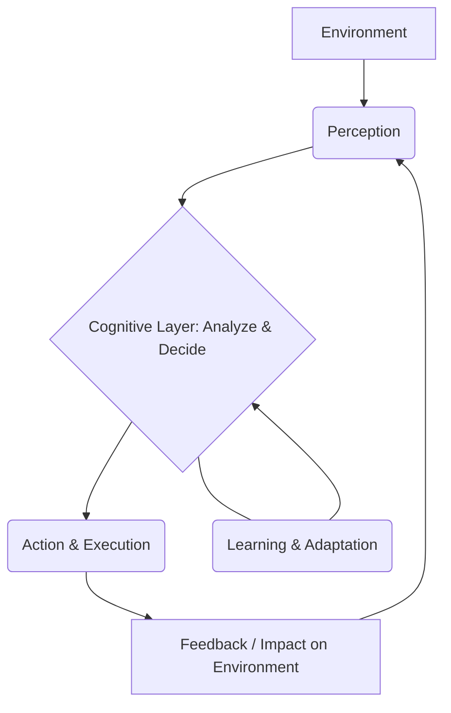

# Agentic AI

## Introduction
Agentic AI refers to systems designed to operate independently, making decisions and taking actions without direct human oversight [GFG]. These systems are programmed with specific objectives and continuously work towards achieving those goals [GFG]. They are capable of acting autonomously, interacting with their environment, and potentially collaborating with other agents [GFG - Tutorial].

## TL;DR
*   **Autonomous & Goal-Oriented:** Agentic AI operates independently, making decisions to achieve specific objectives without constant human input [GFG].
*   **Perceives, Plans, Acts, Learns:** It follows a cycle of gathering information (perception), analyzing and deciding (cognitive layer), executing actions, and adapting based on experience (learning) [GFG, GFG - Architecture].
*   **Leverages Generative AI:** Often utilizes Large Language Models (LLMs) and generative techniques to produce text, code, or actions [GFG - Tutorial, GFG - Traditional vs Agentic].
*   **Architectures:** Can be single-agent (one agent for a task) or multi-agent (multiple agents collaborating on a large problem) [GFG - Architecture].
*   **Applications:** Includes autonomous vehicles, IT operations, and cybersecurity [GFG, GFG - Traditional vs Agentic].
*   **Advantages:** Offers autonomy, adaptability, and versatility in handling complex tasks [GFG].
*   **Challenges:** Raises concerns about safety, accountability, and system complexity [GFG].

## Key Characteristics and Principles
Agentic AI systems are built upon several core principles that enable their independent and intelligent behavior:
*   **Autonomy:** Agentic AI systems operate independently, making decisions and taking actions without human oversight. They work within predefined limits, thereby reducing the need for human involvement [GFG, GFG - Architecture].
*   **Goal-Oriented Behaviour:** These systems are programmed with specific objectives and consistently work towards achieving them [GFG].
*   **Adaptability:** They learn from past experiences and adjust their actions to suit changing environments and handle new situations that were not explicitly programmed [GFG, GFG - Architecture].
*   **Versatility:** Agentic AI can manage a wide array of complex and dynamic tasks [GFG].
*   **Environmental Interaction:** Agents are designed to interact with their surrounding environment [GFG - Tutorial].
*   **Collaboration:** Some agentic systems, especially multi-agent architectures, can collaborate with other agents to accomplish shared tasks [GFG - Tutorial, GFG - Architecture].

## Agentic AI vs. Traditional AI
Agentic AI differs significantly from traditional AI in its core functionality and operational paradigm.

| Feature            | Traditional AI                                   | Agentic AI                                                        |
| :----------------- | :----------------------------------------------- | :---------------------------------------------------------------- |
| **Core Function**  | Performs specific, pre-programmed tasks [GFG - Traditional vs Agentic]. Solves specific tasks [GFG - Traditional vs Agentic]. | Autonomously sets goals and executes tasks [GFG - Traditional vs Agentic]. Achieves defined goals [GFG - Traditional vs Agentic]. |
| **Human Input**    | Requires human input and predefined rules [GFG].  | Operates independently, with minimal human oversight [GFG].        |
| **Decision Making**| Uses pre-programmed rules, logic, and algorithms to analyze data and provide predictions [GFG - Traditional vs Agentic]. | Makes its own decisions [GFG]. Uses LLMs and cognitive models [GFG - Traditional vs Agentic]. |
| **Typical Output** | Deterministic [GFG - Traditional vs Agentic].     | Generative, dynamic [GFG - Traditional vs Agentic].                 |
| **Learning**       | Limited to fixed rules and patterns [needs review]. | Learns from experience and adapts to changes [GFG, GFG - Architecture]. |
| **Environment**    | Often operates in controlled or static environments [needs review]. | Interacts with and adapts to dynamic environments [GFG - Tutorial]. |
| **Examples**       | Customer support chatbots using preset scripts, medical diagnosis based on programmed rules, fraud detection algorithms [GFG - Traditional vs Agentic]. | Autonomous vehicles, IT operations (fixing issues, scaling resources), cybersecurity (real-time threat response) [GFG, GFG - Traditional vs Agentic]. |

## How Agentic AI Works (Single Agent Architecture)
The architecture of a single agentic AI system comprises several key components that work in harmony to ensure its independent and effective operation [GFG - Architecture].

1.  **Perception:** This component is responsible for collecting relevant, up-to-date data from the agent's surroundings. It uses various inputs such as images, sound, text, sensor data, data streams, and external databases for its specific mission [GFG, GFG - Architecture].
2.  **Cognitive Layer:** After perceiving its environment, the agent analyzes the collected data and decides on the best course of action. This involves assessing the current situation, considering potential outcomes, and selecting the most appropriate response [GFG - Architecture].
3.  **Action and Execution:** The action component carries out the decisions made by the agent. Once an action is chosen, the agent interacts with its environment, which might involve sending commands to physical systems or initiating digital processes [GFG - Architecture].
4.  **Learning and Adaptation:** To improve over time, agentic systems need to learn from past experiences. This enables them to adapt to new situations that may not have been explicitly programmed into them [GFG - Architecture].

*Figure: Simplified flow of an Agentic AI system*

## Types of Agentic Architectures
Agentic AI systems can be structured in different ways, each suited for various tasks and environments [GFG - Architecture].

*   **Single-Agent Architecture:** In this setup, a solitary agent is responsible for handling a particular task or solving a problem [GFG - Architecture]. The operational components (Perception, Cognitive Layer, Action, Learning) described above are typical of a single-agent system.
*   **Multi-Agent Architectures:** These architectures involve multiple specialized agents working together. Each agent typically handles its own domain, such as performance analysis, injury prevention, or market strategy. Multi-agent systems are designed to divide a larger, complex problem into smaller, manageable sub-problems, with agents collaborating to achieve a shared objective [GFG - Architecture].

## Core Concepts and Development Essentials
Developing agentic AI applications requires a blend of programming skills, understanding of advanced AI models, and ethical considerations.

*   **Programming Foundations:** Strong programming skills, particularly in Python, are crucial. This involves familiarity with key programming tools, libraries, and frameworks used in AI development [GFG - Tutorial].
*   **Generative AI:** Understanding Generative AI, especially Large Language Models (LLMs) like GPT and LlamaIndex, is critical. Generative AI empowers agents to autonomously produce text, code, and actions [GFG - Tutorial].
*   **Prompt Engineering:** This practice involves crafting effective inputs (prompts) to elicit better outputs from LLMs. Techniques include Zero-Shot, One-Shot, Few-Shot, Chain of Thought Prompting, and defining Role & Context for the LLM [GFG - Tutorial].
*   **Knowledge, Memory, and Embeddings:** For agents to perform effectively, they must efficiently store, recall, and process knowledge. This involves exploring concepts like embeddings, different types of memory, and retrieval techniques for building context-aware systems [GFG - Tutorial].
*   **CrewAI for Collaborative Agents:** Frameworks like CrewAI enable multiple agents to collaborate and work efficiently on shared tasks. This includes understanding CrewAI frameworks, flows, and creating custom tools for agents [GFG - Tutorial].
*   **Automation and Workflow Integration:** Agentic AI can be integrated with automation tools to execute complex workflows and business processes, such as Agentic RAG (Retrieval Augmented Generation) pipelines [GFG - Tutorial].
*   **Responsible & Ethical Agentic AI:** The development and deployment of autonomous agents introduce unique ethical, legal, and security concerns. This includes addressing issues like bias in AI models, deepfakes, and prompt injection attacks [GFG - Tutorial].

## Applications and Examples
The potential applications for Agentic AI are vast and diverse, spanning multiple industries:
*   **Autonomous Vehicles:** Agentic AI can be used in self-driving cars, where the AI functions as the driver, making real-time decisions for navigation, obstacle avoidance, and route optimization [GFG].
*   **IT Operations:** Agentic AI systems can monitor servers and networks, autonomously detecting and fixing issues, or scaling resources as needed, significantly reducing manual intervention [GFG - Traditional vs Agentic].
*   **Cybersecurity:** These agents can detect and respond to cyber threats in real time, adapting their strategies to counter evolving attacks without human oversight [GFG - Traditional vs Agentic].

## Advantages
Agentic AI offers several key benefits due to its inherent design:
*   **Autonomous:** It functions independently with minimal human oversight, leading to increased efficiency and reduced operational costs [GFG].
*   **Adaptable:** The systems learn from experience and adjust their actions to changing environments, allowing them to perform effectively in dynamic and unpredictable conditions [GFG].
*   **Versatile:** Agentic AI can handle a wide range of complex and dynamic tasks, making it suitable for diverse applications where traditional AI might struggle [GFG].

## Limitations
Despite its advantages, Agentic AI also presents several challenges and limitations:
*   **Safety:** Requires ongoing monitoring to prevent errors or unintended outcomes, as autonomous actions can have significant consequences [GFG].
*   **Accountability:** The independent nature of Agentic AI raises ethical concerns and complex questions about responsibility when autonomous actions lead to errors or adverse results [GFG].
*   **Complexity:** Designing, implementing, and maintaining agentic AI systems can be difficult due to their intricate architectures and dynamic operational nature [GFG].

## Conclusion
Agentic AI represents a significant evolution in artificial intelligence, moving beyond pre-programmed responses to systems capable of autonomous, goal-oriented action, perception, and learning. By leveraging generative AI and sophisticated architectural components, agentic systems can adapt to dynamic environments and collaborate to solve complex problems. While offering immense potential for applications across various sectors, it also necessitates careful consideration of ethical implications, safety protocols, and the inherent complexity of development and deployment. As the field progresses, addressing these challenges will be crucial for realizing the full benefits of Agentic AI.

## Memory Aids
*   **P.A.C.A.L.:** **P**erception, **A**ction, **C**ognition, **A**daptation, **L**earning - The core cycle of an agent.
*   **A.G.E.N.T.:** **A**utonomous, **G**oal-oriented, **E**nvironment-aware, **N**etworked (collaborative), **T**hinking (cognitive).
*   **Analogy:** Think of a self-driving car (Agentic AI) versus a traditional cruise control (Traditional AI). The self-driving car perceives, plans, acts, and learns, adapting to traffic and conditions (Agentic), while cruise control just maintains speed (Traditional).

## Common Mistakes
*   **Confusing with Basic Automation:** Agentic AI goes beyond simple automation; it involves autonomous decision-making and adaptation, not just following predefined scripts [GFG - Traditional vs Agentic].
*   **Underestimating Ethical Challenges:** Overlooking the profound ethical and accountability questions raised by systems that act independently [GFG].
*   **Ignoring the Need for Oversight:** Assuming that "autonomous" means "set and forget." Agentic AI still requires monitoring for safety, performance, and unintended outcomes [GFG].
*   **Solely Equating with LLMs:** While LLMs are a critical enabler for generative capabilities in agentic systems, Agentic AI encompasses the entire intelligent agent architecture, including perception, cognitive layers, action, and learning, not just the language model itself [GFG - Tutorial, GFG - Architecture].

## Related Images

*course-img* — source: https://www.geeksforgeeks.org/artificial-intelligence/agentic-ai-architecture/

*course-img* — source: https://www.geeksforgeeks.org/artificial-intelligence/agentic-ai-vs-traditional-ai/

## CITATIONS
*   **[GFG]** GeeksforGeeks. "What is Agentic AI." *GeeksforGeeks*, [https://www.geeksforgeeks.org/artificial-intelligence/what-is-agentic-ai/](https://www.geeksforgeeks.org/artificial-intelligence/what-is-agentic-ai/)
*   **[GFG - Tutorial]** GeeksforGeeks. "Agentic AI Tutorial." *GeeksforGeeks*, [https://www.geeksforgreeks.org/artificial-intelligence/agentic-ai-tutorial/](https://www.geeksforgreeks.org/artificial-intelligence/agentic-ai-tutorial/)
*   **[GFG - Architecture]** GeeksforGeeks. "Agentic AI Architecture." *GeeksforGeeks*, [https://www.geeksforgeeks.org/artificial-intelligence/agentic-ai-architecture/](https://www.geeksforgeeks.org/artificial-intelligence/agentic-ai-architecture/)
*   **[GFG - Traditional vs Agentic]** GeeksforGeeks. "Agentic AI vs. Traditional AI." *GeeksforGeeks*, [https://www.geeksforgeeks.org/artificial-intelligence/agentic-ai-vs-traditional-ai/](https://www.geeksforgeeks.org/artificial-intelligence/agentic-ai-vs-traditional-ai/)
*   **[Wiki]** Wikipedia. "Agentic AI." *Wikipedia*, [https://en.wikipedia.org/wiki/Agentic_AI](https://en.wikipedia.org/wiki/Agentic_AI)