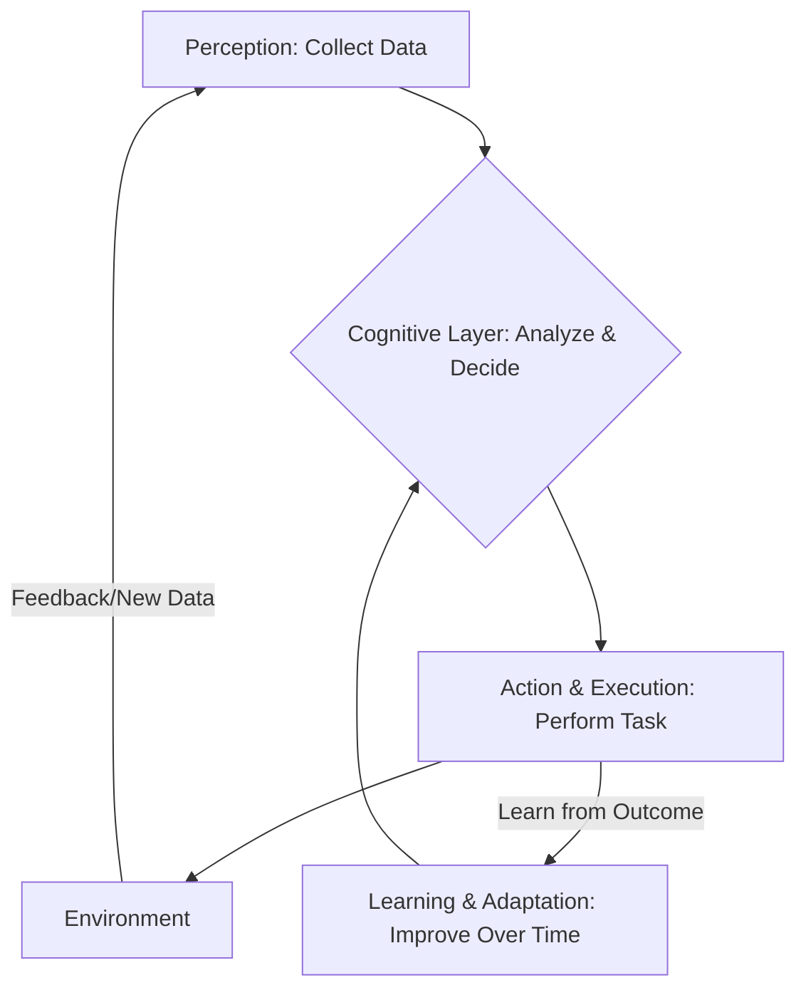

# Agentic AI

## Introduction
Agentic AI refers to artificial intelligence systems designed to operate autonomously, make decisions, and take actions to achieve specific objectives without direct human oversight [GFG]. These systems are goal-oriented, continuously perceive their environment, process information, plan actions, and learn from experience to adapt over time [GFG]. Building upon generative techniques, Agentic AI leverages Large Language Models (LLMs) and cognitive models to perform multi-step tasks independently [GFG].

## TL;DR
*   **Autonomous Operation:** Agentic AI systems work independently, making decisions and taking actions without constant human intervention [GFG].
*   **Goal-Oriented:** They are programmed with specific objectives and continuously work towards achieving them [GFG].
*   **Perception-Action Loop:** They collect relevant data (Perception), analyze it and decide (Cognitive Layer), execute actions (Action and Execution), and improve over time (Learning and Adaptation) [GFG].
*   **Leverages Generative AI:** Often built on Large Language Models (LLMs) for producing text, code, and actions autonomously [GFG].
*   **Adaptable:** Learns from experience and adjusts behavior to changing environments [GFG].
*   **Applications:** Used in self-driving cars, IT operations, and cybersecurity for real-time decision-making [GFG].
*   **Key Differences from Traditional AI:** Unlike traditional AI, which relies on predefined rules and human input for specific tasks, Agentic AI autonomously sets goals and executes complex, multi-step tasks [GFG].
*   **Challenges:** Raises concerns about safety, accountability, ethical issues, and complexity [GFG].

## What is Agentic AI?
Agentic AI systems operate independently, making decisions and taking actions without human oversight [GFG]. They are programmed with specific objectives and continuously work towards achieving those goals [GFG]. These systems are designed to interact with their environment and can collaborate with other agents [GFG]. Building upon generative techniques, Agentic AI utilizes LLMs and cognitive models to autonomously achieve defined goals, plan multi-step tasks, and act with minimal human oversight [GFG].

## Key Characteristics and Principles
Agentic AI systems embody several core characteristics and principles:
*   **Autonomy:** They operate independently, making decisions and taking actions without human oversight, and adapting to changing environments within set limits [GFG]. This reduces the need for human involvement [GFG].
*   **Goal-Oriented Behaviour:** Programmed with specific objectives, they consistently work towards achieving these goals [GFG].
*   **Adaptability:** They learn from experience and adjust their actions and strategies to changing environments, allowing them to handle new situations not explicitly programmed [GFG].
*   **Versatility:** Capable of handling a wide range of complex and dynamic tasks [GFG].
*   **Interaction with Environment:** Agents perceive information from their surroundings and act upon them [GFG].
*   **Collaboration:** Agentic AI can collaborate with other agents to achieve shared tasks [GFG].

## How Agentic AI Works: Components and Process
Agentic AI systems function through a continuous cycle of perception, cognitive processing, action, and learning.

### Components of Agentic AI Architecture
The architecture of an agentic AI system comprises several key components working in concert [GFG]:

1.  **Perception:**
    *   The agent collects relevant, up-to-date data from its surroundings using sensors, APIs, databases, or user inputs for its specific mission [GFG].
    *   It gathers information like images, sound, text, or sensor data to understand its environment [GFG].

2.  **Cognitive Layer (Analyze and Decide):**
    *   After perceiving its environment, the agent analyzes the collected data to decide the best course of action [GFG].
    *   This involves assessing the current situation, considering potential outcomes, and selecting the optimal action [GFG].

3.  **Action and Execution:**
    *   This component executes the decisions made by the agent [GFG].
    *   Once the data is processed and an action is chosen, the agent performs the action, which could involve sending commands to physical systems or digital interfaces [GFG].

4.  **Learning and Adaptation:**
    *   Agentic AI systems must adapt and improve over time by learning from past experiences [GFG].
    *   This enables them to handle new situations that may not have been specifically programmed, enhancing their effectiveness [GFG].

### Types of Agentic Architectures
*   **Single-agent architecture:** A single agent operates independently to perform tasks [GFG].
*   **Multi-agent architectures:** Multiple specialized agents work collaboratively. Each agent handles its own domain (e.g., performance analysis, injury prevention, market strategy), allowing large problems to be divided and solved efficiently [GFG].

### Workflow Diagram

*Figure 1: Agentic AI System Workflow* [GFG]

## Agentic AI vs. Traditional AI
Agentic AI significantly differs from traditional AI in its core function, operation, and capabilities [GFG].

| Feature            | Traditional AI                                     | Agentic AI                                                   |
| :----------------- | :------------------------------------------------- | :----------------------------------------------------------- |
| **Core Function**  | Performs specific, pre-programmed tasks [GFG].     | Autonomously sets goals and executes multi-step tasks [GFG]. |
| **Human Input**    | Requires human input and predefined rules [GFG].   | Operates independently; minimal human oversight [GFG].       |
| **Typical Output** | Deterministic (e.g., predictions, classifications) [GFG]. | Generates text, code, and actions autonomously; adaptive [GFG]. |
| **Adaptability**   | Limited; relies on programmed rules [GFG].         | Learns from experience; adjusts actions to changing environments [GFG]. |
| **Complexity**     | Designed for specific tasks [GFG].                 | Handles complex, dynamic environments and broad goals [GFG]. |
| **Underlying Tech**| Uses pre-programmed rules, logic, algorithms [GFG]. | Builds on generative techniques, LLMs, cognitive models [GFG]. |
| **Examples**       | Chatbots (preset scripts), medical diagnosis (programmed rules), fraud detection (algorithms) [GFG]. | Autonomous vehicles, IT operations (fixing issues, scaling resources), cybersecurity (real-time threat response) [GFG]. |

## Development and Implementation Aspects

### 1. Programming Foundations for Agentic AI
Strong programming skills, particularly in Python, are crucial for developing autonomous agents. This involves using key programming tools, libraries, and frameworks [GFG].

### 2. Introduction to Generative AI
Generative AI empowers agents to produce text, code, and actions autonomously [GFG]. Understanding Large Language Models (LLMs) is critical for applying Generative AI within agentic systems. Popular LLMs include GPT and Llama, and frameworks like LlamaIndex are used [GFG].

### 3. Prompt Engineering
Prompt engineering is the practice of crafting inputs to get better outputs from LLMs [GFG]. Key techniques include:
*   **Zero-Shot, One-Shot, and Few-Shot Prompting:** Different methods of providing context or examples to the LLM [GFG].
*   **Chain of Thought Prompting:** Guiding the LLM through a series of logical steps to arrive at a solution [GFG].
*   **Role & Context:** Defining the role of the AI and the context of the task to improve relevance and accuracy [GFG].

### 4. Knowledge, Memory and Embeddings
For agents to perform effectively, they must store, recall, and process knowledge efficiently [GFG]. This involves:
*   **Embeddings:** Representing complex data (like text or images) as numerical vectors that capture semantic meaning [GFG].
*   **Memory and Retrieval Techniques:** Storing and efficiently retrieving relevant information from databases, often using vector databases, to provide context-aware responses [GFG].

### 5. CrewAI for Collaborative Agents
CrewAI is a framework that enables multiple specialized agents to collaborate and work efficiently on shared tasks [GFG]. It supports creating custom tools for agents and defining workflows [GFG].

### 6. Automation and Workflow Integration
Agentic AI can be combined with automation tools to execute complex workflows and business processes [GFG]. This includes deploying and automating agents in real-world pipelines, often involving techniques like Agentic RAG (Retrieval Augmented Generation) [GFG].

## Applications of Agentic AI
The potential applications of Agentic AI are extensive and diverse [GFG]:
*   **Autonomous Vehicles:** AI acts as the driver, making real-time decisions for navigation and safety [GFG].
*   **IT Operations:** Agentic AI monitors servers and networks, autonomously fixing issues or scaling resources as needed [GFG].
*   **Cybersecurity:** Detects and responds to threats in real-time, adapting its strategies dynamically [GFG].
*   **Customer Support:** While traditional chatbots use preset scripts, agentic systems could autonomously resolve complex customer issues by diagnosing problems and initiating multi-step solutions [GFG, needs review for specific examples, but aligns with capabilities].
*   **Medical Diagnosis:** Beyond suggesting outcomes, agentic AI could potentially integrate data, propose diagnostic paths, and even adapt treatment plans based on patient responses [GFG, needs review for specific examples, but aligns with capabilities].

## Advantages
*   **Autonomous:** Functions independently with minimal human oversight, reducing the need for constant human intervention [GFG].
*   **Adaptable:** Learns from experience and adjusts actions to changing environments, allowing it to handle new and unforeseen situations [GFG].
*   **Versatile:** Capable of handling a wide range of complex and dynamic tasks across various domains [GFG].

## Limitations
*   **Safety:** Requires ongoing monitoring to prevent errors or unintended outcomes, especially in critical applications [GFG].
*   **Accountability:** Raises ethical concerns and questions about responsibility for autonomous actions, particularly when errors occur [GFG].
*   **Complexity:** Can be difficult to design, develop, test, and maintain due to the intricate interactions and adaptive nature of agents [GFG].

## Responsible & Ethical Agentic AI
Autonomous agents introduce unique ethical, legal, and security concerns that must be addressed during deployment [GFG]. Key considerations include:
*   **Bias in AI Models:** Ensuring fairness and preventing discriminatory outcomes [GFG].
*   **Deepfakes:** The potential for malicious generation of synthetic media [GFG].
*   **Prompt Injection:** Protecting against unauthorized or harmful instructions to the AI [GFG].
*   **Transparency and Explainability:** Understanding how autonomous decisions are made.
*   **Control and Human Oversight:** Maintaining appropriate levels of human control over highly autonomous systems.

## Examples
*   **Self-driving cars:** An Agentic AI perceives road conditions, traffic, and surroundings, makes navigation decisions, and executes driving actions without human input [GFG].
*   **Automated IT incident response:** An Agentic AI monitors server logs, detects anomalies (perception), diagnoses the root cause (cognitive), and then automatically applies a patch or scales resources (action), learning from each incident to improve future responses [GFG].
*   **Cybersecurity threat mitigation:** An Agentic AI continuously monitors network traffic, identifies a novel threat (perception), determines a response strategy (cognitive), and then deploys countermeasures like quarantining infected systems or updating firewall rules (action), adapting to new attack vectors [GFG].
*   **Collaborative Design Systems:** Multiple Agentic AIs, perhaps one specializing in structural integrity and another in aesthetics, could work together using CrewAI to design a complex product, each contributing to a shared goal [GFG, needs review for specific examples, but aligns with CrewAI description].

## Conclusion
Agentic AI represents a significant evolution in artificial intelligence, moving beyond predefined tasks to systems capable of autonomous, goal-oriented action and continuous learning [GFG]. While offering immense potential in diverse fields from autonomous vehicles to cybersecurity, its implementation demands careful consideration of ethical implications, safety protocols, and the inherent complexity of such adaptive systems [GFG]. As development progresses, responsible practices will be crucial for harnessing the full benefits of agentic intelligence.

## Memory Aids
*   **P-C-A-L Loop:** **P**erception → **C**ognitive Layer (Analyze & Decide) → **A**ction & Execution → **L**earning & Adaptation. This outlines the core operational flow [GFG].
*   **A.G.A.V. - A**utonomous, **G**oal-oriented, **A**daptable, **V**ersatile. These are key characteristics [GFG].
*   **Agentic AI vs. Traditional AI: Goal vs. Task:** Agentic AI aims for broad *goals* autonomously, Traditional AI performs specific, pre-programmed *tasks* [GFG].

## Common Mistakes
*   **Underestimating Complexity:** Agentic AI systems are inherently complex, requiring extensive design, development, and maintenance efforts that are often underestimated [GFG].
*   **Neglecting Safety and Monitoring:** Autonomous operation necessitates continuous monitoring to prevent errors or unintended outcomes; failing to implement robust safety mechanisms can lead to significant risks [GFG].
*   **Ignoring Ethical and Accountability Concerns:** Deploying agentic AI without addressing questions of bias, responsibility for autonomous actions, and potential misuse (e.g., deepfakes, prompt injection) can lead to severe ethical and legal issues [GFG].
*   **Lack of Adaptability Planning:** Expecting agentic systems to perform optimally without robust learning and adaptation mechanisms can limit their effectiveness in dynamic, real-world environments [GFG].
*   **Over-reliance on Generative AI without Prompt Engineering:** While LLMs are powerful, neglecting proper prompt engineering can lead to suboptimal or unreliable outputs from agentic systems [GFG].

## CITATIONS
*   [GFG] GeeksforGeeks:
    *   "What is Agentic AI": https://www.geeksfor Geeks.org/artificial-intelligence/what-is-agentic-ai/
        *   Key Characteristics of Agentic AI: "Autonomy and Goal-Oriented Behaviour: Agentic AI systems operate independently making decisions and taking actions without human oversight. They are programmed with specific objectives and work toward…"
        *   How Agentic AI Works?: "Agentic AI systems operate through various steps such as: Perception: Collects only the most relevant, up‑to‑date data from sensors, APIs, databases or users for its specific mission, unlike general a…"
        *   Agentic AI vs. Traditional AI: "Let's see the key differences between traditional AI and Agentic AI, Traditional AI requires human input and predefined rules, whereas Agentic AI operates independently and makes its own decisions. Tr…"
        *   Applications of Agentic AI: "The potential applications of Agentic AI are vast and varied. Here are some few examples: Autonomous Vehicles: Agentic AI can be used in self-driving cars, where the AI acts as the driver making real-…"
        *   Advantages: "Autonomous: Functions independently with minimal human oversight. Adaptable: Learns from experience and adjusts actions to changing environments. Versatile: Handles a wide range of complex and dynamic…"
        *   Limitations: "Safety: Requires ongoing monitoring to prevent errors or unintended outcomes. Accountability: Raises ethical concerns and questions about responsibility for autonomous actions. Complexity: Can be diff…"
    *   "Agentic AI Tutorial": https://www.geeksfor Geeks.org/artificial-intelligence/agentic-ai-tutorial/
        *   Programming Foundations: "Strong programming skills are important for developing autonomous agents. This section introduces key programming tools, libraries and frameworks required for developing agentic AI application. Python…"
        *   Introduction to Generative AI: "Generative AI empowers agents to produce text, code and actions autonomously. Understanding LLMs is critical for applying GenAI inside agentic systems. Large Language Model LlamaIndex Popular LLMs: GP…"
        *   Prompt Engineering: "Prompt engineering is the practice of crafting inputs to get better outputs from LLMs. What is Prompt Engineering? Zero-Shot , One-Shot and Few-Shot Prompting Chain of Thought Prompting Role & Context…"
        *   Introduction to Agentic AI & Core Concepts: "Agentic AI enables machines to act autonomously, interact with their environment and collaborate with other agents. This section introduces the core concepts and applications of agentic systems. What …"
        *   Knowledge, Memory and Embeddings: "For agents to perform effectively, they must store, recall and process knowledge efficiently. This section explores embeddings, memory and retrieval techniques for context-aware systems. Embeddings Ve…"
        *   CrewAI for Collaborative Agents: "CrewAI enables multiple agents to collaborate and work efficiently on shared tasks. This section explores CrewAI frameworks and flows. Introduction to CrewAI CrewAI Tools Creating Custom Tools for Cre…"
        *   Automation and Workflow Integration: "Agentic AI can be combined with automation tools to execute complex workflows and business processes. This section covers how to deploy and automate agents in real-world pipelines. Agentic RAG Agentic…"
        *   Responsible & Ethical Agentic AI: "Autonomous agents introduce unique ethical, legal and security concerns. This section highlights responsible practices for deploying safe and trustworthy agents. Bias in AI Models Deepfakes Prompt Inj…"
    *   "Agentic AI Architecture": https://www.geeksfor Geeks.org/artificial-intelligence/agentic-ai-architecture/
        *   Types of Agentic Architectures: "There are several types of agentic architectures each with its own strengths and weaknesses, suitable for different tasks and environments. Some common types include: 1. Single-agent architecture: A s…"
        *   Components of Single Agentic AI Architecture: "The architecture of an agentic AI system is composed of several key components that work together to ensure it operates independently and effectively. These components enable the system to make decisi…"
        *   Perception: "The way by which the agent collects information from its surroundings and using inputs like images, sound, text or sensor data is perception. Systems use sensors, data streams and external databases t…"
        *   Cognitive Layer: "After understanding its environment agent must analyze the data and decide the best action. This process involves assessing the current situation, considering potential outcomes and selecting the best…"
        *   Action and Execution: "The action component executes the decisions made by the agent. Once the agent processes the data and chooses an action, it takes action in the environment. This could involve sending commands to physi…"
        *   Learning and Adaptation: "The systems need to adapt and get better over time by learning from past experiences. This enables them to handle new situations that may not have been specifically programmed. Learning mechanisms in …"
        *   Principles of Agentic AI Architecture: "The principles behind the Agentic AI architecture are mentioned below: Autonomy : Agentic AI works independently within set limits and hence reducing the need for human involvement. It adapts to chang…"
        *   Multi-Agent Architectures: "In multi-agent architectures, multiple specialized agents work together, each handling its own domain such as performance analysis, injury prevention or market strategy. Agents divide a large problem …"
    *   "Agentic AI vs. Traditional AI": https://www.geeksfor Geeks.org/artificial-intelligence/agentic-ai-vs-traditional-ai/
        *   Traditional AI: "Traditional AI is designed for solving specific tasks rather than creating entirely new content. It uses pre-programmed rules, logic and algorithms to analyze data and provide predictions, classificat…"
        *   Agentic AI: "Agentic AI is designed to autonomously achieve defined goals, plan multi-step tasks and act with minimal human oversight. Building upon generative techniques, agentic systems use LLMs and cognitive mo…"
        *   Key Differences: "Let's see Agentic AI vs. Traditional AI, Feature Traditional AI Agentic AI Core Function Performs specific, preprogrammed tasks Autonomously sets goals and executes tasks Typical output Deterministic …"
        *   Traditional AI Examples: "Customer support: Chatbots answer basic questions using preset scripts. Medical diagnosis: Systems analyze test results and suggest possible outcomes based on programmed rules. Fraud detection: Algori…"
        *   Agentic AI Examples: "IT operations: Agentic AI monitors servers and networks, autonomously fixing issues or scaling resources when needed. Cybersecurity: Detects and responds to threats in real time, adapting its strategi…"
*   [Wiki] Wikipedia:
    *   "Agentic AI": https://en.wikipedia.org/wiki/Agentic_AI
    *   "Intelligent agent": https://en.wikipedia.org/wiki/Intelligent_agent