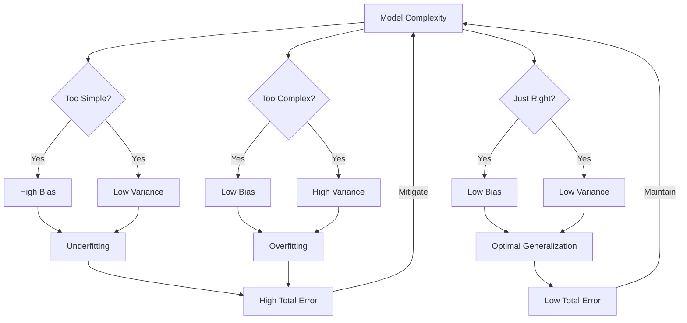

# Bias variance tradeoff

## Introduction
In machine learning, **bias** and **variance** are two fundamental concepts that describe the sources of error in a model's predictions [TP]. Understanding the **bias-variance tradeoff** is crucial for developing models that generalize well to new, unseen data [Scaler]. It represents the balance between two types of errors a model can make: error from overly simplistic assumptions (bias) and error from oversensitivity to training data (variance) [GFG-balance-tradeoff].

## TL;DR
*   **Bias** is the error due to overly simplistic assumptions in a model, causing it to miss relevant patterns and **underfit** the data.
*   **Variance** is the error due to a model being too sensitive to the training data, capturing noise, and performing poorly on new data, leading to **overfitting**.
*   The **Bias-Variance Tradeoff** means that reducing one type of error often increases the other.
*   The goal is to find an optimal balance that minimizes the **total error** for robust model performance.

## What is Bias?
**Bias** refers to the error introduced when a model oversimplifies the underlying patterns in the data [Scaler]. It is the difference between the predictions made by a machine learning model and the correct actual values [GFG], [GFG-bias-vs-variance]. High bias leads to significant errors in both training and testing datasets [GFG-balance-tradeoff].

*   **Impact:** Models with high bias cannot capture the hidden patterns in the training data, leading to **underfitting** [TP]. They perform poorly on both training and test datasets and cannot generalize well to new, unseen data [TP].
*   **Types of Bias:**
    *   **High Bias:** Occurs due to erroneous assumptions or when a model is too simple to capture the complexity of the data [TP], [GFG-bias-vs-variance].
    *   **Low Bias:** Implies the model's predictions are close to the actual values on average, meaning it captures the data's underlying patterns well.

### Examples of Bias in Models
*   A **linear regression** model attempting to fit non-linear data will typically exhibit high bias [TP].
*   Models like **linear regression** and **logistic regression** are often examples of models with high bias [TP].

## What is Variance?
**Variance** in machine learning refers to the variability of model predictions for a given input [Scaler]. It quantifies how much the predictions of a model fluctuate when trained on different subsets of the training data [Scaler], or how much the model's performance changes when trained on different data subsets [GFG-bias-vs-variance].

*   **Impact:** A model with high variance has a very complex fit to the training data, capturing noise along with the actual patterns [GFG], [TP]. This leads to **overfitting**, where the model shows high training accuracy but low test accuracy [TP].
*   **Types of Variance:**
    *   **High Variance:** Occurs when the model is too complex and captures noise in the training data, leading to poor generalization on test data [TP].
    *   **Low Variance:** Indicates that the model's predictions are consistent across different training datasets, suggesting it is not overly sensitive to minor fluctuations in the data.

### Examples of Variance in Models
*   A **decision tree** with many branches that perfectly fits the training data but performs poorly on test data is an example of high variance [TP].
*   Models like **k-nearest neighbors** and **decision trees** are known to potentially exhibit high variance [TP].

## Bias-Variance Combinations
Understanding the relationship between bias and variance is crucial for diagnosing model behavior and achieving optimal performance [Scaler].

| Bias         | Variance     | Model Behavior     | Description                                                                                                                                                                                                                                                                                                                         |
| :----------- | :----------- | :----------------- | :---------------------------------------------------------------------------------------------------------------------------------------------------------------------------------------------------------------------------------------------------------------------------------------------------------------------------------- |
| **High Bias**  | **Low Variance** | **Underfitting**     | The model is too simple, making erroneous assumptions and failing to capture the underlying patterns in the data [GFG-bias-vs-variance]. Predictions are consistent but consistently incorrect. It performs poorly on both training and test data [Scaler].                                                                  |
| **Low Bias**   | **High Variance**| **Overfitting**      | The model is too complex, fitting the training data (including noise) perfectly but failing to generalize to new, unseen data [GFG-bias-vs-variance]. Predictions are accurate on training data but inconsistent and inaccurate on test data [Scaler].                                                               |
| **High Bias**  | **High Variance**| [needs review]     | This scenario is generally undesirable and indicates a severely flawed model.                                                                                                                                                                                                                                        |
| **Low Bias**   | **Low Variance** | **Optimal Model**  | The ideal scenario where the model accurately captures the underlying patterns of the data while being robust to minor fluctuations. It generalizes well to unseen data, achieving good performance on both training and test sets [GFG-bias-vs-variance]. |

## Bias-Variance Tradeoff
The **bias-variance tradeoff** is a fundamental concept in machine learning that represents the balance between bias and variance in model performance [Scaler], [GFG-balance-tradeoff].

*   If an algorithm is too **simple** (e.g., a linear equation hypothesis), it tends to have **high bias** and **low variance**, leading to **underfitting** and high error [GFG], [GFG-bias-vs-variance].
*   If an algorithm is too **complex** (e.g., a high-degree polynomial hypothesis), it tends to have **low bias** (fits training data well) but **high variance** (overfits to noise), leading to poor generalization [GFG], [GFG-bias-vs-variance].

The goal is to find a model complexity level that minimizes the **total error** by achieving a suitable balance between bias and variance, allowing the model to generalize well to unseen data [Scaler].


*Figure: Bias-Variance Tradeoff based on Model Complexity*

## Total Error Mathematical Derivation
The decomposition of the total error of a machine learning model into bias squared, variance, and irreducible error provides valuable insights into the sources of error in the model's predictions [Scaler].

The **Mean Squared Error (MSE)** of a model's prediction (**Ŷ**) compared to the true value (**Y**) can be decomposed as follows:

$\text{MSE} = E[(Y - \hat{Y})^2]$
$\text{MSE} = (\text{Bias})^2 + \text{Variance} + \text{Irreducible Error}$ [Scaler], [GFG-bias-vs-variance]

Where:
*   $(\text{Bias})^2$: Represents the squared difference between the average prediction of the model and the true value.
*   **Variance**: Measures how much the model's predictions vary when trained on different datasets.
*   **Irreducible Error**: The inherent noise in the data that cannot be reduced by any model.

The aim is to ensure that the bias and variance are comparable and one does not excessively outweigh the other [GFG-bias-vs-variance].

## Strategies to Reduce Bias
Reducing high bias in machine learning models involves making them more complex or flexible to capture underlying data patterns more accurately [Scaler].

*   **Increase Model Complexity:** Use a more complex model (e.g., a polynomial model instead of a linear model for non-linear data) [Scaler], [GFG-bias-vs-variance]. This allows the model to capture more intricate relationships.
*   **Add More Features:** Incorporate additional relevant features into the dataset [needs review - not explicitly stated for bias reduction in sources, though it's a common technique].
*   **Decrease Regularization:** For models that use regularization, reducing the regularization strength can help decrease bias, as it allows the model to fit the training data more closely [needs review - not explicitly stated for bias reduction in sources].

## Strategies to Reduce Variance
Reducing high variance in machine learning models involves making them more robust and less sensitive to fluctuations in the training data [Scaler].

*   **Simplify the Model:** One approach is to simplify the model, making it less prone to capturing noise [Scaler]. This could involve using fewer features, a less complex algorithm, or reducing the number of parameters.
*   **Cross-validation:** By splitting the data into training and testing sets multiple times, **cross-validation** helps identify if a model is overfitting (high variance) and can be used to tune hyperparameters to reduce variance [GFG-bias-vs-variance].
*   **Increase Training Data:** Providing more training data can help a model learn the underlying patterns more accurately and reduce its sensitivity to specific data points [needs review - common technique, but not explicit in sources].
*   **Regularization:** Techniques like L1 or L2 regularization add a penalty to the model's complexity, discouraging it from fitting the training data too perfectly and thereby reducing variance [needs review - common technique, but not explicit in sources for *reducing variance specifically*].
*   **Ensemble Methods:** Using techniques like **bagging** (e.g., Random Forests) can reduce variance by averaging predictions from multiple models [needs review - common technique, but not explicit in sources for *reducing variance specifically*].

## Examples
The Python example demonstrates the bias-variance tradeoff using **polynomial regression** to fit synthetic data [GFG-balance-tradeoff].

### Generating Synthetic Data
First, synthetic data with a non-linear relationship and some noise is generated.
```python
import numpy as np
import matplotlib.pyplot as plt
from sklearn.preprocessing import PolynomialFeatures
from sklearn.linear_model import LinearRegression
from sklearn.pipeline import make_pipeline

np.random.seed(0)
X = np.linspace(0, 10, 100)
y = 0.5 * X**2 - X + np.random.normal(0, 3, 100)
```
[GFG-balance-tradeoff]

### Fitting the Model
We define a function to fit polynomial models of different degrees. A **lower degree polynomial** (e.g., degree 1 for linear) will likely have **high bias** and **low variance** (underfitting), while a **higher degree polynomial** will have **low bias** but **high variance** (overfitting) [GFG-balance-tradeoff].

```python
def fit_polynomial_model(X, y, degree):
    model = make_pipeline(PolynomialFeatures(degree), LinearRegression())
    model.fit(X.reshape(-1, 1), y)
    return model

# Example of fitting models with different degrees
# Linear model (high bias, low variance)
model_degree_1 = fit_polynomial_model(X, y, 1)

# A moderately complex model (optimal tradeoff)
model_degree_3 = fit_polynomial_model(X, y, 3)

# Very complex model (low bias, high variance)
model_degree_20 = fit_polynomial_model(X, y, 20)

# To visualize these, predictions would be made and plotted against the actual data.
# The degree-1 model would visibly underfit the quadratic data.
# The degree-20 model would oscillate wildly, fitting the noise.
# A moderate degree (e.g., 2 or 3 in this quadratic case) would show a good fit.
```
[GFG-balance-tradeoff]

## Memory Aids
*   **Target Analogy:**
    *   **High Bias, Low Variance:** All your shots hit far from the bullseye, but they are all tightly grouped together. (Consistent, but consistently wrong).
    *   **Low Bias, High Variance:** Your shots are scattered all over the target, but some hit the bullseye. (Accurate on average, but inconsistent).
    *   **Low Bias, Low Variance:** All your shots hit the bullseye or are very close. (Consistent and accurate).
*   **Model Complexity:**
    *   **Simple Model = Underfitting = High Bias** (Doesn't learn enough).
    *   **Complex Model = Overfitting = High Variance** (Learns too much, including noise).

## Common Mistakes
1.  **Ignoring the Tradeoff:** Choosing a model solely based on high training accuracy without evaluating its generalization to new data (often indicates high variance).
2.  **Over-simplifying Models:** Using a model that is too simple for the complexity of the data, leading to high bias and poor performance on both training and test sets.
3.  **Over-complicating Models:** Creating models that are too complex, leading to overfitting and poor performance on unseen data.
4.  **Misinterpreting Error:** Confusing high training error with high bias and low training error with low bias, without considering the test error to assess variance.

## Conclusion
The **bias-variance tradeoff** is a core concept in machine learning, essential for building models that perform well on unseen data. Bias stems from overly simplistic assumptions, leading to underfitting, while variance arises from oversensitivity to training data, causing overfitting. The goal is to strategically manage model complexity and employ various techniques to find an optimal balance between these two sources of error, thereby minimizing the total error and maximizing the model's ability to generalize [Scaler], [GFG-balance-tradeoff].

## CITATIONS
*   [GFG] https://www.geeksforgeeks.org/machine-learning/ml-bias-variance-trade-off/ "Bias-Variance Trade Off - Machine Learning - GeeksforGeeks"
*   [GFG-bias-vs-variance] https://www.geeksforgeeks.org/machine-learning/bias-vs-variance-in-machine-learning/ "Bias and Variance in Machine Learning - GeeksforGeeks"
*   [GFG-balance-tradeoff] https://www.geeksforgeeks.org/machine-learning/how-to-balance-bias-variance-tradeoff/ "How to Balance bias variance tradeoff - GeeksforGeeks"
*   [Scaler] https://www.scaler.com/topics/bias-and-variance-in-machine-learning/ "Bias and Variance in Machine Learning - Scaler Topics"
*   [TP] https://www.tutorialspoint.com/machine_learning/machine_learning_bias_and_variance.htm "Bias and Variance in Machine Learning - TutorialsPoint"
*   [Wiki] https://en.wikipedia.org/wiki/Bias%E2%80%93variance_tradeoff "Bias–variance tradeoff - Wikipedia"