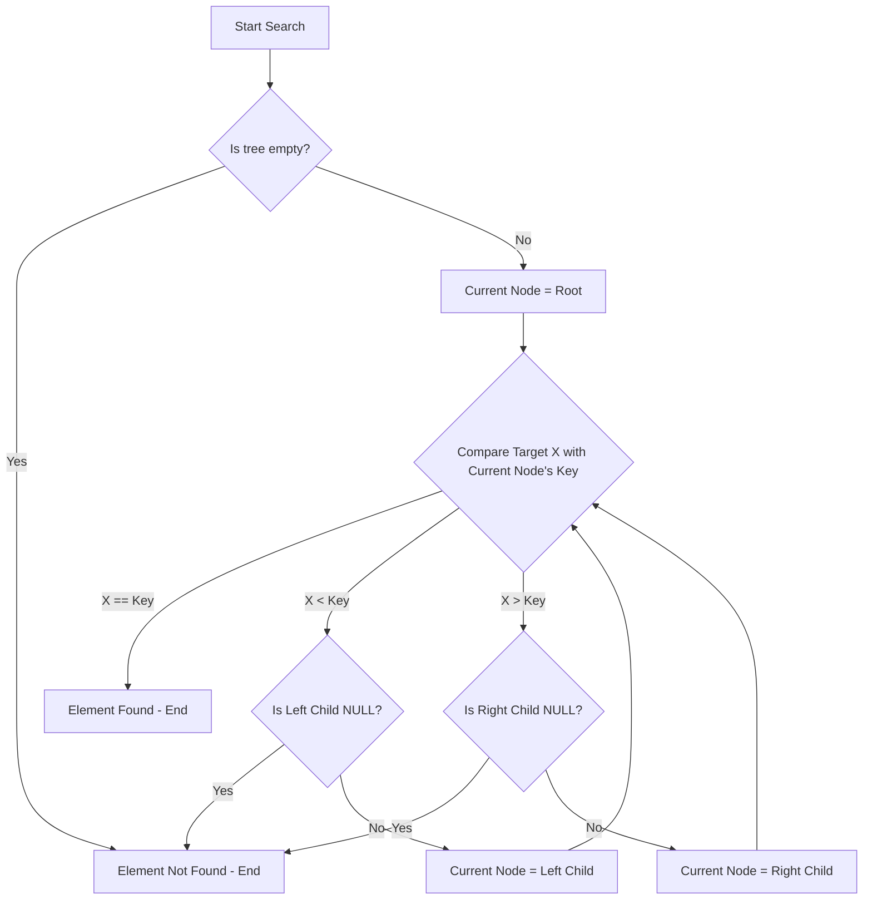

# Binary Search Tree

## Introduction
A Binary Search Tree (BST) is a hierarchical data structure composed of nodes [GFG]. It organizes data in a tree-like hierarchy with a single root node at the top [GFG]. Each node in a BST holds a key and an associated value [TP]. The primary purpose of a BST is to store data in a way that allows for efficient searching, insertion, and deletion operations [GFG, TP].

## TL;DR
*   **Hierarchical Structure:** Nodes arranged in a tree, with a single root and up to two children per node [GFG].
*   **Ordering Property:** For any node, all keys in its left subtree are smaller, and all keys in its right subtree are larger [GFG].
*   **Node Definition:** Each node stores data and references to left and right child nodes [TP].
*   **Basic Operations:** Search, Insert, Delete, Find Min/Max, Traversal (Inorder, Preorder, Postorder) [GFG, TP].
*   **Search Algorithm:** Starts at the root, compares the target key with the current node's key, and proceeds to the left or right subtree based on comparison [GFG, TP].
*   **Time Complexity:** Most operations (search, insert, delete) take O(h) time, where 'h' is the height of the tree [GFG].
*   **Space Complexity:** Recursive search takes O(h) for the call stack, while iterative search takes O(1) auxiliary space [GFG].

## Key Characteristics of a BST
*   **Hierarchical Structure:** A BST consists of nodes, where each node can have at most two children (a left child and a right child). This forms a tree-like hierarchy starting from a single root node [GFG].
*   **Ordering Property:** For every node in the BST:
    *   All keys in its left subtree are smaller than the node's key [GFG].
    *   All keys in its right subtree are greater than the node's key [GFG].

## Node Structure
A node in a BST typically stores the data (or key) and pointers (or references) to its left and right child nodes. If a child does not exist, its pointer is usually `NULL` or `nullptr` [TP].

```c
struct node {
    int data;            // The key or value stored in the node
    struct node *leftChild;  // Pointer to the left child node
    struct node *rightChild; // Pointer to the right child node
};
```
[TP]

## Basic Operations on BST
Binary Search Trees support several fundamental operations for data management [GFG, TP]:
*   **Search:** Locating an element (key) within the tree.
*   **Insert:** Adding a new element into the tree while maintaining the BST properties.
*   **Deletion:** Removing an element from the tree.
*   **Minimum in BST:** Finding the smallest key in the tree.
*   **Maximum in BST:** Finding the largest key in the tree.
*   **Floor in BST:** Finding the largest key less than or equal to a given value.
*   **Ceil in BST:** Finding the smallest key greater than or equal to a given value.
*   **Inorder Successor in BST:** Finding the next smallest element in an inorder traversal.
*   **Inorder Predecessor in BST:** Finding the previous largest element in an inorder traversal.
*   **Handling duplicates in BST:** Strategies for managing multiple occurrences of the same key [GFG].

## Searching in BST
Searching for an element is a core operation in a Binary Search Tree [GFG, TP].

### Algorithm for Search Operation
To search for a key `X` in a BST, start at the root node and follow these steps [GFG, TP]:
1.  **START:** Begin at the root of the tree.
2.  **Check Empty Tree:** If the tree is empty (root is NULL), the search is not possible [TP].
3.  **Compare:** Compare the value `X` to be searched with the value of the current node.
    *   If `X` is equal to the current node's value, the element is found [GFG, TP].
    *   If `X` is smaller than the current node's value, move to the left child [GFG, TP].
    *   If `X` is greater than the current node's value, move to the right child [GFG, TP].
4.  **Recurse/Iterate:** Repeat step 3 until the element is found, or a `NULL` pointer is encountered (meaning the element is not in the tree) [GFG, TP].

### Illustration of Searching in a BST
A visual illustration would typically depict the path taken from the root down to the target node or to a null pointer if not found [GFG]. (Actual illustration cannot be embedded).

### Search Algorithm Flowchart



### Recursive Search in BST
A recursive approach defines the search logic and calls itself on the appropriate child subtree [GFG].
*   **Time Complexity:** O(h), where 'h' is the height of the BST [GFG].
*   **Auxiliary Space:** O(h), due to the space required for the recursion stack [GFG].

### Iterative Search in BST
An iterative approach uses a loop to traverse the tree, avoiding the overhead of recursion [GFG].
*   **Time Complexity:** O(h), where 'h' is the height of the BST [GFG].
*   **Auxiliary Space:** O(1), as it does not use a recursion stack [GFG].

## Examples (Search Operation)
Consider a BST with nodes: 50, 20, 90, 15, 35, 65, 55. If we want to search for the element 35 [TP]:
1.  Start at the root (50).
2.  Compare 35 with 50. Since 35 < 50, move to the left child (20).
3.  Compare 35 with 20. Since 35 > 20, move to the right child (35).
4.  Compare 35 with 35. Since they are equal, the element 35 is found [TP].

Example output might look like:
```
BST: --15 --20 --35 --50 --55 --65 --90
Element to be searched: 35
Element 35 found
```
[TP]

## Tree Traversal Methods
Common ways to visit all nodes in a binary tree [TP]:
*   **Inorder Traversal:** Visits nodes in ascending order of their keys (Left -> Root -> Right) [TP].
*   **Preorder Traversal:** Visits the root first, then its children (Root -> Left -> Right) [TP].
*   **Postorder Traversal:** Visits children first, then the root (Left -> Right -> Root) [TP].

## Properties of Binary Trees
These properties apply to binary trees in general, and thus to BSTs [GFG]:

1.  **Maximum Nodes at Level 'l':** A binary tree can have at most `2^l` nodes at level `l`. The root is at level 0 [GFG].
2.  **Maximum Nodes in a Binary Tree of Height 'h':** A binary tree of height `h` can have at most `2^(h+1) - 1` nodes. Height is defined as the longest path from the root to a leaf node. A tree with only a root node has height 0 [GFG].
3.  **Minimum Height for 'N' Nodes:** The minimum possible height for `N` nodes is `⌊log₂N⌋` [GFG].
4.  **Minimum Levels for 'L' Leaves:** A binary tree with `L` leaves must have at least `⌊log₂L⌋` levels [GFG].
5.  **Nodes with Two Children vs. Leaf Nodes:** In a full binary tree (where every non-leaf node has exactly two children), the number of leaf nodes (`L`) is always one more than the internal nodes (`T`) with two children (`L = T + 1`) [GFG].
6.  **Total Edges in a Binary Tree:** In any non-empty binary tree with `n` nodes, the total number of edges is `n - 1` [GFG].

## Node Relationships
Nodes within a binary tree can be categorized by the number of children they have [GFG]:
*   **Leaf Node:** A node with 0 children.
*   **Unary Node:** A node with 1 child. [needs review - "Unary Node" not explicitly mentioned in the excerpt, but implied by 1 child definition]
*   **Binary Node:** A node with 2 children. [needs review - "Binary Node" not explicitly mentioned in the excerpt, but implied by 2 children definition]

## Types of Binary Trees
Different classifications of binary trees exist [GFG]:
*   **Full Binary Tree:** Every non-leaf node has exactly two children [GFG].
*   **Complete Binary Tree:** All levels are fully filled, except possibly the last level, which is filled from left to right [GFG].
*   **Perfect Binary Tree:** [needs review - definition not provided in source excerpts]
*   **Self-balancing Binary Search Tree:** A variant of BSTs that automatically maintains its height (e.g., AVL trees, Red-Black trees) to ensure O(log n) time complexity for operations, even in worst-case scenarios [Wiki].

## Standard Problems on BST
Binary Search Trees are a common topic in competitive programming and algorithm design. Problems range in difficulty [GFG]:

### Easy Standard Problems on BST
*   Second largest in BST
*   Sum of k smallest in BST
*   BST keys in given Range
*   BST to Balanced BST
*   Check for BST
*   Binary Tree to BST
*   Check if array is Inorder of BST
*   Sorted Array to Balanced BST
*   Check Same BST
[GFG]

### Medium Standard Problems on BST
*   BST from Preorder
*   Sorted Linked List to Balanced BST
*   Transform a BST to greater sum tree
*   BST to a Tree with sum of all smaller keys
*   Construct BST from Level Order
*   Check if an array can represent Level Order
[GFG]

### Hard Standard Problems on BST
*   Construct all possible BSTs for keys 1 to N
*   In-place Convert BST into a Min-Heap
*   Check given array of size n can represent BST of n levels or not
*   Merge two BSTs with limited extra space
*   K’th Largest Element
[GFG]

## Memory Aids
*   **"Left is Less, Right is Right (more)":** This simple phrase helps remember the BST ordering property. Left child/subtree values are always less than the parent, right child/subtree values are always greater [GFG].
*   **Inorder Traversal = Sorted Order:** An inorder traversal of a BST always yields the elements in sorted (ascending) order [TP].
*   **Recursive vs. Iterative Search:** Recursive is elegant but uses stack space (O(h)); Iterative is often faster and uses constant auxiliary space (O(1)) [GFG].

## Common Mistakes
*   **Ignoring the BST Property during Insertion/Deletion:** Not correctly placing new nodes or restructuring after deletion can violate the BST property, leading to incorrect search results [GFG].
*   **Assuming Balanced Trees:** Standard BST operations can degrade to O(n) time complexity in the worst-case (e.g., a skewed tree resembling a linked list). Students often forget this and assume O(log n) for all cases [GFG]. Self-balancing BSTs address this [Wiki].
*   **Incorrect Handling of Duplicates:** Without a clear strategy, duplicate keys can either be ignored, placed in the left subtree, or placed in the right subtree. An inconsistent approach leads to errors [GFG].
*   **Off-by-One Errors in Height/Level Calculations:** Confusion between 0-indexed levels/heights and 1-indexed can lead to incorrect property calculations [GFG].

## Conclusion
Binary Search Trees are fundamental data structures offering efficient methods for storing and retrieving ordered data. Their defining characteristic is the ordering property, which dictates that all values in the left subtree are smaller than the root, and all values in the right subtree are larger [GFG]. While efficient for many operations, their performance is heavily dependent on the tree's height, which can degenerate to linear time in worst-case scenarios for unbalanced trees. Understanding BSTs is crucial for mastering more advanced data structures like self-balancing trees and for solving a wide range of algorithmic problems [GFG, Wiki].

## CITATIONS
*   [GFG] GeeksforGeeks, "Binary Search Tree - Data Structure," https://www.geeksforgeeks.org/dsa/binary-search-tree-data-structure/
    *   Quoted spans: "Hierarchical Structure : A BST is composed of nodes, each having up to two children, forming a tree-like hierarchy with a single root node at the top. Ordering Property : For every node in the BST, al…", "Insertion in BST Searching in BST Deletion in BST Minimum in BST Maximum in BST Floor in BST Ceil in BST Inorder Successor in BST Inorder Predecessor in BST Handling duplicates in BST…", "Second largest in BST Sum of k smallest in BST BST keys in given Range BST to Balanced BST Check for BST Binary Tree to BST Check if array is Inorder of BST Sorted Array to Balanced BST Check Same BST…", "BST from Preorder Sorted Linked List to Balanced BST Transform a BST to greater sum tree BST to a Tree with sum of all smaller keys Construct BST from Level Order Check if an array can represent Level…", "Construct all possible BSTs for keys 1 to N In-place Convert BST into a Min-Heap Check given array of size n can represent BST of n levels or not Merge two BSTs with limited extra space K’th Largest E…", "Let's say we want to search for the number X, We start at the root. Then: We compare the value to be searched with the value of the root. If it's equal we are done with the search if it's smaller we k…", "Output Not Found Found Time complexity: O(h), where h is the height of the BST. Auxiliary Space: O(h) This is because of the space needed to store the recursion stack. We can avoid the auxiliary space…", "Iterative Program to implement search in BST", "A binary tree can have at most 2 l nodes at level l .", "A binary tree of height h can have at most 2 h+1 - 1 nodes.", "The minimum possible height for N nodes is ⌊log⁡ 2 N⌋ .", "A binary tree with L leaves must have at least ⌊log⁡ 2 L⌋ levels.", "In a full binary tree (where every node has either 0 or 2 children), the number of leaf nodes (L) is always one more than the internal nodes (T) with two children :…", "In any non-empty binary tree with n nodes, the total number of edges is n - 1 .", "Each node has at most two children . 0 children → Leaf Node 1 child → Unary Node 2 children → Binary Node…", "Full Binary Tree → Every non-leaf node has exactly two children . Complete Binary Tree → All levels are fully filled except possibly the last , which is filled from left to right . Perfect Binary Tree…"
*   [TP] TutorialsPoint, "Binary Search Tree," https://www.tutorialspoint.com/data_structures_algorithms/binary_search_tree.htm
    *   Quoted spans: "BST is a collection of nodes arranged in a way where they maintain BST properties. Each node has a key and an associated value. While searching, the desired key is compared to the keys in BST and if f…", "Following are the basic operations of a Binary Search Tree − Search − Searches an element in a tree. Insert − Inserts an element in a tree. Pre-order Traversal − Traverses a tree in a pre-order manner…", "Define a node that stores some data, and references to its left and right child nodes. struct node { int data; struct node *leftChild; struct node *rightChild; };…", "Whenever an element is to be searched, start searching from the root node. Then if the data is less than the key value, search for the element in the left subtree. Otherwise, search for the element in…", "1. START 2. Check whether the tree is empty or not 3. If the tree is empty, search is not possible 4. Otherwise, first search the root of the tree. 5. If the key does not match with the value in the r…", "Insertion done BST: --15 --20 --35 --50 --55 --65 --90 Element to be searched: 35 Element 35 found…"
*   [Wiki] Wikipedia, "Binary search tree," https://en.wikipedia.org/wiki/Binary_search_tree
*   [TPT] TutorialsPoint, "Searching in Binary Search Tree (BST)" (no content used from this specific link in the provided excerpts, but general tutorialspoint content was used under [TP]).
*   [Scaler] Scaler, (No content used from Scaler in the provided excerpts).