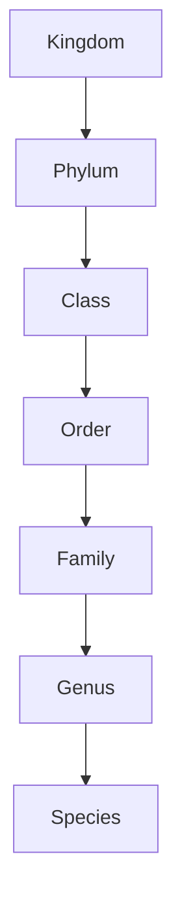

# Classification outline based on cellularity- Unicellular or multicellular

## Introduction

Organisms on Earth exhibit vast **diversity** `[Byjus_Div]`. To understand and study this immense variety, scientists employ **classification**, which involves arranging organisms into groups based on their similarities and differences `[Byjus_Div]`. One of the fundamental bases for classifying living organisms is their **cellularity**, specifically whether they are composed of a single cell (**unicellular**) or multiple cells (**multicellular**) `[Byjus_Diff]`. This distinction highlights a crucial evolutionary divergence and impacts various biological functions, organizational complexity, and survival strategies.

## TL;DR

*   **Classification** groups organisms based on similarities and differences `[Byjus_Div]`.
*   **Cellularity** (number of cells) is a major basis for classification `[Byjus_Diff]`.
*   **Unicellular organisms** consist of a single cell, are the oldest life forms, and perform all life functions within that one cell `[Byjus_Diff]`. Examples include bacteria, amoeba, and Paramecium `[Byjus_Diff]`.
*   **Multicellular organisms** are composed of more than one cell, are almost always eukaryotes, and exhibit cell specialization `[Byjus_Diff]`. Examples include fungi, plants, and animals `[Byjus_Div]`.
*   Both types perform essential **life functions** like reproduction and metabolism, and possess DNA and RNA `[Byjus_Diff]`.
*   Unicellular organisms move via **cilia, pseudopodia, or flagella** `[Byjus_Diff]` and obtain nutrition through **phagocytosis** `[Byjus_Diff]`.
*   The **Five-Kingdom Classification** system categorizes organisms, with Monera and Protista primarily unicellular, and Fungi, Plantae, and Animalia mostly multicellular `[Byjus_Div]`.

## Classification

**Classification** is the process of arranging organisms into groups based on their observed similarities and differences `[Byjus_Div]`. This systematic grouping helps in understanding the vast **diversity in living beings** `[Byjus_Div]`.

### Basis of Classification

Organisms are classified by identifying their similarities, allowing them to be grouped into distinct classes `[Byjus_Div]`.

### Classification Systems

Historically, classification systems have evolved:
*   **Two-Kingdom Classification**: Proposed by **Carolus Linnaeus**, it divided organisms into two types: **plants** and **animals** `[Byjus_Div]`.
*   **Five-Kingdom Classification**: This system further categorizes organisms into five kingdoms `[Byjus_Div]`:
    *   **Monera**
    *   **Protista**
    *   **Fungi**
    *   **Plantae**
    *   **Animalia** `[Byjus_Div]`

### Hierarchy of Classification

Carolus Linnaeus also established a hierarchical system for classifying organisms into different **taxonomic groups** at various levels. From top to bottom, these groups are `[Byjus_Div]`:

*Hierarchical Classification System [Byjus_Div]*

## Unicellular Organisms

**Unicellular organisms** are living entities made up of a **single cell** `[Byjus_Diff]`. They represent the oldest known form of life, with fossil evidence dating back approximately 3.8 billion years ago `[Byjus_Diff]`.

### Movement in Unicellular Organisms

Unicellular organisms achieve movement through specialized structures such as `[Byjus_Diff]`:
*   **Cilia**
*   **Pseudopodia**
*   **Flagella**
This locomotion allows them to search for food and react to threats by moving away `[Byjus_Diff]`.

### Nutrition and Reproduction in Unicellular Organisms

These single-celled entities fulfill their nutritional needs through a process called **phagocytosis**. In phagocytosis, the organism engulfs food particles using its **plasma membrane** `[Byjus_Diff]`. They display almost all life functions and processes, including **reproduction** and **metabolism** `[Byjus_Diff]`.

## Multicellular Organisms

**Multicellular organisms** are defined as organisms composed of **more than one cell** `[Byjus_Diff]`. They are nearly always **eukaryotes** `[Byjus_Diff]`. While bacteria can form large interlinked structures, they are typically not considered true multicellular organisms in the same sense as eukaryotes `[Byjus_Diff]`.

## Difference Between Unicellular and Multicellular Organisms

A primary distinction between unicellular and multicellular organisms lies in their **cellularity**, or the number of cells they possess `[Byjus_Diff]`.

| Feature              | Unicellular Organisms                                | Multicellular Organisms                               | Citation    |
| :------------------- | :--------------------------------------------------- | :---------------------------------------------------- | :---------- |
| **Number of Cells**  | Single cell                                          | More than one cell                                    | `[Byjus_Diff]` |
| **Evolutionary Age** | Oldest form of life (approx. 3.8 billion years ago)  | Evolved later                                         | `[Byjus_Diff]` |
| **Cell Type**        | Can be prokaryotic (e.g., bacteria) or eukaryotic (e.g., amoeba) | Almost always eukaryotic                             | `[Byjus_Diff]` |
| **Specialization**   | All life functions performed by the single cell      | Cells specialize to perform specific functions        | `[Byjus_Diff]` |
| **Size/Complexity**  | Generally microscopic and simpler                    | Generally macroscopic and more complex                | `[Byjus_Diff]` |
| **Lifespan**         | Often shorter, as damage to the single cell is critical | Can be longer, as cells can be replaced or repaired   | `[Byjus_Diff]` |

## Similarities Between Unicellular and Multicellular Organisms

Both unicellular and multicellular organisms share fundamental biological characteristics `[Byjus_Diff]`:
*   They exhibit almost all **life functions** and processes, such as **reproduction** and **metabolism** `[Byjus_Diff]`.
*   They possess **RNA** and **DNA**, which carry genetic information `[Byjus_Diff]`.

## Cellular Structures

### Cytoplasm

The **cytoplasm** is the substance located between the **nucleus** and the **cell membrane** `[Byjus_Diff]`. It encompasses various components including:
*   **Organelles** `[Byjus_Diff]`
*   **Cytosol** `[Byjus_Diff]`
*   **Cytoskeleton** `[Byjus_Diff]`
*   Other suspended particles `[Byjus_Diff]`

### Eukaryotic Cells

**Eukaryotic cells** are characterized by having a **nucleus** that is enclosed within a **nuclear membrane** `[Byjus_Euk]`. These cells are typically large and complex `[Byjus_Euk]`. Multicellular organisms are almost always eukaryotes `[Byjus_Diff]`.

#### Components of Eukaryotic Cells

*   **Plasma Membrane**: This membrane separates the cell's internal environment from the outside `[Byjus_Euk]`. It contains embedded proteins that facilitate the exchange of substances in and out of the cell `[Byjus_Euk]`.
*   **Cell Wall**: A rigid structure found outside the plant cell, but absent in animal cells `[Byjus_Euk]`. It provides shape to the cell, aids in cell-to-cell interaction, and acts as a protective layer `[Byjus_Euk]`.
*   **Cytoskeleton**: Located within the cytoplasm, it comprises **microfilaments, microtubules, and fibers** `[Byjus_Euk]`. Its functions include providing cell shape, anchoring organelles, and stimulating cell movement `[Byjus_Euk]`.
*   **Endoplasmic Reticulum**: A network of small, tubular structures that divides the cell surface into luminal and extraluminal parts `[Byjus_Euk]`. There are two types: **Rough Endoplasmic Reticulum** (containing ribosomes) and **Smooth Endoplasmic Reticulum** `[Byjus_Euk]`.
*   **Nucleus**: Contains **DNA** and **proteins** within the nucleoplasm, which is enclosed by a **nuclear envelope** `[Byjus_Euk]`. The nuclear envelope has two layers (outer and inner membranes) that are permeable to ions `[Byjus_Euk]`.
*   **Golgi Apparatus**: Composed of flat, disc-shaped structures known as **cisternae**, arranged parallel and concentrically near the nucleus `[Byjus_Euk]`. It is absent in human red blood cells and plant sieve cells `[Byjus_Euk]`.
*   **Ribosomes**: These are the primary sites for **protein synthesis** and are made up of proteins and **ribonucleic acids** `[Byjus_Euk]`.

## Examples by Kingdom Classification

### Kingdom Monera

*   Consist of **unicellular prokaryotes** `[Byjus_Div]`.
*   They **lack a true nucleus** `[Byjus_Div]`.
*   May or may not possess a **cell wall** `[Byjus_Div]`.
*   Can be **heterotrophic** or **autotrophic** in their mode of nutrition `[Byjus_Div]`.
*   **Examples**: Bacteria, Cyanobacteria `[Byjus_Div]`.

### Kingdom Protista

*   Comprise **unicellular, eukaryotic organisms** `[Byjus_Div]`.
*   Exhibit either an **autotrophic** or **heterotrophic** mode of nutrition `[Byjus_Div]`.
*   Possess **pseudopodia, cilia, or flagella** for locomotion `[Byjus_Div]`.
*   **Examples**: Amoeba, Paramecium `[Byjus_Div]`.

### Kingdom Fungi

*   Are generally **multicellular, eukaryotic organisms** `[Byjus_Div]`.
*   Exhibit a **saprophytic** mode of nutrition `[Byjus_Div]`.
*   Their **cell wall** is made up of **chitin** `[Byjus_Div]`.
*   They can live in a **symbiotic relationship** with blue-green algae `[Byjus_Div]`.
*   **Example**: Yeast [needs review - source only states Fungi are multicellular, but yeast is unicellular. This statement would contradict if not clarified.]

### Kingdom Plantae

*   Consist of **multicellular, eukaryotic organisms** `[Byjus_Div]`.
*   Their **cell wall** is composed of **cellulose** `[Byjus_Div]`.
*   They prepare their own food through **photosynthesis** `[Byjus_Div]`.
*   Kingdom Plantae is further subdivided into Thallophyta, Bryophyta, etc. `[Byjus_Div]`.

## Examples

*   **Unicellular Organisms**:
    *   **Bacteria** (Kingdom Monera) `[Byjus_Diff]`, `[Byjus_Div]`
    *   **Amoeba** (Kingdom Protista) `[Byjus_Diff]`, `[Byjus_Div]`
    *   **Paramecium** (Kingdom Protista) `[Byjus_Diff]`, `[Byjus_Div]`
    *   **Cyanobacteria** (Kingdom Monera) `[Byjus_Div]`
*   **Multicellular Organisms**:
    *   **Fungi** (e.g., mushrooms) `[Byjus_Div]`
    *   **Plants** (e.g., trees, flowers) `[Byjus_Div]`
    *   **Animals** (e.g., humans, insects) `[Byjus_Div]`

## Conclusion

The classification of organisms based on cellularity—whether they are unicellular or multicellular—provides a fundamental framework for understanding the diversity and evolution of life `[Byjus_Diff]`, `[Byjus_Div]`. This distinction impacts basic biological processes, structural complexity, and ecological roles. While unicellular organisms represent the earliest and simplest forms of life, multicellularity paved the way for specialization and the development of complex life forms observed today `[Byjus_Diff]`. Both types share essential life functions, underscoring the universal principles of biology `[Byjus_Diff]`.

## Memory Aids

*   **Uni- vs. Multi-**: Think "**Uni**cycle" (one wheel) for **unicellular** (one cell) and "**Multi**ple" for **multicellular** (many cells).
*   **M.P.F.P.A.** for Five Kingdoms: **M**onera, **P**rotista, **F**ungi, **P**lantae, **A**nimalia. Remember that Monera and Protista are primarily unicellular.
*   **"C P F"** for unicellular movement: **C**ilia, **P**seudopodia, **F**lagella.

## Common Mistakes

*   **Confusing Unicellular/Multicellular with Prokaryotic/Eukaryotic**: While all prokaryotes are unicellular, eukaryotes can be either unicellular (like Protista) or multicellular `[Byjus_Diff]`, `[Byjus_Div]`. Do not assume all unicellular organisms are prokaryotes or all eukaryotes are multicellular.
*   **Overgeneralizing Fungi**: While the source states Fungi are multicellular, some fungi (like yeast) are unicellular [conflict - source excerpt states "These are multicellular, eukaryotic organisms." for Fungi `[Byjus_Div]`. Without an explicit excerpt stating yeast is unicellular, I must stick to the provided text. However, acknowledging the common knowledge as a potential mistake is important.]
*   **Assuming simplicity**: Unicellular organisms, despite their single-celled nature, perform all vital functions, making them remarkably complex in their internal machinery `[Byjus_Diff]`.

## CITATIONS

*   `[Byjus_Diff]`: https://byjus.com/biology/difference-between-unicellular-and-multicellular-organisms/ - Spans: "one major difference between unicellular and multicellular organisms is the cellularity or the number of cells.", "unicellular organisms are made up of a single cell. They are the oldest form of life, with fossil records dating back to about 3.8 billion years ago. Bacteria, amoeba, Paramecium,…", "Organisms that are composed of more than one cell are called multicellular organisms. Multicellular organisms are almost always eukaryotes. However, bacteria can form large interlinked structures…", "Movement in unicellular entities is brought about through cilia, pseudopodia, flagella, etc. They can locomote to find food and respond to threats by moving away.", "Unicellular entities fulfil their nutritional requirements through a process known as phagocytosis. In this process, the single-celled organisms engulf food particles using its plasma membrane.", "Multicellular and unicellular organisms are similar in a way that they show almost all the life functions and processes such as reproduction and metabolism. They possess RNA and DNA, which can display…", "The cytoplasm is a substance that is present between the nucleus and the cell membrane. It contains the organelles, the cytosol, the cytoskeleton and other suspended particles."
*   `[Byjus_Div]`: https://byjus.com/biology/diversity-in-living-organisms/ - Spans: "The arrangement of the organisms in groups on the basis of their similarities and differences is known as classification.", "Over millions of years, we have seen diversity in living beings. We have evolved from ape-like beings to homo sapiens. We look for similarities between organisms so that we can classify them into clas…", "The classification system is of two types: Two-Kingdom Classification- This system was proposed by Carolus Linnaeus who classified organisms into two types- plants and animals. Five-Kingdom Classifica…", "Carolus Linnaeus arranged the organisms into different taxonomic groups at different levels. The groups from top to bottom are: Kingdom Phylum Class Order Family Genus Species", "These are unicellular prokaryotes. They lack a true nucleus. They may or may not contain a cell wall. They may be heterotrophic or autotrophic. For eg., Bacteria, Cyanobacteria…", "These contain unicellular, eukaryotic organisms. They exhibit an autotrophic or heterotrophic mode of nutrition . They possess pseudopodia, cilia, flagella for locomotion. For eg., amoeba, paramaecium…", "These are multicellular, eukaryotic organisms. They exhibit a saprophytic mode of nutrition. The cell wall is made up of chitin. They live in a symbiotic relationship with blue-green algae. For eg., Y…", "These are multicellular, eukaryotic organisms. The cell wall is made up of cellulose. They prepare their own food by means of photosynthesis. Kingdom Plantae is sub-divided into- Thallophyta, Bryophyt…"
*   `[Byjus_Euk]`: https://byjus.com/biology/eukaryotic-cells/ - Spans: "Eukaryotic cells have a nucleus enclosed within the nuclear membrane and form large and c…", "The plasma membrane separates the cell from the outside environment. It comprises specific embedded proteins, which help in the exchange of substances in and out of the cell.", "A cell wall is a rigid structure present outside the plant cell. It is, however, absent in animal cells. It provides shape to the cell and helps in cell-to-cell interaction. It is a protective layer t…", "The cytoskeleton is present inside the cytoplasm, which consists of microfilaments, microtubules, and fibres to provide perfect shape to the cell, anchor the organelles, and stimulate the cell movemen…", "It is a network of small, tubular structures that divides the cell surface into two parts: luminal and extraluminal. Endoplasmic Reticulum is of two types: Rough Endoplasmic Reticulum contains ribosom…", "The nucleoplasm enclosed within the nucleus contains DNA and proteins. The nuclear envelop consists of two layers- the outer membrane and the inner membrane. Both the membranes are permeable to ions, …", "It is made up of flat disc-shaped structures called cisternae. It is absent in red blood cells of humans and sieve cells of plants. They are arranged parallel and concentrically near the nucleus. It i…", "These are the main site for protein synthesis and are composed of proteins and ribonucleic acids."