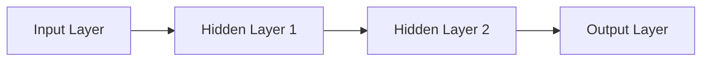
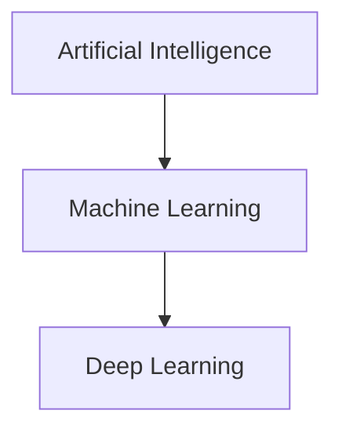

# Deep Learning

## Introduction

Deep Learning is a significant and rapidly growing field within artificial intelligence (AI) [Scaler]. It involves training complex neural networks, inspired by the human brain, to process data and learn patterns [GFG]. This approach has enabled machines to achieve high accuracy in various tasks, from understanding visual data to generating human language [GFG].

## TL;DR

*   Deep Learning is a subset of Machine Learning, which is a subset of Artificial Intelligence [GFG].
*   It utilizes multi-layered neural networks inspired by the human brain [GFG].
*   Key components include layers, neurons, weights, biases, activation functions, and optimization algorithms [GFG].
*   Deep learning excels in tasks like image recognition, natural language processing, and speech recognition [GFG].
*   Advantages include high accuracy and automated feature engineering [GFG].
*   Popular models are CNNs for images, RNNs for sequences, and Generative Models for data generation [GFG].

## How Deep Learning Works

Deep Learning fundamentally relies on neural networks, which are inspired by the human brain [GFG]. These networks consist of multiple layers of interconnected nodes or "neurons" [GFG]. Data flows through these layers, where each neuron performs specific calculations [GFG]. The neurons collaborate to process input data, allowing the network to learn and make predictions [GFG].

## Basic Components of Neural Networks

The fundamental building blocks of a neural network include [GFG]:
*   **Layers**: Neural networks are structured into multiple layers, including an input layer, one or more hidden layers, and an output layer [GFG].
*   **Weights and Biases**: These are adjustable parameters within the network that are learned during training to minimize errors [GFG].
*   **Forward Propagation**: The process where input data moves through the network layers, from input to output, to generate a prediction [GFG].
*   **Activation Functions**: Functions applied to the output of each neuron to introduce non-linearity, enabling the network to learn complex patterns [GFG].
*   **Loss Functions**: Measures the discrepancy between the network's predictions and the actual target values [GFG].
*   **Backpropagation**: An algorithm used to adjust the network's weights and biases by propagating the error backwards through the layers, based on the loss function [GFG].
*   **Learning Rate**: A hyperparameter that determines the step size at which weights are adjusted during backpropagation [GFG].

## Evolution of Neural Architectures

The journey of deep learning began in the 1950s with the introduction of the **perceptron** [GFG]. This was a single-layer neural network [GFG]. While innovative, perceptrons had a limitation: they could only solve problems that were linearly separable [GFG].

## Types of Neural Networks and Deep Learning Models

Deep learning employs various types of neural network architectures, each suited for different kinds of tasks and data [GFG].

*   **Feedforward Neural Networks (FNNs)**:
    *   The simplest type of Artificial Neural Network (ANN) [GFG].
    *   Data flows in one direction, from the input layer to the output layer [GFG].
    *   Typically used for basic tasks like classification [GFG].
*   **Convolutional Neural Networks (CNNs)**:
    *   Designed specifically for processing grid-like data, such as images [GFG].
    *   Utilize convolutional layers to automatically detect patterns and features in the data [GFG].
*   **Recurrent Neural Networks (RNNs)**:
    *   Used for modeling sequence data, such as time series or natural language [GFG].
*   **Generative Models**:
    *   A class of models that generate new data resembling the training data [GFG].
    *   Key types include Generative Adversarial Networks (GANs) and Autoencoders [GFG].
*   **Deep Reinforcement Learning (DRL)**:
    *   Combines the representation learning capabilities of deep learning with the decision-making abilities of reinforcement learning [GFG].
    *   Helps agents learn optimal behaviors in complex environments [GFG].
*   **Transformer**: A notable deep learning architecture [Wiki].

## Optimization Algorithms in Deep Learning

Optimization algorithms are crucial in deep learning as they aim to minimize the loss function [GFG]. This is achieved by iteratively adjusting the weights and biases of the model [GFG]. One of the most common optimization algorithms is Gradient Descent [GFG].

## Machine Learning vs. Deep Learning

Both Machine Learning and Deep Learning are branches of Artificial Intelligence (AI) [GFG]. While they are often applied to similar tasks, they possess distinct capabilities and approaches [GFG].

*   **Machine Learning**: Primarily applies statistical algorithms [GFG].
*   **Deep Learning**: [needs review - specific approach in comparison context not detailed in excerpts; however, it is known to use multi-layered neural networks as discussed elsewhere [GFG]].

## Advantages of Deep Learning

Deep learning offers several significant advantages:
*   **High Accuracy**: Deep learning algorithms can achieve state-of-the-art performance in various complex tasks, including image recognition and natural language processing [GFG].
*   **Automated Feature Engineering**: Deep learning models can automatically learn and extract relevant features from raw data, reducing the need for manual feature selection [GFG].

## Applications of Deep Learning

Deep learning has revolutionized numerous fields, enabling machines to perform complex tasks previously thought to be exclusive to human intelligence.

*   **Computer Vision / Image and Video Recognition**:
    *   Enables machines to identify and understand visual data [GFG].
    *   Used in object detection and recognition [GFG].
    *   Essential for self-driving cars to detect pedestrians, traffic signs, and other vehicles [GFG].
    *   Aids in medical imaging tools for detecting diseases [GFG].
*   **Natural Language Processing (NLP)**:
    *   Allows machines to understand and generate human language [GFG].
    *   Applications include automatic text generation [GFG].
    *   Powers virtual assistants like Siri and Alexa to interpret spoken commands and respond naturally [GFG].
    *   Used in chatbots for human-like conversations [GFG].
*   **Speech Recognition**:
    *   Makes voice interaction with machines more practical and accurate [GFG].
    *   Converts spoken language into text and understands its meaning [GFG].
    *   Used in voice typing and dictation tools [GFG].
*   **Reinforcement Learning**:
    *   Deep learning trains agents to take actions in an environment to maximize a reward [GFG].
*   **Recommendation Systems**:
    *   Utilizes deep learning to personalize content and product suggestions [GFG].
    *   Learns from user behavior to improve experiences on platforms like Netflix and YouTube [GFG].
*   **Healthcare and Drug Discovery**:
    *   Speeds up diagnosis and drug development [GFG].
    *   Assists doctors and researchers in making medical decisions with higher confidence [GFG].
    *   Used in medical imaging to detect diseases [GFG].
*   **Cybersecurity and Scientific Research**:
    *   Plays a key role in securing digital systems by detecting threats [GFG].
    *   Supports faster breakthroughs in scientific discovery [GFG].

## Examples

Specific real-world applications of deep learning include:
*   **Self-driving cars** detecting pedestrians and traffic signs using cameras [GFG].
*   **Virtual assistants** like Siri and Alexa interpreting spoken commands [GFG].
*   **Netflix and YouTube** suggesting personalized video content to users [GFG].
*   **Medical imaging tools** detecting diseases with high accuracy [GFG].
*   **Cybersecurity systems** identifying and countering digital threats [GFG].
*   **Voice typing and dictation tools** converting speech to text [GFG].

## Conclusion

Deep learning has emerged as a transformative technology, enabling remarkable advancements across diverse fields through its ability to process complex data using neural networks [GFG]. Its continued evolution promises further innovations and applications, driving the future of artificial intelligence [needs review].

## Memory Aids

*   **"Neurons like Brain Cells"**: Remember that neural networks are inspired by the human brain, with layers of interconnected "neurons" processing information [GFG].
*   **"CNN for Pictures, RNN for Stories"**: Associate CNNs with image-based tasks (like recognizing pictures) and RNNs with sequence data (like stories or time series) [GFG].
*   **"Optimization minimizes Loss"**: Think of optimization algorithms as the "fine-tuners" that reduce the "error" (loss) in the model's predictions by adjusting its internal parameters [GFG].

## Common Mistakes

*   **Confusing Machine Learning and Deep Learning**: While related, remember that Deep Learning is a subset of Machine Learning, using a specific type of algorithm (deep neural networks) [GFG].
*   **Ignoring Prerequisites**: Attempting to learn deep learning without foundational knowledge in programming (especially Python), linear algebra, and calculus can be challenging [Scaler].
*   **Overlooking the Role of Data**: Deep learning models heavily rely on large amounts of high-quality data; poor data quality or insufficient data can hinder performance [needs review].

## Free Deep Learning Course from Scaler

Scaler offers a free Deep Learning course designed for beginners, providing a comprehensive introduction to the field [Scaler].

*   **What you'll learn**: The course covers skills essential for aspiring AI and ML professionals [Scaler].
*   **Pre-requisites**: Basic programming knowledge (Python is recommended) and an understanding of fundamental mathematical concepts (linear algebra, calculus, statistics) are necessary [Scaler].
*   **Who should learn**: It is highly valuable for individuals looking to enter AI and Machine Learning fields, as deep learning is a key subset [Scaler].
*   **Certification**: Upon successful completion, participants receive a Certificate of Excellence from Scaler [Scaler].

## CITATIONS

*   **[GFG]** GeeksforGeeks:
    *   "Introduction to Deep Learning": https://www.geeksforgeeks.org/deep-learning/introduction-deep-learning/
    *   "Deep Learning Tutorial": https://www.geeksforgeeks.org/deep-learning/deep-learning-tutorial/
    *   "Deep Learning Examples: Practical Applications in Real Life": https://www.geeksforgeeks.org/deep-learning/deep-learning-examples/
*   **[Scaler]** Scaler:
    *   "Free Deep Learning Course with Certification": https://www.scaler.com/topics/course/deep-learning-free-course/
*   **[Wiki]** Wikipedia:
    *   "Deep learning": https://en.wikipedia.org/wiki/Deep_learning
    *   "Transformer (deep learning architecture)": https://en.wikipedia.org/wiki/Transformer_(deep_learning_architecture)