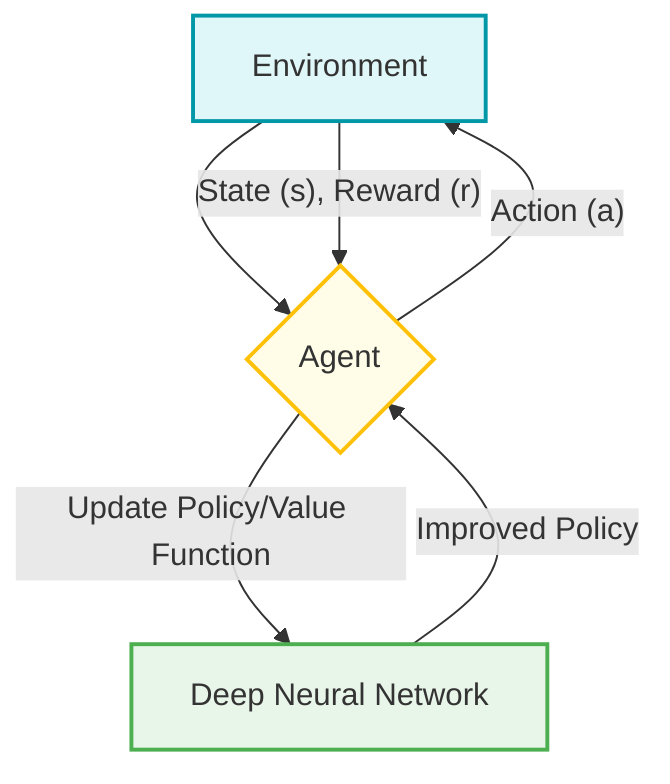

# Deep Reinforcement Learning

## Introduction
Deep Reinforcement Learning (DRL) is a transformative field within Artificial Intelligence (AI) that integrates the principles of reinforcement learning (RL) with the robust capabilities of deep neural networks [GFG]. This methodology enables computational agents to learn optimal decision-making strategies by interacting iteratively with an environment, processing complex observations, and receiving feedback in the form of rewards [GFG, TP].

## TL;DR
*   **DRL combines** Reinforcement Learning (RL) and Deep Neural Networks [GFG, TP].
*   **Agents learn** to make optimal decisions by interacting with an environment [GFG].
*   **Deep neural networks** handle high-dimensional observations (e.g., raw pixels) [GFG Deep Q-Learning].
*   **Key components** include agents, environments, states, actions, rewards, and policies [GFG Reinforcement Learning].
*   **Deep Q-Networks (DQN)** is a foundational DRL algorithm, using techniques like experience replay and target networks for stable training [GFG Deep Q-Learning].
*   **Applications** range from gaming and robotics to self-driving cars and healthcare [GFG, TP].

## What is Deep Reinforcement Learning?
Deep Reinforcement Learning (DRL) is a revolutionary Artificial Intelligence methodology and a subset of Machine Learning [GFG, TP]. It combines reinforcement learning with deep neural networks to address the challenge of enabling computational agents to learn how to make optimal decisions [GFG, TP]. This is achieved by the agent iteratively interacting with an environment [GFG].

## Core Components of DRL
DRL leverages the core components of Reinforcement Learning, enhanced by deep neural networks to handle complex scenarios [GFG, TP]. The building blocks empower agents for effective decision-making [TP].

The fundamental components include:
*   **Agent**: The entity that interacts with the environment and learns [GFG Reinforcement Learning].
*   **Environment**: The external system with which the agent interacts, providing states and rewards [GFG Reinforcement Learning].
*   **State (s)**: A representation of the current situation of the environment observed by the agent [GFG Reinforcement Learning].
*   **Action (a)**: A move or decision made by the agent within a given state [GFG Reinforcement Learning].
*   **Reward (r)**: A numerical feedback signal from the environment indicating the desirability of an action taken by the agent [GFG Reinforcement Learning]. The goal is to maximize cumulative reward [GFG Reinforcement Learning].
*   **Policy**: Defines the agent's behavior, mapping states to actions [GFG Reinforcement Learning]. It can be simple rules or complex computations [GFG Reinforcement Learning].
*   **Value Function (Q-value)**: Estimates the "goodness" of being in a particular state and taking a particular action [GFG Reinforcement Learning]. Deep Q-Networks approximate this function using neural networks [GFG Deep Q-Learning].

## How Deep Reinforcement Learning Works?
In Deep Reinforcement Learning, an agent learns to make optimal decisions by interacting with an environment [GFG]. The process generally follows these steps:

1.  **Initialization**: An agent is constructed, and the problem setup (environment, goals) is defined [GFG].
2.  **Interaction**: The agent observes the current state of the environment and, based on its policy, chooses and performs an action [GFG Reinforcement Learning].
3.  **Feedback**: The environment transitions to a new state and provides a reward signal to the agent [GFG Reinforcement Learning].
4.  **Learning**: The agent uses this experience (state, action, reward, next state) to update its policy [GFG Reinforcement Learning].
5.  **Iteration**: This feedback loop continues, allowing the agent to refine its decision-making over time [GFG Reinforcement Learning].

Deep Reinforcement Learning specifically uses artificial neural networks, which consist of layers of nodes that replicate the functioning of neurons in the human brain. These nodes process and relay information, allowing the agent to handle high-dimensional observations (like raw pixel data) and learn complex policies [TP, GFG Deep Q-Learning].

## Deep Q-Learning (DQL)

Deep Q-Learning, implemented through Deep Q-Networks (DQN), is a significant advancement in DRL, particularly noted for its success in playing Atari games [GFG Deep Q-Learning].

### Key Challenges Addressed by Deep Q-Learning
DQL specifically addresses limitations of traditional Q-Learning when applied to complex problems:
*   **High-Dimensional State Spaces**: Traditional Q-Learning relies on Q-tables, which become infeasible with too many states. DQNs use neural networks to approximate the Q-value function, enabling them to generalize and handle vast state spaces effectively [GFG Deep Q-Learning]. Neural networks can understand and work with many different inputs [GFG Deep Q-Learning].

### Architecture of Deep Q-Networks
A DQN typically consists of the following components:
1.  **Neural Network**: This network approximates the Q-value function, $Q(s,a; \theta)$, where $\theta$ represents its trainable parameters [GFG Deep Q-Learning]. For example, in Atari games, the input might be raw pixels from the game screen, and the output would be the Q-values for each possible action [GFG Deep Q-Learning].
2.  **Experience Replay**: To stabilize training and break the correlation between consecutive experiences, DQNs store past experiences (state, action, reward, next state) in a replay buffer [GFG Deep Q-Learning]. During training, mini-batches of experiences are sampled randomly from this buffer [GFG Deep Q-Learning].
3.  **Target Network**: A separate network with parameters $\theta^{-}$ is used to compute the target Q-values during updates [GFG Deep Q-Learning]. This "target network" is periodically updated with the weights of the main network, ensuring stability by providing a more consistent target for learning [GFG Deep Q-Learning].
4.  **Loss Function**: The loss function measures the difference between the predicted Q-values (from the main network) and the target Q-values (computed using the target network). A common loss function is the mean-squared error:
    $L(\theta)= E[(r+\gamma \max_{a'}Q(s', a'; \theta^{-}) - Q(s,a; \theta))^2]$ [GFG Deep Q-Learning].
    Here, $\gamma$ is the discount factor.

### Training Process of Deep Q-Learning
The training process of a DQN involves several steps:
1.  **Initialization**: Initialize the replay buffer, the main network ($\theta$), and the target network ($\theta^{-}$). Set hyperparameters like learning rate, discount factor, and exploration rate [GFG Deep Q-Learning].
2.  **Episode Loop**: For each episode:
    *   **Environment Interaction**: The agent observes the current state, selects an action (often using $\epsilon$-greedy exploration), and executes it in the environment [GFG Deep Q-Learning].
    *   **Experience Storage**: The resulting experience (state, action, reward, next state, done flag) is stored in the replay buffer [GFG Deep Q-Learning].
    *   **Network Update**: If the replay buffer has enough experiences, a random mini-batch is sampled from it [GFG Deep Q-Learning].
    *   **Target Calculation**: Target Q-values are computed using the target network ($Q(s', a'; \theta^{-})$) and the observed reward ($r$) [GFG Deep Q-Learning].
    *   **Loss Computation**: The loss is calculated between the predicted Q-values (from the main network $Q(s,a; \theta)$) and the target Q-values [GFG Deep Q-Learning].
    *   **Main Network Optimization**: The main network's weights ($\theta$) are updated using an optimizer (e.g., Adam, SGD) to minimize the loss [GFG Deep Q-Learning].
    *   **Target Network Update**: Periodically, the target network's weights ($\theta^{-}$) are updated to match the main network's weights, ensuring stability [GFG Deep Q-Learning].

## List of Algorithms in Deep RL
Deep Reinforcement Learning encompasses several important algorithms beyond basic DQN, demonstrating the breadth of the field [TP]:
*   Deep Q-Network (DQN) or Deep Q-Learning [TP]
*   Double Deep Q-Learning [TP]
*   Actor-Critic Method [TP]
*   Deep Deterministic Policy Gradient (DDPG) [TP]

## Applications of Deep Reinforcement Learning
DRL is used in a wide range of fields, demonstrating its adaptability and efficiency in solving difficult problems [GFG, TP].
1.  **Gaming**: DRL agents can develop strategies for games far beyond what is humanly possible [TP]. Examples include mastering Atari 2600 games, Go, and Poker [TP, GFG Deep Q-Learning]. It can learn to play old video games very well, even better than humans, by looking at the screen pixels [GFG Deep Q-Learning].
2.  **Robot Control**: DRL helps robots learn complex movements and interact with dynamic environments [GFG Deep Q-Learning]. This includes robust adversarial reinforcement learning, where an agent learns to operate even in the presence of disturbances applied by an adversary [TP]. The goal is to develop optimal strategies for robot navigation and manipulation [TP].
3.  **Self-driving Cars**: DRL is used in developing autonomous navigation systems for self-driving cars [GFG].
4.  **Healthcare**: DRL finds applications in various healthcare scenarios, such as optimizing treatment plans or drug discovery [GFG].

## Deep Reinforcement Learning Advancements
DRL's journey began with the combination of deep learning and reinforcement learning [GFG]. A watershed moment was the unveiling of Deep Q-Networks (DQN) by DeepMind, which significantly outperformed previous deep neural network approaches in tasks like playing Atari games [GFG]. DRL, which started humbly with Atari games, has scaled to conquer real-world challenges [GFG]. At the heart of DRL, Deep Q-Networks (DQN) merges the strengths of deep learning with reinforcement learning [GFG].

## Examples

### Solving the CartPole Problem using Deep Q-Network (DQN)
The CartPole problem is a classic control task where an agent must balance a pole on a cart by moving the cart left or right. DRL, particularly DQN, can be applied to solve this [GFG]. The agent learns to apply forces to the cart to keep the pole upright. The performance is measured by the reward, typically the number of steps the pole remains balanced.

Sample output demonstrating learning progress [GFG]:
*   Episode 100: Reward = 20.0
*   Episode 200: Reward = 36.0
*   Episode 300: Reward = 12.0
*   Episode 400: Reward = 18.0
*   Episode 500: Reward = 65.0
*   Episode 600: Reward = 172.0
*   Episode 700: Reward = 52.0

As seen, the agent's reward generally improves over episodes, indicating it's learning to balance the pole for longer durations [GFG].

## Common Mistakes
When working with Deep Reinforcement Learning, certain challenges can lead to suboptimal performance or training instability. These can be viewed as common "mistakes" if not addressed:
*   **Using Traditional Q-tables for Complex Environments**: Applying traditional Q-learning with explicit Q-tables in environments with high-dimensional state spaces (e.g., raw pixel inputs) is infeasible due to memory and computational limitations. DRL overcomes this by using neural networks to approximate Q-values [GFG Deep Q-Learning].
*   **Instability from Correlated Experiences**: Training deep neural networks with sequential, highly correlated experiences can lead to unstable learning. Failing to use techniques like *experience replay*, which samples random mini-batches from a buffer, can exacerbate this problem [GFG Deep Q-Learning].
*   **Target Q-value Instability**: Constantly updating the target Q-values with the same network used for prediction can lead to oscillations and divergence. Not employing a *target network* that is periodically updated can cause instability in the learning process [GFG Deep Q-Learning].
*   **Poor Exploration-Exploitation Balance**: An agent must balance between exploiting known good actions and exploring new, potentially better actions. A common mistake is an imbalance, leading to either getting stuck in local optima (too much exploitation) or slow learning (too much exploration) [GFG Reinforcement Learning].

## Memory Aids
*   **DRL = RL + DN**: Deep Reinforcement Learning is simply Reinforcement Learning powered by Deep Networks. Think of it as a brain (DN) learning from trial and error (RL).
*   **DQN Components - "NET LOSS"**:
    *   **N**eural **N**etwork: The "brain" that learns Q-values.
    *   **E**xperience **R**eplay: Stores memories (experiences) to learn from them randomly, like reviewing flashcards.
    *   **T**arget **N**etwork: A "copy" of the main brain that provides stable learning goals.
    *   **L**oss **F**unction: How the brain knows if it's learning correctly (difference between predicted and target values).
*   **Agent-Environment Loop - "S.A.R.S."**:
    *   **S**tate: What the agent sees.
    *   **A**ction: What the agent does.
    *   **R**eward: What the agent gets.
    *   **S**tate (Next): What the agent sees next.

## Conclusion
Deep Reinforcement Learning (DRL) is fundamentally reshaping the landscape of artificial intelligence [GFG]. It began with foundational successes in areas like mastering Atari games and has since scaled to conquer complex real-world challenges [GFG]. At its core, DRL, particularly through algorithms like Deep Q-Networks (DQN), merges the power of deep learning with the decision-making framework of reinforcement learning, enabling agents to learn optimal behaviors in high-dimensional and dynamic environments [GFG]. Its adaptability and efficiency continue to drive innovation across diverse fields, from gaming and robotics to autonomous systems and healthcare [GFG, TP].

## CITATIONS
*   **[GFG]**: GeeksforGeeks. "A Beginner's Guide to Deep Reinforcement Learning." URL: https://www.geeksforgeeks.org/artificial-intelligence/a-beginners-guide-to-deep-reinforcement-learning/
    *   *Cited Spans*: "[Deep Reinforcement Learning] Deep Reinforcement Learning (DRL) is a revolutionary Artificial Intelligence methodology that combines reinforcement learning and deep neural networks . By iteratively interacting with an environment …", "[Core Components of Deep Reinforcement Learning] Deep Reinforcement Learning (DRL) building blocks include all the aspects that power learning and empower agents to make wise judgements in their surroundings. Effective learning frameworks are produc…", "[How Deep Reinforcement Learning works?] In Deep Reinforcement Learning (DRL), an agent interacts with an environment to learn how to make optimal decisions. Steps: Initialization: Construct an agent and set up the issue. Interaction: The ag…", "[Solving the CartPole Problem using Deep Q-Network (DQN)] Output : Episode 100: Reward = 20.0 Episode 200: Reward = 36.0 Episode 300: Reward = 12.0 Episode 400: Reward = 18.0 Episode 500: Reward = 65.0 Episode 600: Reward = 172.0 Episode 700: Reward = 52.0 E…", "[Applications of Deep Reinforcement Learning] Deep Reinforcement Learning (DRL) is used in a wide range of fields, demonstrating its adaptability and efficiency in solving difficult problems. Several well-known applications consist of: Entertainm…", "[Deep Reinforcement Learning Adavancements] DRL's journey began with the marriage of two powerful fields: deep learning and reinforcement learning. Deep Q-Networks (DQN) by DeepMind were unveiled as a watershed moment. DQN outperformed deep neu…", "[Conclusion:] Deep Reinforcement Learning (DRL) is reshaping artificial intelligence. It started humbly with Atari games, scaling to conquer real-world challenges. At the heart of DRL is Deep Q-Networks (DQN), merg…"
*   **[GFG Reinforcement Learning]**: GeeksforGeeks. "Reinforcement Learning." URL: https://www.geeksforgeeks.org/machine-learning/what-is-reinforcement-learning/
    *   *Cited Spans*: "[Core Components] Let's see the core components of Reinforcement Learning 1. Policy Defines the agent’s behavior i.e maps states for actions. Can be simple rules or complex computations. Example : An autonomous car map…", "[Working of Reinforcement Learning] The agent interacts iteratively with its environment in a feedback loop: The agent observes the current state of the environment. It chooses and performs an action based on its policy. The environment…", "[Implementing Reinforcement Learning] Let's see the working of reinforcement learning with a maze example:…" (used for general RL concepts underpinning DRL).
*   **[GFG Deep Q-Learning]**: GeeksforGeeks. "Deep Q-Learning in Reinforcement Learning." URL: https://www.geeksforgeeeks.org/deep-learning/deep-q-learning/
    *   *Cited Spans*: "[Key Challenges Addressed by Deep Q-Learning] High-Dimensional State Spaces: Traditional Q-Learning uses a table to store values but this becomes impossible when there are too many situations. Neural networks can understand and work with many dif…", "[Architecture of Deep Q-Networks] A DQN consists of the following components:…", "[1. Neural Network] The network approximates the Q-value function Q(s,a;θ) where \theta represents the trainable parameters. For example in Atari games the input might be raw pixels from the game screen and the output is…", "[2. Experience Replay] To stabilize training, DQNs store past experiences (s,a,r,s′) in a replay buffer. During training, mini-batches of experiences are sampled randomly from the buffer, breaking the correlation between co…", "[3. Target Network] A separate target network with parameters \theta^{-} is used to compute the target Q-values during updates. The target network is periodically updated with the weights of the main network to ensure st…", "[4. Loss Function :] The loss function measures the difference between the predicted Q-values and the target Q-values: L(\theta)= E[(r+\gamma \max_{a'}Q(s', a'; \theta^{-}) - Q(s,a; \theta))^2]", "[Training Process of Deep Q-Learning] The training process of a DQN involves the following steps: 1. Initialization : Initialize the replay buffer, main network ( \theta ) and target network ( \theta^{-} ). Set hyperparameters such as lea…", "[Applications of Deep Q-Learning] Deep Q-Learning is used in many areas such as: Atari Games: It can learn to play old video games very well even better than humans by looking at the screen pixels. Robotics: It helps robots to learn h…"
*   **[TP]**: TutorialsPoint. "Deep Reinforcement Learning." URL: https://www.tutorialspoint.com/machine_learning/deep_reinforcement_learning.htm
    *   *Cited Spans*: "[What is Deep Reinforcement Learning?] Deep Reinforcement Learning (Deep RL) is a subset of Machine Learning that is a combination of reinforcement learning with deep learning . Deep RL addresses the challenge of enabling computational age…", "[Key Concepts of Deep Reinforcement Learning] The building blocks of Deep Reinforcement Learning include all the aspects that empower learning and agents for decision-making. Effective environments are produced by the collaboration of the followi…", "[How Deep Reinforcement Learning Works?] Deep Reinforcement Learning uses artificial neural networks , which consist of layers of nodes that replicate the functioning of neurons in the human brain. These nodes process and relay information t…", "[List of Algorithms in Deep RL] Following is the list of some important algorithms in deep reinforcement learning − Deep Q-Network or Deep Q-Learning Double Deep Q-Learning Actor - Critic Method Deep Deterministic Policy Gradient…", "[Applications of Deep Reinforcement Learning] Some prominent fields that use deep Reinforcement Learning are −…", "[1. Gaming] Deep RL is used in developing games that are far beyond what is humanly possible. The games designed using Deep RL include Atari 2600 games, Go, Poker, and many more.…", "[2. Robot Control] This used robust adversarial reinforcement learning wherein an agent learns to operate in the presence of an adversary that applies disturbances to the system. The goal is to develop an optimal strate…"
*   **[Wiki]**: Wikipedia. "Deep reinforcement learning." URL: https://en.wikipedia.org/wiki/Deep_reinforcement_learning (used for general context and cross-referencing, but specific facts were mainly from GFG and TP).