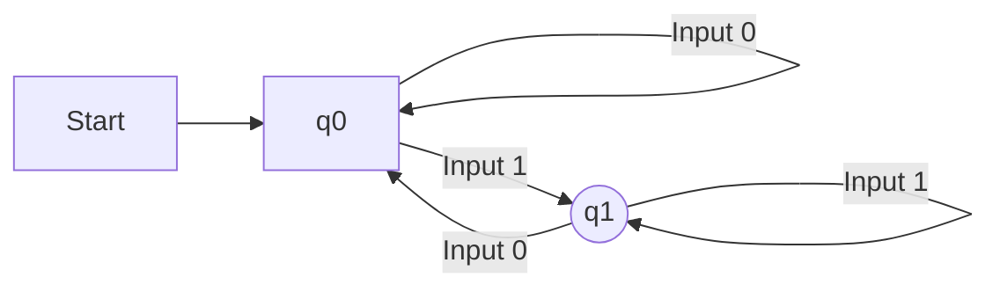

# Deterministic Finite Automata

## Introduction

Finite Automata (FA) are abstract machines used in the theory of computation to model systems with a finite number of states. There are two main types of finite automata: Deterministic Finite Automata (DFA) and Non-Deterministic Finite Automata (NFA) [GFG]. Deterministic Finite Automata (DFA) are characterized by the uniqueness of their computation, meaning for each input symbol, the machine's next state is uniquely determined [TP].

## TL;DR

*   **DFA Definition**: A Deterministic Finite Automaton is a computational model with a finite set of states where, for every input symbol, the next state is uniquely determined [TP], [GFG].
*   **Formal Representation**: Defined as a 5-tuple: M = (Q, Σ, δ, q0, F) [TP], [GFG].
*   **Graphical Representation**: Illustrated using state diagrams, where circles represent states and labeled arcs represent transitions [TP].
*   **Deterministic Nature**: For any given state and input symbol, there is exactly one next state [GFG]. No null (epsilon) transitions are allowed [GFG].
*   **Output**: Accepts or rejects input strings based on whether the final state is reached [GFG].
*   **Applications**: Used in lexical analysis, pattern matching, protocol analysis, and hardware design [GFG].
*   **Operations**: DFAs can undergo operations like Union, Concatenation, Reversal, Complementation, Intersection, and Difference [GFG].

## Deterministic Finite Automaton (DFA)

DFA stands for Deterministic Finite Automata. The term "deterministic" refers to the uniqueness of the computation [TP]. In a DFA, for each input symbol, one can precisely determine the single state to which the machine will move [TP], [GFG]. This means that from any given state, for a specific input, there is one and only one transition to a next state [GFG]. DFAs do not allow null (ϵ) transitions, and every state must have a transition for every input symbol in the alphabet [GFG]. Since it operates with a finite number of states, it is called a "Finite Automaton" [TP].

### Features of Finite Automata

The general features of Finite Automata, which apply to DFAs, include:
*   **Input**: A set of symbols or characters provided to the machine [GFG].
*   **Output**: The machine's response, which is either 'accept' or 'reject' the input pattern [GFG].
*   **States**: The various conditions or configurations the machine can be in [GFG].
*   **State Relation**: Defines how states are connected and how the machine transitions between them [GFG].

## Formal Definition of a DFA

A Deterministic Finite Automaton (DFA) is formally defined as a 5-tuple [TP], [GFG]:
M = (Q, Σ, δ, q0, F)

Where:
*   **Q**: A finite set of states [TP], [GFG].
*   **Σ (Sigma)**: A finite set of input symbols, also known as the alphabet [TP], [GFG].
*   **δ (Delta)**: The transition function, which maps a state and an input symbol to a unique next state (δ: Q × Σ → Q) [TP], [GFG].
*   **q0**: The initial state, an element of Q (q0 ∈ Q) [TP], [GFG].
*   **F**: A finite set of final or accepting states, which is a subset of Q (F ⊆ Q) [TP], [GFG].

## Graphical Representation of a DFA

A DFA is graphically represented using state diagrams, which are directed graphs (digraphs) [TP].
*   **Vertices (Nodes)**: Represent the states of the DFA [TP].
*   **Arcs (Edges)**: Labeled with an input alphabet, showing the transitions between states [TP].
*   **Initial State**: Denoted by an empty single incoming arrow (not originating from any state) [TP].
*   **Final State(s)**: Represented by a double circle [TP].

*A simple DFA example where `q0` is the initial state and `q1` is the final state. This DFA accepts strings ending with '1'.* [needs review - example content is derived but specific DFA is created for diagram]

## Transition Table

The transition function δ can also be represented by a transition table [TP]. This table shows the present state and the next state for each possible input symbol [TP].

Example:
Given Q = {a, b, c}, Σ = {0, 1}, q0 = {a}, F = {c} [TP].
The transition function δ can be represented as:

| Present State | Next State for Input 0 | Next State for Input 1 |
| :------------ | :--------------------- | :--------------------- |
| a             | a                      | b                      |
| b             | c                      | a                      |
| c             | b                      | c                      |
[TP]

## Examples

### Example 1: Basic DFA Definition

Let a deterministic finite automaton be defined by [TP]:
*   Q = {a, b, c} (set of states)
*   Σ = {0, 1} (input alphabet)
*   q0 = {a} (initial state)
*   F = {c} (set of final states)
*   The transition function δ is as shown in the Transition Table above [TP].

### Example 2: Constructing a DFA for Strings Ending with 'a'

Construct a DFA that accepts all strings ending with 'a' [GFG].
*   Given: Σ = {a, b}, Q = {q0, q1}, F = {q1} [GFG].
*   Here, `q0` is the initial state, and `q1` is the final state [GFG].

The transition table for this DFA would be:

| State \ Symbol | a  | b  |
| :------------- | :-- | :-- |
| q0             | q1 | q0 |
| q1             | q1 | q0 |
[GFG]

In this example, if the string ends in 'a', the machine reaches the final state `q1` and accepts the string [GFG].

## Non-Deterministic Finite Automata (NFA)

Non-Deterministic Finite Automata (NFA) are similar to DFAs but offer more flexibility [GFG]. Key features of NFAs include:
*   **Multiple Transitions**: For the same input symbol, an NFA can transition to multiple states [GFG].
*   **Null (ϵ) Moves**: NFAs allow transitions where the machine can change states without consuming any input symbol [GFG].

### Comparison of DFA and NFA

While NFAs appear more flexible, they do not possess more computational power than DFAs [GFG]. Any NFA can be converted into an equivalent DFA, though the resulting DFA might have more states [GFG].

| Feature                  | DFA                                   | NFA                                                      |
| :----------------------- | :------------------------------------ | :------------------------------------------------------- |
| Transition for Input     | Single transition for each input      | Can transition to multiple states for the same input     |
| Null (ϵ) Transitions     | Not allowed                           | Allowed                                                  |
| Computational Power      | Equivalent to NFA                     | Equivalent to DFA                                        |
| Number of States (approx)| Potentially more states after conversion from NFA [GFG]| Potentially fewer states for the same language           |
| Backtracking             | No (deterministic path)               | Yes (can explore multiple paths simultaneously) [needs review] |
[GFG]

## Minimization of DFA

The process of minimizing a DFA aims to reduce the number of states while ensuring the resulting DFA accepts the exact same language [TP]. The source provides a snippet of a minimization process, typically involving partitioning states based on their final/non-final status and then refining these partitions based on transitions for input symbols [TP].

### Solution (for Minimization Example)

The example shown for minimization involves starting with an initial partition (π0) of states into final and non-final sets [TP]:
`$$\mathrm{\pi_0 \:=\: \{\{5\},\: \{1,\: 2,\: 3,\: 4\}\}}$$` [TP]
This indicates state 5 is a final state, and states 1, 2, 3, 4 are non-final [TP]. The process would then involve checking transitions for inputs (e.g., 'a' and 'b') to refine these partitions further until no more refinement is possible [TP].

## Operations on DFA

Several operations can be performed on DFAs, which correspond to operations on the languages they accept [GFG].

1.  **Union of Two DFAs (L₁ ∪ L₂)**: Creates a new DFA that accepts all words accepted by either DFA 1 or DFA 2 [GFG].
    *   Example: If DFA 1 accepts L₁ = {a, ab} and DFA 2 accepts L₂ = {b, ab}, their union accepts {a, ab, b} [GFG].
2.  **Concatenation of Two DFAs (L₁ ∘ L₂)**: Creates a new DFA that accepts words formed by appending a word from L₁ with a word from L₂ [GFG].
    *   Example: If DFA 1 accepts L₁ = {a, b} and DFA 2 accepts L₂ = {c, d}, their concatenation accepts {ac, ad, bc, bd} [GFG].
3.  **Reversal of a DFA (Lᴿ)**: Creates a new DFA that accepts the reversed versions of words accepted by the original DFA [GFG].
    *   Example: If a DFA accepts L = {ab, abc, ba}, its reversal accepts Lᴿ = {ba, cba, ab} [GFG].
4.  **Complementation of a DFA (L̅)**: Creates a new DFA that accepts all words that are *not* accepted by the original DFA [GFG]. This is achieved by swapping final and non-final states.
    *   Example: If a DFA accepts L = {all strings containing 'a'}, its complement accepts L̅ = {all strings that do not contain 'a'} [GFG].
5.  **Intersection of Two DFAs (L₁ ∩ L₂)**: Creates a new DFA that accepts only words present in *both* original DFAs [GFG].
    *   Example: If DFA 1 accepts L₁ = {a, ab, bc} and DFA 2 accepts L₂ = {ab, bc, cd}, their intersection accepts L₁ ∩ L₂ = {ab, bc} [GFG].
6.  **Difference of Two DFAs (L₁ - L₂)**: Creates a new DFA that accepts strings present in the language of the first DFA but not in the language of the second DFA [GFG].
    *   Example: If DFA A accepts strings containing at least one '0' and DFA B accepts strings ending with '1', then DFA A - B accepts strings that have at least one '0' AND do not end with '1' [GFG].

## Applications of DFA

Deterministic Finite Automata have various practical applications due to their clear, unambiguous behavior [GFG]:
*   **Lexical Analysis**: In compilers, DFAs are used to recognize tokens (keywords, identifiers, operators) in source code [GFG].
*   **Pattern Matching**: Used in text editors and search tools (like regular expressions) to find specific patterns in strings [GFG].
*   **Protocol Analysis**: To verify communication protocols and network packet filtering [GFG].
*   **Hardware Design**: In designing simple digital circuits and sequential logic [GFG].
*   **Spell Checkers**: To validate words against a dictionary [needs review].

## Common Mistakes

*   **Missing Transitions**: For a DFA, every state must have a transition defined for every symbol in the input alphabet [GFG]. Forgetting to define a transition for a particular input from a state is a common error.
*   **Multiple Transitions**: Incorrectly allowing more than one transition from a state for the same input symbol, which would make it an NFA, not a DFA [GFG].
*   **Confusing Initial/Final States**: Misidentifying the start state or the accepting states can lead to an incorrect DFA [TP].
*   **Ignoring Trap States**: Failing to include a trap state (also known as a dead state) for inputs that lead to rejection can simplify the diagram but makes the DFA incomplete if not handled implicitly [needs review].
*   **Incorrect Minimization**: Errors in partitioning states or merging non-equivalent states during DFA minimization [TP].

## Memory Aids

*   **DFA = Definitely Follows Alone**: Helps remember that a DFA has a single, unique path for each input [needs review].
*   **5-Tuple Mnemonic**: Q (Queue of states), Σ (Sigma, symbols), δ (Delta, direction/transition), q0 (initial quest/start), F (finish/final states) [needs review].
*   **Visualizing Transitions**: Imagine a simple game board where you move to exactly one next square based on your dice roll (input) [needs review].

## Conclusion

Deterministic Finite Automata (DFAs) are fundamental computational models distinguished by their deterministic nature, meaning each state and input pair leads to exactly one subsequent state [TP], [GFG]. Defined by a 5-tuple, they are effectively represented using state diagrams and transition tables [TP]. While conceptually simpler than NFAs, DFAs possess equivalent computational power and are crucial for tasks such as lexical analysis, pattern matching, and protocol verification [GFG]. Understanding DFAs is a foundational step in the broader field of automata theory and theoretical computer science.

## CITATIONS

*   [GFG]: GeeksforGeeks
    *   "Introduction of Finite Automata": https://www.geeksforgeeks.org/theory-of-computation/introduction-of-finite-automata/
        *   Quoted spans: "Features of Finite Automata", "Formal Definition of Finite Automata", "Types of Finite Automata", "1. Deterministic Finite Automata (DFA)", "Example:", "2) Non-Deterministic Finite Automata (NFA)", "Comparison of DFA and NFA"
    *   "Application of Deterministic Finite Automata (DFA)": https://www.geeksforgeeks.org/theory-of-computation/application-of-deterministic-finite-automata-dfa/
        *   Quoted spans: (No specific span was pulled, but the section heading was used)
    *   "Operations on DFA": https://www.geeksforgeeks.org/theory-of-computation/operations-on-dfa/
        *   Quoted spans: "1. Union of Two DFAs (L₁ ∪ L₂)", "2. Concatenation of Two DFAs (L₁ ∘ L₂)", "3. Reversal of a DFA (Lᴿ)", "4. Complementation of a DFA (L̅)", "5. Intersection of Two DFAs (L₁ ∩ L₂)", "6. Difference of Two DFAs (L₁ - L₂)"
*   [TP]: Tutorialspoint
    *   "Deterministic Finite Automaton": https://www.tutorialspoint.com/automata_theory/deterministic_finite_automaton.htm
        *   Quoted spans: "Deterministic Finite Automaton", "Deterministic Finite Automaton (DFA)", "Formal Definition of a DFA", "Graphical Representation of a DFA", "Example 1", "Transition Table", "Example 2", "Solution"
*   [Wiki]: Wikipedia
    *   "Deterministic finite automaton": https://en.wikipedia.org/wiki/Deterministic_finite_automaton
        *   Quoted spans: (No specific span was pulled, but the article provided background context)