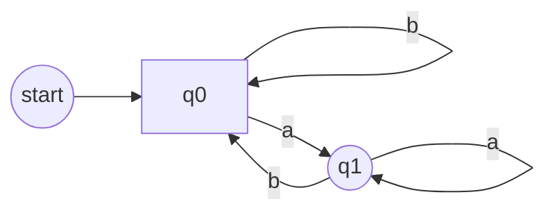

# Deterministic Finite Automata

## Introduction
An **automaton** (plural: automata) is an abstract, self-propelled computing device designed to follow a predetermined sequence of operations [TPT]. **Automata Theory** is the study of these abstract machines and the computational problems they can solve [TPT]. A **Finite Automaton** is a basic type of abstract machine that receives input symbols and produces an output of "accept" or "reject" based on predefined patterns [GFG]. It operates through a set of configurations known as states [GFG].

## TL;DR
*   **DFA** stands for **Deterministic Finite Automaton** [TP].
*   It's a type of finite automaton where, for each **input symbol**, the machine transitions to **one and only one** next state [GFG], [TP].
*   **No null (epsilon) transitions** are allowed [GFG].
*   Formally defined by a **5-tuple**: **(Q, Σ, δ, q0, F)** [GFG], [TP].
*   Can be represented graphically by a **state diagram** or tabularly by a **transition table** [TP].
*   Every **Non-Deterministic Finite Automaton (NFA)** can be converted into an equivalent DFA [GFG].

## Basic Automata Theory Concepts
*   **Alphabet (Σ)**: A finite set of symbols [TPT].
    *   Example: Σ = {a, b, c, d} [TPT].
*   **String**: A finite sequence of symbols taken from the alphabet [TPT].
    *   Example: "cabcad" is a string over Σ = {a, b, c, d} [TPT].
*   **Length of a String (|S|)**: The number of symbols in a string [TPT].
    *   Example: If S = "cabcad", then |S| = 6 [TPT].
    *   An empty string (denoted by **λ** or **ε**) has a length of 0 [TPT].
*   **Kleene Star (Σ*)**: A unary operator on a set of symbols (Σ) that yields the infinite set of all possible strings of all possible lengths over Σ, including the empty string (λ) [TPT].
    *   Example: If Σ = {a}, then Σ* = {λ, a, aa, aaa, ...} [needs review - specific example not in source, general definition is] [TPT].
*   **Kleene Closure / Plus (Σ+)**: The infinite set of all possible strings of all possible lengths over Σ, **excluding** the empty string (λ) [TPT].
    *   Representation: Σ+ = Σ* - {λ} [TPT].

## Formal Definition of a Finite Automaton
A **Finite Automaton** is formally defined as a 5-tuple: **(Q, Σ, δ, q0, F)** [GFG], [TPT].
*   **Q**: A finite set of **states** [GFG], [TPT].
*   **Σ**: A finite set of **input symbols** (the alphabet of the automaton) [GFG], [TPT].
*   **δ (Transition Function)**: Maps a (state, input symbol) pair to a next state [GFG], [TPT].
*   **q0**: The **initial state** (q0 ∈ Q) [GFG], [TPT].
*   **F**: A finite set of **final** or **accepting states** (F ⊆ Q) [GFG], [TPT].

## Types of Finite Automata
There are two primary types of finite automata [GFG]:
1.  **Deterministic Finite Automata (DFA)**
2.  **Non-Deterministic Finite Automata (NFA)**

## Deterministic Finite Automata (DFA)
A **Deterministic Finite Automaton (DFA)** is a type of finite automaton where the computation is unique for each input [TP]. The term "deterministic" signifies that for every state and for each input symbol, there is exactly one next state to which the machine can transition [TP].
*   It is represented by the 5-tuple **{Q, Σ, q0, F, δ}** [GFG].
*   For each input symbol, the machine transitions to **one and only one** state [GFG].
*   **Null transitions (ϵ-moves)** are **not allowed** in a DFA; every state must have a transition for every symbol in the input alphabet [GFG].

## Formal Definition of a DFA
A DFA **M** is formally defined as a 5-tuple: **M = (Q, Σ, δ, q0, F)** [TP], [GFG].
*   **Q**: A finite set of states [TP], [GFG].
*   **Σ**: A finite set of input symbols (alphabet) [TP], [GFG].
*   **δ (Transition Function)**: A total function mapping **Q × Σ → Q**. This means for every state in Q and every symbol in Σ, there is exactly one next state [TP], [GFG].
*   **q0**: The initial state (q0 ∈ Q) [TP], [GFG].
*   **F**: A finite set of final states (F ⊆ Q) [TP], [GFG].

## Graphical Representation of a DFA
DFAs are often represented using **state diagrams**, which are directed graphs (digraphs) [TP].
*   **Vertices**: Represent the **states** (elements of Q) [TP].
*   **Arcs (Edges)**: Labeled with an **input alphabet symbol**, they show the **transitions** (defined by δ) [TP].
*   **Initial State (q0)**: Denoted by an empty single incoming arc, pointing to it [TP].
*   **Final States (F)**: Represented by **double circles** [TP].

## Transition Table
A **transition table** is another way to represent the **transition function (δ)** of a DFA [TP].
*   It is a tabular form showing the **Present State** and the **Next State** for each possible input symbol [TP].

## Examples

### Example 1: DFA for strings ending with 'a' [GFG]
Construct a DFA that accepts all strings ending with 'a'.
*   **Σ** = {a, b}
*   **Q** = {q0, q1}
*   **q0** = q0
*   **F** = {q1}

**Transition Table:**

| State \ Symbol | a   | b   |
| :------------- | :-- | :-- |
| **q0**         | q1  | q0  |
| **q1**         | q1  | q0  |

If the string ends in 'a', the machine reaches the final state **q1**, indicating acceptance [GFG].

**Graphical Representation (State Diagram):**

### Example 2: Formal Definition and Transition Table [TP]
Let a DFA be defined as:
*   **Q** = {a, b, c}
*   **Σ** = {0, 1}
*   **q0** = {a}
*   **F** = {c}

**Transition Table:**

| Present State | Next State for Input 0 | Next State for Input 1 |
| :------------ | :--------------------- | :--------------------- |
| a             | a                      | b                      |
| b             | c                      | a                      |
| c             | b                      | c                      |

## Comparison of DFA and NFA
Both DFA and NFA are types of finite automata, but they differ in how transitions are handled [GFG].

| Feature                  | Deterministic Finite Automata (DFA)        | Non-Deterministic Finite Automata (NFA)        |
| :----------------------- | :----------------------------------------- | :----------------------------------------------- |
| **Transition on Input**  | For each input symbol, moves to **one and only one** state [GFG]. | For each input symbol, can move to **multiple states** [GFG]. |
| **Null (ϵ) Transitions** | **Not allowed** [GFG].                      | **Allowed** (can change state without consuming input) [GFG]. |
| **Computational Power**  | Equivalent to NFA [GFG].                   | Equivalent to DFA [GFG].                         |
| **Conversion**           | NFA can be converted to an equivalent DFA (though the DFA may have more states) [GFG]. | DFA is a special case of NFA [needs review - implicit from NFA definition, but not explicitly stated]. |
| **Backtracking**         | No backtracking is required [GFG].         | May require backtracking [GFG].                  |

## Operations on DFA
DFAs can be combined or modified using various set operations on the languages they accept [GFG].

1.  **Union of Two DFAs (L₁ ∪ L₂)**: Creates a new DFA that accepts all strings that are accepted by either of the original DFAs [GFG].
    *   Example: If DFA1 accepts L₁ = {a, ab} and DFA2 accepts L₂ = {b, ab}, their union accepts {a, b, ab} [GFG].
2.  **Concatenation of Two DFAs (L₁ ∘ L₂)**: Creates a new DFA that accepts strings formed by taking a string from L₁ followed by a string from L₂ [GFG].
    *   Example: If DFA1 accepts L₁ = {a, b} and DFA2 accepts L₂ = {c, d}, their concatenation accepts {ac, ad, bc, bd} [GFG].
3.  **Reversal of a DFA (Lᴿ)**: Creates a new DFA that accepts the reversed versions of all strings accepted by the original DFA [GFG].
    *   Example: If DFA accepts L = {ab, abc, ba}, its reversal accepts Lᴿ = {ba, cba, ab} [GFG].
4.  **Complementation of a DFA (L̅)**: Creates a new DFA that accepts all strings **not** accepted by the original DFA [GFG]. This is achieved by swapping final and non-final states.
    *   Example: If a DFA accepts all strings containing 'a', its complement accepts all strings that **do not** contain 'a' [GFG].
5.  **Intersection of Two DFAs (L₁ ∩ L₂)**: Creates a new DFA that accepts only those strings that are accepted by **both** original DFAs [GFG].
    *   Example: If DFA1 accepts L₁ = {a, ab, bc} and DFA2 accepts L₂ = {ab, bc, cd}, their intersection accepts {ab, bc} [GFG].
6.  **Difference of Two DFAs (L₁ - L₂)**: Creates a new DFA that accepts strings present in L₁ but not in L₂ [GFG].
    *   Example: If DFA A accepts strings with at least one '0' and DFA B accepts strings ending with '1', then DFA A - B accepts strings with at least one '0' that do not end with '1' [GFG].

## Applications of DFA
The provided sources indicate a page on "Application of Deterministic Finite Automata (DFA)" [GFG], but the content in the excerpt is empty. Thus, specific applications are not detailed here [needs review].

## Minimization of DFA
It is possible to minimize a DFA, meaning to construct an equivalent DFA with the minimum possible number of states [TP]. The sources provide an example of a minimized DFA's result but do not detail the algorithm or method for minimization [TP].

## Conclusion
Deterministic Finite Automata (DFAs) are fundamental computational models in automata theory. Characterized by their deterministic nature (a unique next state for every input), absence of null transitions, and finite states, they are used for recognizing regular languages. Despite their simplicity, they are powerful enough to recognize various patterns and form the basis for more complex computational concepts. Their clear formal definition and graphical representation make them accessible for analysis and design.

## Memory Aids
*   **DFA**: "**D**efinitely **F**ixed **A**ctions" – implies a single, determined next state.
*   **5-tuple (Q, Σ, δ, q0, F)**: "**Q**ueen **Σ**igma **δ**oes **q**uickly **F**inish" (States, Alphabet, Transition, Start State, Final States).
*   **DFA vs NFA**: **D**FA is **D**irect and **D**etermined (one path); **N**FA is **N**umerous (multiple paths) and **N**ull-friendly.

## Common Mistakes
*   **Confusing DFA with NFA**: A common error is assuming DFAs allow multiple transitions for the same input or null transitions, which are features of NFAs [GFG].
*   **Incorrectly labeling initial/final states**: Always ensure the **initial state** is marked with an incoming arrow and **final states** with double circles in state diagrams [TP].
*   **Missing transitions**: For a DFA, every state must have a defined transition for **every symbol** in the input alphabet [GFG]. Missing a transition path makes the automaton invalid as a DFA.
*   **Misinterpreting the transition function (δ)**: Remembering that δ maps (state, input) to a **single** next state is crucial for DFAs [TP].

## CITATIONS
*   [GFG]: https://www.geeksforgeeks.org/theory-of-computation/introduction-of-finite-automata/
    *   Quoted spans: "Features of Finite Automata", "Formal Definition of Finite Automata", "Types of Finite Automata", "1. Deterministic Finite Automata (DFA)", "Example:", "2) Non-Deterministic Finite Automata (NFA)", "Comparison of DFA and NFA", "1. Union of Two DFAs (L₁ ∪ L₂)", "2. Concatenation of Two DFAs (L₁ ∘ L₂)", "3. Reversal of a DFA (Lᴿ)", "4. Complementation of a DFA (L̅)", "5. Intersection of Two DFAs (L₁ ∩ L₂)", "6. Difference of Two DFAs (L₁ - L₂)", "Application of Deterministic Finite Automata (DFA)"
*   [TP]: https://www.tutorialspoint.com/automata_theory/deterministic_finite_automaton.htm
    *   Quoted spans: "Deterministic Finite Automaton", "Deterministic Finite Automaton (DFA)", "Formal Definition of a DFA", "Graphical Representation of a DFA", "Example 1", "Transition Table", "Example 2", "Solution"
*   [TPT]: https://www.tutorialspoint.com/automata_theory/automata_theory_quick_guide.htm
    *   Quoted spans: "Automata What is it?", "Formal definition of a Finite Automaton", "Alphabet", "String", "Length of a String", "Kleene Star", "Kleene Closure / Plus"
*   [Wiki]: https://en.wikipedia.org/wiki/Deterministic_finite_automaton
    *   Quoted spans: "Deterministic finite automaton"