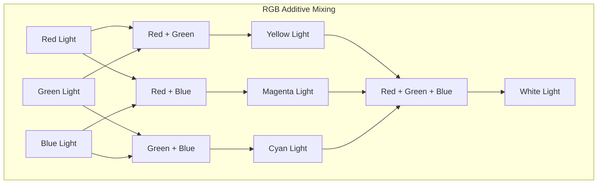

# RGB colour model

## Introduction
Color models are mathematical representations used in computer graphics to describe how colors are generated and represented digitally [TP]. They utilize primary colors to produce a wide spectrum of other colors, known as the **color gamut** [TP]. The **RGB color model** is one of the most widely recognized and extensively used models, particularly in digital displays and imaging systems [GFG], [TP].

## TL;DR
*   **RGB** stands for **Red**, **Green**, and **Blue** [GFG], [TP].
*   It is an **additive color model**, mixing light to create colors [GFG], [TP].
*   Used primarily for digital displays, cameras, and scanners [GFG].
*   Colors are represented by intensity values for Red, Green, and Blue components, typically 0-255 [GFG].
*   (0,0,0) represents **black** (no light), and (255,255,255) represents **white** (full intensity of all three) [GFG].
*   Images in RGB are essentially **3D matrices** where each layer corresponds to a color channel [GFG_Python].

## Key Characteristics of Color Models
Color is perceived as light reflected from objects, detected by human eyes within the visible electromagnetic spectrum (390 to 700 nanometers) [TP]. Color has three fundamental properties: **hue**, **saturation**, and **brightness** (or **lightness/value**) [TP]. Color models use a set of primary colors to produce a range of other colors, and this range is known as its **color gamut** [TP].

## Overview of Color Models in Computer Graphics
In computer graphics, various color models are employed to generate and represent color images [TP]. Each model uses a different approach with distinct primary colors and mixing principles to achieve its **gamut** [TP]. Examples include **RGB**, **CMY/CMYK**, **HSV**, **HLS**, and **YUV/YIQ/YCbCr** [TP], [GFG].

## RGB Color Model

### Definition and Principles
The **RGB color model** is the most widely used color model in computer graphics [GFG], [TP]. It is an **additive color model**, meaning it creates colors by mixing different intensities of light [GFG], [TP]. Its three **primary colors** are **Red**, **Green**, and **Blue** [GFG], [TP].

### Representation
The **RGB** model can be visualized as a **unit cube** in a 3D Cartesian coordinate system [TP]. Each axis represents the intensity of one primary color (Red, Green, Blue).
*   Typically, color intensities are represented by values ranging from **0 to 255** for each channel [GFG].
*   A pixel color is defined by a triplet **(R, G, B)** [GFG].
*   **(0,0,0)** represents **black** (no light) [GFG], [TP].
*   **(255,255,255)** (or **(1,1,1)** in a normalized unit cube) represents **white** (full intensity of all three primary colors) [GFG], [TP].
*   Pure primary colors are represented as:
    *   **Red**: (255,0,0) [GFG], [TP]
    *   **Green**: (0,255,0) [GFG]
    *   **Blue**: (0,0,255) [GFG]

### Additive Color Mixing
When Red, Green, and Blue light are combined, they produce secondary colors and ultimately white light [GFG].

*   **Red + Green** = **Yellow** [GFG]
*   **Red + Blue** = **Magenta** [GFG]
*   **Green + Blue** = **Cyan** [GFG]
*   **Red + Green + Blue** = **White** [GFG]

### Applications
The **RGB color model** is widely used in:
*   Computer monitors and displays [GFG]
*   Digital cameras [GFG]
*   Scanners [GFG]
*   Any system that generates color images using light [GFG]

### Advantages
*   **Simplicity**: Easy to implement due to its direct mapping to hardware [GFG].
*   **Direct Hardware Mapping**: Aligns well with how electronic displays work, which use red, green, and blue light-emitting components [GFG].
*   **Wide Gamut**: Can represent millions of colors [GFG].

### Disadvantages
*   **Not Intuitive for Human Perception**: Manipulating colors in RGB (e.g., making a color lighter or darker) is not as intuitive as models based on hue, saturation, and lightness/value [GFG].
*   **Complex Color Manipulation**: Adjusting specific color attributes (like changing only the **hue**) can be difficult as it often requires changing all three R, G, and B components simultaneously [GFG].

## Comparison with Other Color Models

### RGB vs. CMY/CMYK
| Feature           | RGB Color Model                                       | CMY / CMYK Color Model                                         | Source          |
| :---------------- | :---------------------------------------------------- | :------------------------------------------------------------- | :-------------- |
| **Type**          | **Additive** (mixes light)                            | **Subtractive** (mixes pigments/inks)                          | [GFG], [TP]     |
| **Primary Colors**| **Red**, **Green**, **Blue**                          | **Cyan**, **Magenta**, **Yellow** (CMY); **Black** (CMYK)      | [GFG], [TP]     |
| **Black/White**   | **Black** is (0,0,0); **White** is (255,255,255)      | **White** is (0,0,0); **Black** is (1,1,1) for CMY, or pure **K** for CMYK | [GFG], [TP]     |
| **Application**   | Digital displays, monitors, cameras, web graphics     | Printing, pigments, inks                                       | [GFG], [TP]     |
| **Mixing Result** | Mixing all primaries creates **White**                | Mixing all primaries ideally creates **Black** (CMY), but often muddy brown; **K** (black) is added for true black [GFG] | [GFG]           |

### HSV Color Model
*   Represents colors using **Hue**, **Saturation**, and **Value** [TP], [GFG].
*   Often preferred for its intuitive nature, especially for artists, as it separates color information (**hue**, **saturation**) from brightness (**value**) [GFG].
*   Represented by a **hexagonal cone** [TP].
*   **Hue** is measured as an angle (0-360°) [TP].

### HLS Color Model
*   Similar to HSV, but uses **Hue**, **Lightness**, and **Saturation** [TP].
*   Represented by a **double hexagonal cone** [TP].
*   **Hue** is measured as an angle (0-360°) [TP].

### YUV/YIQ/YCbCr Color Model
*   This family of color models separates **luminance** (brightness, denoted by **Y**) from **chrominance** (color information, denoted by U, V or I, Q or Cb, Cr) [TP].
*   It is used in analog television broadcasting, for example, **YIQ** for NTSC television [GFG], [TP].

## RGB in Image Processing (Python Example)
In image processing, particularly with libraries like OpenCV, NumPy, and Matplotlib in Python, images are treated as numerical data structures [GFG_Python].

### Image Loading and Display
*   To work with images, libraries like **OpenCV** (cv2), **NumPy**, and **Matplotlib** are typically used [GFG_Python].
*   Images can be loaded and then displayed to visualize their content [GFG_Python].

### Image Shape and Channels
*   The `shape` attribute of an image array returns its dimensions: **height**, **width**, and the number of **channels** [GFG_Python].
*   For **RGB** color images, there are always **3 channels** [GFG_Python].

### Pixel Data Representation
*   Any color image, in the context of **RGB**, is essentially a **3D matrix** (or array) [GFG_Python].
*   In this 3D matrix representation:
    *   The **first channel** typically represents the **Red** component [GFG_Python].
    *   The **second channel** represents the **Green** component [GFG_Python].
    *   The **third channel** represents the **Blue** component [GFG_Python].
*   Each element in the matrix (pixel value) indicates the intensity of that specific color component at a given location [GFG_Python].

### Extracting Individual Channels
*   Libraries like OpenCV provide functions, such as `cv2.split()`, to separate an RGB image into its individual Red, Green, and Blue **channels** [GFG_Python]. This allows for channel-specific processing.

### Color Distribution Analysis (Histogram)
*   A **histogram** can be generated for each RGB channel to understand the distribution of color intensities within an image [GFG_Python]. This helps in analyzing how much of each primary color is present and its concentration across different intensity levels.

### Channel Statistical Analysis
*   For each Red, Green, and Blue channel, various statistical measures can be computed, including:
    *   **Mean**: Average intensity value [GFG_Python].
    *   **Median**: Middle intensity value [GFG_Python].
    *   **Standard Deviation**: Spread of intensity values [GFG_Python].
    *   **Minimum Value**: Lowest intensity observed [GFG_Python].
    *   **Maximum Value**: Highest intensity observed [GFG_Python].

### Channel Correlation Analysis
*   A **correlation matrix** can be used to assess the relationship between the Red, Green, and Blue channels [GFG_Python].
*   This correlation is often visualized using a **heatmap**, where color intensity represents the correlation values between channel pairs [GFG_Python]. High correlation might indicate that changes in one channel's intensity are often accompanied by similar changes in another.

## Examples
*   **Computer Monitors and Televisions**: Display images by emitting red, green, and blue light through individual sub-pixels [GFG].
*   **Digital Cameras**: Capture light through sensors that record red, green, and blue components of the light [GFG].
*   **Web Design**: Colors on websites are specified using RGB hexadecimal codes (e.g., `#FF0000` for red) or RGB triplet values [needs review - this is generally true but not in source].
*   **LED Displays**: Large outdoor and indoor LED screens use RGB LEDs to produce a full spectrum of colors [needs review - generally true but not in source].

## Memory Aids
*   **R**ed, **G**reen, **B**lue are the **R**eal **G**ood **B**asic lights.
*   "**RGB** is for **R**adiant **G**lowing **B**rightness" (emphasizes light/additive nature).
*   Think of a stage light system: individual red, green, and blue lights combine to make different colors, and all on together make white.

## Common Mistakes
*   **Confusing Additive with Subtractive**: A common error is assuming RGB is for printing (subtractive) like CMYK. Remember, **RGB** is for **light** (displays), and **CMYK** is for **pigments** (printing) [GFG], [TP].
*   **Incorrect Black/White**: In RGB, (0,0,0) is black (absence of light), and (255,255,255) is white (all lights fully on). This is opposite to how CMY works [GFG], [TP].
*   **Ignoring Gamut Differences**: Not all color models can reproduce the same range of colors. Converting between models (e.g., RGB to CMYK) can lead to color shifts due to different **gamuts** [GFG].
*   **Channel Order**: In some image processing contexts (e.g., OpenCV in Python), the default channel order might be BGR instead of RGB. Always verify the expected channel order of the library or system being used [GFG_Python].

## Conclusion
The **RGB color model** is a foundational concept in computer graphics and digital imaging, defining colors as combinations of **Red**, **Green**, and **Blue** light [GFG], [TP]. Its **additive** nature and direct mapping to display hardware make it indispensable for screens, cameras, and scanners [GFG]. While less intuitive for human perception than some other models, understanding its principles is crucial for anyone working with digital visuals [GFG].

## CITATIONS
*   [GFG] https://www.geeksforgeeks.org/computer-graphics/computer-graphics-the-rgb-color-model/ "Widely used in computer graphics... uses three primary colors: Red, Green, and Blue... an additive color model... produces colors by mixing light... Applications include monitors, cameras, and scanners... each color component is typically represented by an intensity value ranging from 0 to 255... (0,0,0) as black, (255,255,255) as white... can represent millions of colors... Advantages: simplicity, direct mapping to hardware... Disadvantages: not intuitive for human perception, color manipulation can be complex... Red (255,0,0)... Green (0,255,0)... Blue (0,0,255)... Red + Green = Yellow, Red + Blue = Magenta, Green + Blue = Cyan, Red + Green + Blue = White."
*   [GFG2] https://www.geeksforgeeks.org/computer-graphics/difference-between-rgb-cmyk-hsv-and-yiq-color-models/ "RGB uses Red, Green, Blue... additive model... For screens... CMYK uses Cyan, Magenta, Yellow, Black... Subtractive... For printing... HSV: Hue, Saturation, Value; Intuitive for artists... YIQ: Luminance, Chrominance; For NTSC TV."
*   [GFG_Python] https://www.geeksforgeeks.org/python/rgb-color-model-in-python/ "We'll start by setting up the necessary libraries like OpenCV , Numpy and Matplotlib... The "shape" attribute returns the height, width and number of channels... RGB Model deals with colour images that have 3 channels... Any colour image is basically a 3D matrix. In the RGB colour space the first channel represents the Red component, second and third channels represent the Green and Blue components respectively... The cv2 module also has a method to separate the channels. We will use cv2.split() function... In order to understand the colour distribution of each of the channels of this particular image, we'll look into its histogram... We'll look into the mean, median, standard deviation, minimum and maximum values of each channels... We can obtain the correlation between each of the channels using correlation matrix... The color intensity of each cell in the heatmap visually represents correlation values..."
*   [GFG_RGBvsCMYK] https://www.geeksforgeeks.org/computer-graphics/differences-between-rgb-and-cmyk-color-schemes/ "RGB: additive, light-based, displays... CMYK: subtractive, pigment-based, printing... Primary colors, black/white generation... Gamut differences."
*   [TP] https://www.tutorialspoint.com/computer_graphics/computer_graphics_color_models.htm "In graphics, we generate color images there are multiple such modes available... Color is how we perceive light reflected from objects... This range is in between 390 to 700 nanometers (nm). Color has three properties... Color models use primary colors to produce a wide range of other colors. The range of colors a model can produce is called its color gamut... The RGB color model is the most widely used in computer graphics. It uses three primary colors: Red, Green, and Blue... represented by a unit cube... additive color mixing... White is at (1,1,1) and Black is at (0,0,0)... (1,0,0) represents Red... CMY model uses Cyan, Magenta, and Yellow as its primary colors... represented by a unit cube: White is at the origin (0,0,0) and Black is at (1,1,1)... subtractive color mixing... YUV/YIQ/YCbCr Color Model... separates luminance (brightness) from chrominance (color information)... Y represents luminance U and V (or I and Q) represent color information... HSV model represents colors using Hue, Saturation, and Value... represented by a hexagonal cone... Hue is measured as an angle (0-360°)... HLS model is similar to HSV but uses Lightness instead of Value... represented by a double hexagonal cone Hue is measured as an angle (0-360°) Saturation and..."