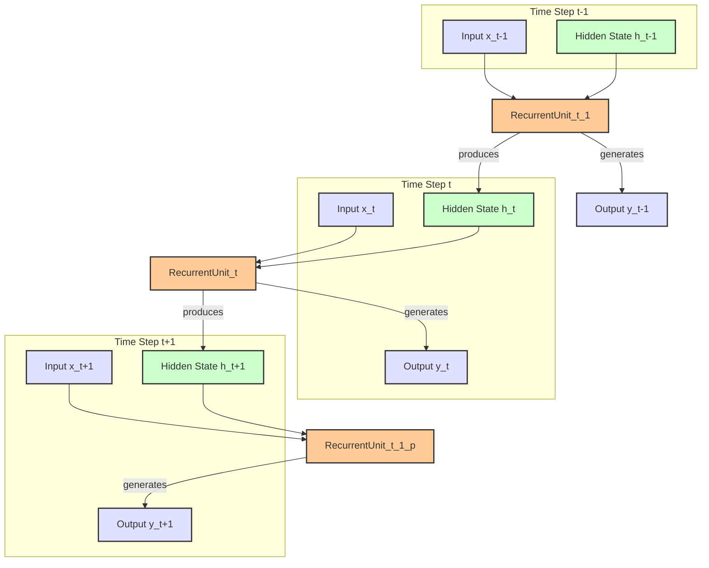

# Recurrent Neural Networks

## Introduction
**Recurrent Neural Networks (RNNs)** are a type of deep learning algorithm designed to process **sequential data** [TP]. Unlike traditional deep neural networks, RNNs process information in a way that allows information to flow from previous inputs to current outputs, enabling them to "remember" information from prior steps in a sequence [GFG, Wiki]. This architecture is particularly suited for tasks where the order of data matters, such as natural language processing, speech recognition, and time series forecasting [GFG].

RNNs share similarities in their input and output structures with other deep learning architectures but differ significantly in how information flows internally. The core distinction lies in their ability to maintain an internal state (memory) that captures contextual information from the sequence [GFG].

## TL;DR
*   **Sequential Data**: RNNs are specialized for processing data where the order matters, like text or time series [TP, GFG].
*   **Memory**: They maintain an internal **hidden state** that acts as a memory, retaining information from previous inputs in a sequence [GFG].
*   **Recurrent Units**: The fundamental building block is a **Recurrent Unit**, which takes both the current input and the previous hidden state to produce the current output and update the hidden state [GFG].
*   **Unfolding**: The recurrent structure is often "unfolded" over time steps, representing each step as a separate layer for computation [GFG].
*   **Backpropagation Through Time (BPTT)**: RNNs are trained using a specialized backpropagation algorithm called BPTT to update network parameters across time steps [GFG].
*   **Applications**: Used in sentiment analysis, time series prediction, and more [GFG].

## Key Components of RNNs

### Recurrent Neurons
The fundamental processing unit in an RNN is a **Recurrent Unit** [GFG]. These units possess a **hidden state** that retains information about previous inputs within a sequence [GFG]. This hidden state effectively provides a form of memory, allowing the network to leverage past information when processing current inputs [GFG].

### RNN Unfolding
**RNN unfolding** (or unrolling) is the process of conceptually expanding the recurrent structure across various time steps [GFG]. In this expanded view, each step of the sequence is represented as a distinct layer in a series, illustrating how information is passed from one time step to the next [GFG]. This visualization helps in understanding how the network processes sequential data and how backpropagation is applied.

## Recurrent Neural Network Architecture
RNNs differ from traditional deep neural networks in how information flows from input to output [GFG]. While they may share similar input and output structures, RNNs incorporate a loop that allows information to persist and influence subsequent steps [GFG]. This loop is what enables the "memory" aspect of RNNs.

## How does RNN work?
At each **time step**, RNNs process units using a fixed **activation function** [GFG]. These units possess an **internal hidden state** that functions as a memory, holding information from previous time steps [GFG]. This memory allows RNNs to understand context and dependencies within sequential data [GFG].

## Updating the Hidden State in RNNs
The **current hidden state** (denoted as **h_t**) is calculated based on two primary factors: the **previous hidden state** (**h_{t-1}**) and the **current input** (**x_t**) [GFG].

The relationship for updating the state can be generally represented as:
**h_t** = f(**h_{t-1}**, **x_t**) [GFG]
where f is an activation function (e.g., tanh or ReLU) and possibly includes learnable weights. [needs review - exact formula not provided in excerpt]

## Backpropagation Through Time (BPTT) in RNNs
Because RNNs handle sequential data, **Backpropagation Through Time (BPTT)** is the algorithm employed to update the network's parameters [GFG]. The **loss function L(θ)**, which quantifies the model's error, depends on the final hidden state and implicitly on each hidden state computed across the entire sequence [GFG]. BPTT essentially performs backpropagation on the unfolded RNN structure, propagating errors backward through time to adjust weights at each step [GFG].

## Types Of Recurrent Neural Networks

Based on the number of inputs and outputs, RNNs can be categorized into four types [GFG]:

### 1. One-to-One RNN
*   Description: [needs review - content not provided in excerpts]

### 2. One-to-Many RNN
*   Description: [needs review - content not provided in excerpts]

### 3. Many-to-One RNN
*   Description: [needs review - content not provided in excerpts]

### 4. Many-to-Many RNN
*   Description: [needs review - content not provided in excerpts]

There are also more advanced or architectural types of RNNs:

### Vanilla RNN
*   Description: [needs review - content not provided in excerpts]

### Bidirectional RNNs
*   Description: [needs review - content not provided in excerpts]

### Long Short-Term Memory Networks (LSTMs)
*   Description: [needs review - content not provided in excerpts]

### Gated Recurrent Units (GRUs)
*   Description: [needs review - content not provided in excerpts]

## How RNN Differs from Feedforward Neural Networks?
[needs review - content not provided in excerpts]

## Examples

RNNs are widely applied in tasks involving sequential data. Below are detailed implementation examples:

### Sentiment Analysis with an Recurrent Neural Networks (RNN) (TensorFlow)
This example demonstrates classifying customer reviews as positive or negative using an RNN [GFG].

1.  **Importing Libraries and Dataset**:
    *   Libraries: `numpy`, `pandas`, `Regular Expression (RegEx)`, `scikit-learn`, `tensorflow` [GFG].
    *   Dataset: Swiggy customer reviews [GFG]. Loaded using `pd.read_csv()` [GFG].
2.  **Text Cleaning and Sentiment Labeling**:
    *   Reviews are converted to lowercase using `data["Review"].str.lower()` [GFG].
    *   Sentiment labels are created based on ratings [GFG].
    *   Missing values are removed [GFG].
3.  **Tokenization and Padding**:
    *   **Tokenizer**: Converts words into integer sequences [GFG].
    *   **Padding**: Ensures all input sequences have the same length [GFG].
4.  **Splitting the Data**:
    *   Data is split into training, validation, and test sets (80% train, 20% test) using `train_test_split(X, y, test_size=0.2, random_state=42, stratify=y)` [GFG]. Stratification maintains class distribution [GFG].
5.  **Building RNN Model**:
    *   A simple RNN model is built for binary sentiment classification using `Sequential([...])` [GFG].
    *   Includes an `Embedding` layer to convert `input_dim` (max features) to dense vectors (`output_dim=16`) [GFG].
6.  **Training and Evaluating Model**:
    *   Model is trained using `model.fit(...)` for 5 epochs with a batch size of 32, with validation [GFG].
    *   Evaluates performance on the test data [GFG].
7.  **Predicting Sentiment**:
    *   A function preprocesses a single review: converts to lowercase (`review_text.lower()`), removes special characters (`re.sub(r'[^a-z0-9\s]', '', text...)`), then predicts sentiment [GFG].

### Classifying Movie Reviews Using RNN (PyTorch)
This example classifies movie reviews as positive or negative using an RNN [GFG].

1.  **Importing Libraries**:
    *   `PyTorch (torch, torch.nn, torch.optim)` for building/training [GFG].
    *   `Pandas` and `NumPy` for data handling [GFG].
    *   `Matplotlib` for visualization [GFG].
    *   `Scikit-learn` for preprocessing [GFG].
2.  **Loading and Preprocessing the Dataset**:
    *   Dataset loaded with `pd.read_csv()` and columns assigned [GFG].
    *   Text is lowercased and tokenized using Pandas string methods [GFG].
    *   Labels are encoded into numeric form using `LabelEncoder()` [GFG].
    *   Data is split into training and testing sets [GFG].
3.  **Creating Dataset and Data Loader**:
    *   A custom `SentimentDataset` class inherits from PyTorch’s `Dataset` [GFG].
    *   Stores texts and labels, implements `__len__` (total samples) and `__getitem__` (returns sample) [GFG].
    *   A `DataLoader` is used to load data in batches [GFG].
4.  **Defining the RNN Model**:
    *   A `SentimentRNN` class inherits from PyTorch’s `nn.Module` [GFG].
    *   Includes an **embedding layer** (converts word indices to dense vectors), an **RNN layer** (processes sequences), and a **fully connected layer** (for classification) [GFG].
5.  **Training the Model**:
    *   **Loss function**: `cross-entropy loss` [GFG].
    *   **Optimizer**: `Adam optimizer` with a `learning rate` of 0.001 [GFG].
    *   Trains for specified epochs, setting the model to training mode (`model.train()`) [GFG].
6.  **Evaluating the Model**:
    *   Sets the model to evaluation mode (`model.eval()`) [GFG].
    *   Disables gradient calculations with `torch.no_grad()` [GFG].
    *   Iterates over test batches, computes model outputs, and tracks correct predictions and total samples [GFG].
7.  **Visualizing Training Loss**:
    *   Plots the training loss, showing a steady decrease by the end of training, indicating good performance despite fluctuations [GFG].

### Time Series Forecasting using Recurrent Neural Networks (RNN) (TensorFlow)
This example uses an RNN for time series forecasting, specifically predicting stock prices [GFG].

1.  **Importing required libraries**:
    *   `numpy`, `pandas`, `matplotlib`, `yfinance`, `scikit-learn`, `tensorflow` [GFG].
2.  **Fetching Data from Yahoo Finance**:
    *   Uses the `yfinance` API to fetch stock data [GFG].
    *   Extracts the `Close` price and reshapes it to a 2D array using `values.reshape(-1, 1)` for RNN input [GFG].
3.  **Normalizing the Data**:
    *   Data is normalized between 0 and 1 using `MinMaxScaler` [GFG]. This improves training efficiency, model stability, and convergence [GFG].
4.  **Preparing the Data for Time Series**:
    *   A `create_dataset` function generates input data (X) and target data (y) by sliding a window of a specified length (`time_step`) over the sequence [GFG].
5.  **Splitting the Data into Training and Testing Sets**:
    *   Data is split into 80% training and 20% testing [GFG].
6.  **Building the RNN Model**:
    *   The model uses **SimpleRNN layers** [GFG].
    *   `units=50` defines the number of recurrent units [GFG].
7.  **Training the Model**:
    *   Trained on historical data using `model.fit(X_train, y_train, epochs=20, batch_size=64)` [GFG].
8.  **Evaluating the model**:
    *   Model performance is evaluated using standard error metrics to gauge how well predictions align with actual values [GFG].
    *   `y_test_unscaled` is used for evaluation [GFG].
9.  **Visualizing the Results**:
    *   [needs review - content not provided in excerpts]

## RNN Hidden State Update and Unfolding

*Description*: This diagram illustrates the **unfolding** of a Recurrent Neural Network over three time steps (**t-1**, **t**, **t+1**). At each time step, a **Recurrent Unit** receives the **current input (x_t)** and the **hidden state (h_t-1)** from the previous time step. It then computes a **new hidden state (h_t)** and an **output (y_t)** for the current time step. The new hidden state is passed on to the next time step, demonstrating the "memory" aspect of RNNs [GFG].

## Conclusion
Recurrent Neural Networks are powerful deep learning models specifically designed for processing and understanding sequential data. Their ability to maintain an internal "memory" via a **hidden state** allows them to capture dependencies and context across time steps, making them indispensable for tasks like natural language processing, sentiment analysis, and time series forecasting [GFG, TP]. While basic RNNs can struggle with long sequences due to issues like vanishing/exploding gradients, more advanced architectures like LSTMs and GRUs address these limitations, extending the effective memory of the network [needs review - specific mention of vanishing/exploding gradients not in excerpts, but common knowledge].

## Memory Aids
*   **R**emember **N**ew **N**umbers: **R**ecurrent **N**eural **N**etworks are for sequential data where the "new numbers" (current input) depend on what you "remember" (hidden state from previous steps).
*   **BPTT** = **B**ack-**P**ropagation **T**hrough **T**ime: Imagine literally unwrapping the network through time and applying standard backpropagation.
*   **Hidden State (h_t)**: Think of it as the network's short-term memory or "summary of the past."

## Common Mistakes
*   **Ignoring Sequence Order**: A common mistake is treating sequential data as independent points, which loses critical temporal information RNNs are designed to capture [GFG].
*   **Vanishing/Exploding Gradients**: For vanilla RNNs, gradients can become extremely small (vanishing) or large (exploding) over many time steps, making learning long-term dependencies difficult [needs review - not explicitly stated as a common mistake in excerpts, but an inherent challenge]. Using LSTMs or GRUs is a common solution to this problem.
*   **Incorrect Padding**: In text processing, not correctly padding sequences to a uniform length can lead to errors or inefficient processing [GFG].
*   **Overfitting**: Training for too many epochs without proper regularization can lead to overfitting, where the model performs well on training data but poorly on unseen data [GFG].

## CITATIONS
*   [GFG] GeeksforGeeks:
    *   "Introduction to Recurrent Neural Networks": https://www.geeksforgeeks.org/machine-learning/introduction-to-recurrent-neural-network/
    *   "Sentiment Analysis with an Recurrent Neural Networks (RNN)": https://www.geeksforgeeks.org/python/sentiment-analysis-with-an-recurrent-neural-networks-rnn/
    *   "Implementing Recurrent Neural Networks in PyTorch": https://www.geeksforgeeks.org/deep-learning/implementing-recurrent-neural-networks-in-pytorch/
    *   "Time Series Forecasting using Recurrent Neural Networks (RNN) in TensorFlow": https://www.geeksforgeeks.org/machine-learning/time-series-forecasting-using-recurrent-neural-networks-rnn-in-tensorflow/
*   [TP] Tutorialspoint:
    *   "TensorFlow - Recurrent Neural Networks": https://www.tutorialspoint.com/tensorflow/tensorflow_recurrent_neural_networks.htm
*   [Wiki] Wikipedia:
    *   "Recurrent neural network": https://en.wikipedia.org/wiki/Recurrent_neural_network