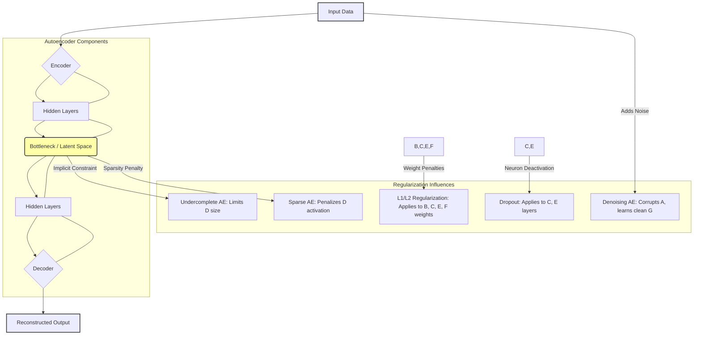

# Regularisation in auto encoders

## Introduction
**Autoencoders** are a type of neural network used for unsupervised learning tasks, primarily for dimensionality reduction and learning efficient data codings [GFG]. They operate by compressing input data into a smaller representation and then reconstructing it. A significant challenge in training autoencoders, like many machine learning models, is **overfitting**, where the model learns to memorize the training data, including noise, rather than capturing generalizable patterns [GFG]. **Regularisation** techniques are crucial for preventing this overfitting, ensuring that autoencoders learn meaningful, compact features that generalize well to unseen data [GFG].

## TL;DR
*   **Autoencoders** compress input data into a **latent space** and then reconstruct it [GFG].
*   **Regularisation** prevents autoencoders from **overfitting** by adding constraints, making them learn generalizable features [GFG].
*   Key regularized autoencoder types include **Sparse Autoencoders**, **Denoising Autoencoders**, and **Undercomplete Autoencoders** [GFG].
*   Regularisation techniques like **L1/L2 penalties**, **Dropout**, and **Early Stopping** improve model robustness and feature learning [GFG].

## Autoencoders: Core Concepts

### Architecture of an Autoencoder
An autoencoder's architecture consists of three main components that work together to compress and reconstruct data [GFG].

### Encoder
The **encoder** compresses the input data into a smaller, more manageable form by reducing its dimensionality while preserving important information [GFG]. It typically consists of an input layer and several hidden layers [GFG].

### Bottleneck (Latent Space)
This is the smallest layer of the network, representing the most compressed version of the input data [GFG]. It serves as an **information bottleneck**, forcing the network to prioritize and learn only the most significant features [GFG].

### Decoder
The **decoder** is responsible for taking the compressed representation from the **latent space** and reconstructing it back into the original data form [GFG]. It uses hidden layers to progressively expand the latent vector [GFG].

### Loss Function in Autoencoder Training
During training, an autoencoder's goal is to minimize the **reconstruction loss**, which measures how different the reconstructed output is from the original input [GFG]. The choice of loss function depends on the data type and task [GFG].

### Efficient Representations in Autoencoders
Constraining an autoencoder helps it learn meaningful and compact features from the input data, leading to more efficient representations [GFG]. After training, often only the **encoder** part is used to encode similar data for tasks like dimensionality reduction or feature extraction [GFG].

## Understanding Regularisation

### Overview of Regularization
**Regularization** refers to a set of techniques used to make a model generalize better by adding constraints to prevent it from **overfitting** the training data [GFG]. Overfitting occurs when the model becomes too specialized to the training data [GFG].

### What are Overfitting and Underfitting?
*   **Overfitting**: Happens when a model learns the training data too well, including its noise, leading to poor performance on new, unseen data [GFG].
*   **Underfitting**: Occurs when a model is too simplistic and fails to capture the underlying patterns in the training data, resulting in poor performance on both training and unseen data [GFG].

### What are Bias and Variance?
*   **Bias**: Refers to errors that occur when a model is too simple to accurately represent the true relationship in the data [GFG]. A high bias model tends to underfit [GFG].
*   **Variance**: Refers to a model's sensitivity to small fluctuations in the training data [GFG]. A high variance model can overfit by learning random noise instead of the essential patterns [GFG].

### Bias-Variance Tradeoff
The **Bias-Variance Tradeoff** is about finding the right balance between these two errors to create models that generalize well [GFG]. Reducing bias often increases variance, and vice-versa [GFG].

### Benefits of Regularization
Regularization offers several benefits:
*   **Prevents Overfitting**: Helps models focus on underlying patterns rather than memorizing noise in the training data [GFG].
*   **Improves Generalization**: Leads to models that perform better on unseen data [GFG].
*   **Reduces Model Complexity**: Can encourage simpler models, especially with techniques like L1 regularization [GFG].

## Types of Autoencoders and Regularisation Techniques

### Vanilla Autoencoder
**Vanilla Autoencoders** are the simplest form used for unsupervised learning tasks [GFG]. They consist of an encoder that compresses input data into a dense representation and a decoder that reconstructs it [GFG].
*   **Applications**: Data Compression, Feature Learning [GFG].

### Undercomplete Autoencoder
**Undercomplete Autoencoders** intentionally restrict the size of the **hidden layer** (bottleneck) to be smaller than the input layer [GFG]. This constraint forces the model to compress the data, learning only the most significant features and preventing it from simply copying the input, thereby acting as a form of implicit regularization [GFG].
*   **Applications**: Anomaly Detection, Feature Extraction, Data Compression [GFG].

### Sparse Autoencoder
**Sparse Autoencoders** add **sparsity constraints** that encourage only a small subset of neurons in the hidden layer to activate at once [GFG]. This helps in creating a more efficient and focused representation, and specifically prevents the network from merely replicating the input data even if the hidden layer size is increased [GFG].
*   **Objective Function of a Sparse Autoencoder**:
    It includes a penalty `Penalty(s)` term in addition to the standard reconstruction loss [GFG].
    The objective can be generally expressed as: `Loss = Reconstruction_Loss(X, X_hat) + λ * Penalty(s)` [GFG].
    Where:
    *   `X`: Input data [GFG].
    *   `X_hat`: Reconstructed output [GFG].
    *   `λ`: **Regularization parameter** that controls the strength of the sparsity penalty [GFG].
    *   `Penalty(s)`: A function that penalizes deviations from sparsity, often implemented using **KL-divergence** [GFG].

*   **Techniques for Enforcing Sparsity**:
    *   **L1 Regularization**: Introduces a penalty proportional to the absolute weight values, encouraging the model to utilize fewer features [GFG]. This is conceptually similar to **LASSO (Least Absolute Shrinkage and Selection Operator) regression** [GFG].
    *   **KL Divergence (Kullback-Leibler Divergence)**: Used to measure the divergence between the average activation of a hidden neuron and a desired low activation target (sparsity level) [GFG].

*   **Training Sparse Autoencoders** [GFG]:
    1.  **Initialization**: Weights are initialized randomly or using pre-trained networks [GFG].
    2.  **Forward Pass**: The input is fed through the encoder to obtain the latent representation [GFG].
    3.  **Sparsity Calculation**: The sparsity penalty is computed based on hidden layer activations [GFG].
    4.  **Loss Calculation**: The total loss is calculated as the sum of reconstruction loss and the sparsity penalty [GFG].
    5.  **Backward Pass**: Weights are adjusted via backpropagation to minimize the total loss [GFG].

*   **Preventing Overfitting with Sparse Autoencoders**:
    Sparse autoencoders address the issue of overfitting that can occur in normal autoencoders, especially when the hidden layer is large enough for the network to simply "cheat" and replicate the input data [GFG].

*   **Applications of Sparse Autoencoders** [GFG]:
    *   **Feature Selection**: Highlights the most relevant features by encouraging sparse activation, improving interpretability [GFG].
    *   **Dimensionality Reduction**: Creates efficient, low-dimensional representations by focusing on key features [GFG].

### Denoising Autoencoder
**Denoising Autoencoders** are designed to handle corrupted or noisy inputs by learning to reconstruct the clean, original data [GFG]. Training involves feeding intentionally corrupted inputs and minimizing the reconstruction loss with respect to the *original, clean* data [GFG]. This prevents the network from simply memorizing the input and instead encourages it to learn robust features that can 'denoise' the data [GFG].
*   **Applications of Denoising Autoencoders** [GFG]:
    *   **Image Denoising**: Removes noise from images to increase quality and improve downstream processing [GFG].
    *   **Signal Cleaning**: Filters noise from audio and sensor signals, boosting detection accuracy [GFG].
    *   **Data Restoration**: Reconstructs missing or corrupted data points [GFG].

## General Regularization Techniques for Autoencoders (and Deep Learning)

### L1 and L2 Regularization
**L1 and L2 regularizations** can be applied to the weights of layers to prevent overfitting [GFG].
*   **L1 Regularization (Lasso-like)**: Adds the absolute value of the magnitude of coefficients as a penalty term to the loss function [GFG]. It encourages sparsity in weights, potentially setting some weights to zero, thereby performing feature selection [GFG]. It is the basis for **LASSO Regression** [GFG].
*   **L2 Regularization (Ridge-like)**: Adds the squared magnitude of the coefficients as a penalty term to the loss function [GFG]. It encourages smaller weights, distributing the impact of features more evenly and handling multicollinearity [GFG]. It is the basis for **Ridge Regression** [GFG].
*   **Elastic Net Regression**: A combination of both L1 and L2 regularization, adding both the absolute norm and the squared measure of weights to the loss function [GFG].
*   In TensorFlow, these can be implemented using `tf.keras.regularizers` [GFG].

### Dropout Regularization
**Dropout regularization** works by randomly setting a fraction of neuron outputs to zero during each training step [GFG]. This prevents neurons from becoming overly co-dependent and forces the network to learn more robust features [GFG]. It is easily implemented in TensorFlow using the `Dropout` layer [GFG].

### Early Stopping with TensorFlow Callbacks
**Early stopping** is a callback function that stops the training process when there's no improvement in a monitored metric (e.g., validation loss) for a specified number of epochs [GFG]. This prevents overfitting by stopping the training at the point where the model's generalization performance is optimal [GFG]. It uses `tf.keras.callbacks.EarlyStopping` [GFG].

### Implementing Batch Normalization in TensorFlow
**Batch Normalization** normalizes the inputs of each layer within a mini-batch [GFG]. This stabilizes and speeds up the training process, allowing for higher learning rates and potentially acting as a slight regularizer by reducing the internal covariate shift [GFG]. It can be implemented using the `BatchNormalization` layer from `tf.keras.layers` [GFG].

### Combining Multiple Regularization Techniques
Regularization techniques like L1/L2, dropout, and early stopping can be used together to achieve robust generalization [GFG]. This combined approach often yields better results than using a single technique [GFG].

### Practical Tips for Regularization in TensorFlow
*   **Choosing Regularization Strength**: For L1 or L2 regularization, start with small values (e.g., 1e-5) and gradually increase them until the model starts generalizing better [GFG].
*   **Dropout Rate**: Typically, a dropout rate between 0.2 and 0.5 is used [GFG].

## Examples

### Example: Sparse Autoencoder for MNIST Dataset
A common application demonstrating regularization in autoencoders is training a **Sparse Autoencoder** on the **MNIST dataset** (handwritten digits) [GFG]. The goal is to learn useful, sparse representations of these images.

1.  **Import Libraries**: Begin by importing necessary libraries like TensorFlow, Keras, and NumPy for data handling and model construction [GFG].
2.  **Load and Preprocess Data**: Load the MNIST dataset. Reshape the 28x28 pixel images into a flat vector (784 features) and normalize pixel values (e.g., to a 0-1 range) [GFG].
3.  **Define Model Parameters**: Specify the input dimension (e.g., 784), hidden layer size, a desired sparsity level (e.g., average activation of 0.01 for hidden units), and the sparsity regularization weight (`lambda`) [GFG].
4.  **Build the Autoencoder Model**: Construct an encoder (e.g., dense layer with ReLU activation) to map input to the hidden layer, and a decoder (dense layer with sigmoid/linear activation) to reconstruct the output from the hidden layer.
5.  **Define Sparse Loss Function**: The total loss combines the standard reconstruction loss (e.g., Mean Squared Error or Binary Cross-Entropy) with a custom sparsity penalty (e.g., **KL-divergence** penalty between the actual average activation of hidden units and the desired sparsity level) [GFG].
6.  **Compile and Train**: Compile the model with an optimizer (e.g., Adam) and train it on the preprocessed MNIST images. The combined loss function guides the training to learn sparse representations [GFG].

This process results in an autoencoder that compresses digits into a representation where only a few neurons in the latent space are active, forcing the model to capture distinct features rather than merely copying the input [GFG].

## Memory Aids
*   **AER** (**A**uto**E**ncoder **R**egularization): **S**tress **D**own, **U**nderstand **W**hat's **K**ey! (**S**parse, **D**enoising, **U**ndercomplete, **W**eight Decay (L1/L2), **K**L-divergence for sparsity).
*   **Sparse AE**: **S**elects important features by encouraging few active neurons (**L1/KL**).
*   **Denoising AE**: **D**irty input, **C**lean output. Learns robust features by removing noise.
*   **Undercomplete AE**: **U**ltra-small bottleneck. Forces compression.
*   **L1 (Lasso)**: **A**bsolute weights, leads to **S**parsity (some weights go to 0).
*   **L2 (Ridge)**: **S**quared weights, leads to **S**maller, distributed weights.
*   **Dropout**: **D**eactivate random neurons during training for robustness.
*   **Early Stopping**: **E**xit training when validation loss stops **E**xasperating (improving).

## Common Mistakes
*   **Ignoring Overfitting**: A primary mistake is not applying regularization, leading to an autoencoder that simply memorizes the training data and performs poorly on new inputs [GFG].
*   **Incorrect Regularization Strength**: Setting the regularization parameter (e.g., `lambda` for sparsity, L1/L2 strength) too low won't prevent overfitting, while setting it too high can lead to underfitting by overly constraining the model [GFG].
*   **Over-reliance on Vanilla Autoencoders**: For complex tasks, a vanilla autoencoder, especially with a hidden layer larger than the input, can learn the identity function and fail to extract meaningful features [GFG].
*   **Misinterpreting Low Reconstruction Loss**: A low reconstruction loss alone does not guarantee that the autoencoder has learned useful features; it might still be overfitting or simply copying the input without effective compression or denoising [GFG].
*   **Not Combining Techniques Wisely**: While combining regularization techniques is powerful, using too many or incompatible methods without careful tuning can sometimes hinder performance rather than improve it [GFG].

## Conclusion
Regularisation is a fundamental and indispensable aspect of training robust **autoencoders** [GFG]. By addressing challenges like overfitting and memorization, regularization techniques—such as **sparse constraints**, **denoising objectives**, **undercomplete architectures**, **L1/L2 weight decay**, **dropout**, and **early stopping**—enable autoencoders to learn meaningful, compact, and generalizable representations of data [GFG]. Incorporating these methods is crucial for building effective machine learning models that perform well on unseen data [GFG].

## CITATIONS
*   [GFG] GeeksforGeeks: `https://www.geeksforgeeks.org/`
    *   "Autoencoders in Machine Learning": `https://www.geeksforgeeks.org/machine-learning/auto-encoders/`
    *   "Types of Autoencoders": `https://www.geeksforgeeks.org/numpy/types-of-autoencoders/`
    *   "Sparse Autoencoders in Deep Learning": `https://www.geeksforgeeks.org/deep-learning/sparse-autoencoders-in-deep-learning/`
    *   "Regularization in Machine Learning": `https://www.geeksforgeeks.org/machine-learning/regularization-in-machine-learning/`
    *   "Adding Regularizations in TensorFlow": `https://www.geeksforgeeks.org/deep-learning/adding-regularizations-in-tensorflow/`
*   [Wiki] Wikipedia: `https://en.wikipedia.org/wiki/Autoencoder`