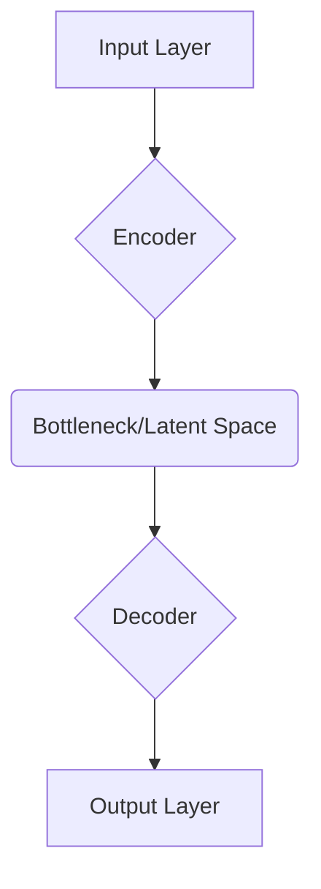

# Regularisation in auto encoders

## Introduction

Autoencoders are a type of artificial neural network used for unsupervised learning tasks. Their primary goal is to learn efficient **data codings** (or representations) in an unsupervised manner [GFG]. An autoencoder works by compressing input data into a **latent space** representation and then reconstructing it back to its original form [GFG]. While powerful for tasks like dimensionality reduction and feature learning, autoencoders can suffer from **overfitting** if not properly constrained, leading them to simply memorize the input data rather than learning meaningful underlying patterns [GfG_Sparse]. **Regularisation** techniques are essential to prevent this, ensuring the model learns generalizable and efficient representations [GfG_Reg], [GfG_TFReg].

## TL;DR

*   **Autoencoders** compress data into a **latent space** and then reconstruct it [GFG].
*   They learn **efficient data representations** by minimizing **reconstruction loss** [GFG].
*   **Overfitting** occurs when an autoencoder memorizes training data, failing to generalize to new data [GfG_Sparse], [GfG_Reg].
*   **Regularisation** techniques are used to prevent overfitting and force the autoencoder to learn more robust, meaningful features [GfG_Reg], [GfG_TFReg].
*   Key regularised autoencoder types include **Undercomplete**, **Denoising**, and **Sparse Autoencoders** [GfG_Types].
*   **Sparse Autoencoders** add a **sparsity constraint** (e.g., L1 regularization, KL-Divergence) to encourage only a few neurons to activate, leading to efficient, focused representations [GfG_Types], [GfG_Sparse].
*   General regularization methods like **L1/L2 regularization**, **Dropout**, **Early Stopping**, and **Batch Normalization** can also be applied to autoencoders [GfG_TFReg].

## Autoencoder Architecture

An autoencoder's architecture consists of three main components working together to compress and reconstruct data [GFG]:

*   **Encoder:** Compresses the input data into a smaller, more manageable form by reducing its dimensionality while preserving important information [GFG]. It typically consists of input layers and hidden layers [GFG].
*   **Bottleneck (Latent Space):** This is the smallest layer of the network and represents the most compressed version of the input data [GFG]. It acts as an **information bottleneck**, forcing the network to prioritize the most significant information [GFG].
*   **Decoder:** Responsible for taking the compressed representation from the latent space and reconstructing it back into the original data form [GFG]. It uses hidden layers to progressively expand the latent vector [GFG].

## Loss Function in Autoencoder Training

During training, an autoencoder's goal is to minimize the **reconstruction loss**, which measures how different the reconstructed output is from the original input [GFG]. The choice of loss function depends on the data type and task [GFG].

## Why Regularisation? (Overfitting & Generalization)

Autoencoders can sometimes "cheat" by simply replicating their input, especially if the hidden layer is large enough to copy the input directly [GfG_Sparse]. This leads to **overfitting**, where the model performs well on training data but poorly on unseen data [GfG_Reg].

### Overfitting and Underfitting

*   **Overfitting:** Occurs when a model learns the training data and its noise too well, failing to generalize to new, unseen data [GfG_Reg], [GfG_TFReg].
*   **Underfitting:** Occurs when a model is too simplistic to capture the underlying patterns in the data, performing poorly on both training and new data [GfG_Reg].

### Bias and Variance

*   **Bias:** Refers to errors that occur when a model is too simplistic and cannot capture the true underlying relationships in the data [GfG_Reg]. A high-bias model often **underfits** [GfG_Reg].
*   **Variance:** Refers to the sensitivity of a model to small fluctuations in the training data [GfG_Reg]. A high-variance model often **overfits** [GfG_Reg].

### Bias-Variance Tradeoff

This refers to the balance between **bias** and **variance** [GfG_Reg]. Finding the right tradeoff is crucial for creating models that generalize well [GfG_Reg]. Regularization helps manage this tradeoff by reducing variance without excessively increasing bias.

### Benefits of Regularisation

Regularization techniques offer several benefits:
*   **Prevents Overfitting:** They help models focus on underlying patterns instead of memorizing noise in the training data [GfG_Reg].
*   **Improved Generalization:** Models generalize better to unseen data [GfG_TFReg].
*   **Learns Meaningful Features:** Forces the autoencoder to learn compact and meaningful features [GFG].
*   **Increased Model Simplicity:** Can lead to simpler models by penalizing complex representations.

## Types of Regularised Autoencoders

These are autoencoders specifically designed with built-in regularization mechanisms.

### Undercomplete Autoencoder

*   **Mechanism:** Intentionally restricts the size of the hidden layer to be smaller than the input layer [GfG_Types].
*   This **bottleneck** forces the model to compress the data, learning only the most essential features [GfG_Types]. It acts as an implicit form of regularization.
*   **Applications:** Anomaly Detection (detects deviations in compressed features), Feature Extraction, Data Compression [GfG_Types].

### Denoising Autoencoder

*   **Mechanism:** Designed to handle corrupted or noisy inputs [GFG], [GfG_Types]. It learns to reconstruct the clean, original data from intentionally corrupted versions [GFG].
*   **Training:** Involves feeding intentionally corrupted inputs and minimizing the reconstruction error against the clean original data [GfG_Types]. This prevents the network from simply memorizing the input [GFG].
*   **Applications:** Image Denoising (removes noise from images), Signal Cleaning (filters noise from audio/sensor signals), Data Restoration [GfG_Types].

### Sparse Autoencoder

*   **Mechanism:** Adds **sparsity constraints** that encourage only a small subset of neurons in the hidden layer to activate at once [GfG_Types]. This creates a more efficient and focused representation [GfG_Types].
*   Unlike undercomplete autoencoders, a sparse autoencoder's hidden layer can be larger than the input layer, but sparsity ensures only a few units are "active" [GfG_Types].

#### Techniques for Enforcing Sparsity

There are several methods to enforce the sparsity constraint [GfG_Sparse]:
*   **L1 Regularization:** Introduces a penalty proportional to the absolute weight values, encouraging the model to utilize fewer features or drive some weights to zero [GfG_Sparse], [GfG_Reg].
*   **KL-Divergence (Kullback-Leibler Divergence):** Penalizes deviations from a desired sparsity level, often by comparing the average activation of a neuron to a small desired activation probability [GfG_Sparse].

#### Objective Function of a Sparse Autoencoder

The objective function typically includes the reconstruction loss plus a sparsity penalty term [GfG_Sparse]:
`Loss = Reconstruction_Loss(X, X_hat) + λ * Penalty(s)` [GfG_Sparse]
*   **X:** Input data [GfG_Sparse].
*   **X_hat:** Reconstructed output [GfG_Sparse].
*   **λ (lambda):** Regularization parameter, controlling the strength of the sparsity penalty [GfG_Sparse].
*   **Penalty(s):** A function that penalizes deviations from sparsity, often implemented using **KL-divergence** or **L1 regularization** [GfG_Sparse].

#### Training Sparse Autoencoders

Training generally involves these steps [GfG_Sparse]:
1.  **Initialization:** Weights are initialized randomly or using pre-trained networks [GfG_Sparse].
2.  **Forward Pass:** Input is fed through the encoder to obtain the **latent representation** [GfG_Sparse].
3.  **Calculate Loss:** Compute the total loss, which includes both the reconstruction loss and the sparsity penalty [GfG_Sparse].
4.  **Backward Pass:** Gradients are calculated with respect to the weights [GfG_Sparse].
5.  **Update Weights:** Weights are updated using an optimization algorithm (e.g., gradient descent) [GfG_Sparse].

#### Preventing the Autoencoder from Overfitting

Sparse autoencoders specifically address the issue of overfitting in normal autoencoders [GfG_Sparse]. By imposing sparsity, they prevent the network from simply replicating input data, even with larger hidden layers, and encourage it to learn more abstract and robust features [GfG_Sparse].

#### Applications of Sparse Autoencoders
*   **Feature Selection:** Highlights the most relevant features by encouraging sparse activation, improving interpretability [GfG_Types].
*   **Dimensionality Reduction:** Creates efficient, low-dimensional representations [GfG_Types].

## General Regularization Techniques

These are broadly applicable in machine learning and can be incorporated into autoencoders.

### L1 and L2 Regularization (Weight Decay)

These techniques add a penalty term to the loss function based on the magnitude of the model's weights [GfG_Reg], [GfG_TFReg].

*   **L1 Regularization (Lasso Regression):** Adds the **absolute value of the magnitude of coefficients** as a penalty term to the loss function [GfG_Reg]. It encourages sparsity in weights, potentially driving some weights to exactly zero, which can be useful for feature selection [GfG_Reg].
*   **L2 Regularization (Ridge Regression):** Adds the **squared magnitude of the coefficients** as a penalty term to the loss function [GfG_Reg]. It helps in handling multicollinearity and generally reduces the magnitude of weights without necessarily forcing them to zero [GfG_Reg].
*   **Elastic Net Regression:** A combination of both L1 and L2 regularization, adding both the absolute norm and the squared measure of the weights to the loss function [GfG_Reg].

### Dropout Regularization

*   **Mechanism:** Randomly sets a fraction of neuron activations to zero during each training step [GfG_TFReg].
*   This prevents neurons from relying too heavily on specific other neurons and forces the network to learn more robust features [GfG_TFReg].
*   Can be implemented using a `Dropout` layer in frameworks like TensorFlow [GfG_TFReg].

### Early Stopping

*   **Mechanism:** Monitors the model's performance on a validation set during training [GfG_TFReg].
*   Training is stopped when there is no significant improvement in validation loss for a specified number of epochs (patience) [GfG_TFReg].
*   Implemented using callbacks in TensorFlow (e.g., `EarlyStopping`) [GfG_TFReg].

### Batch Normalization

*   **Mechanism:** Normalizes the activations of the previous layer at each mini-batch, making training more stable [GfG_TFReg].
*   It can act as a regularizer by adding a slight amount of noise and reducing internal covariate shift [GfG_TFReg].
*   Implemented using a `BatchNormalization` layer in TensorFlow [GfG_TFReg].

## Implementation of Regularisation (TensorFlow)

TensorFlow provides straightforward ways to incorporate various regularization techniques [GfG_TFReg].

*   **L1 and L2 Regularization:** Applied to layer weights using `tf.keras.regularizers` [GfG_TFReg].
*   **Dropout Regularization:** Implemented using the `Dropout` layer [GfG_TFReg].
*   **Early Stopping:** Used via the `EarlyStopping` callback in `tf.keras.callbacks` [GfG_TFReg].
*   **Batch Normalization:** Applied with the `BatchNormalization` layer from `tf.keras.layers` [GfG_TFReg].
*   **Combining Techniques:** Multiple regularization techniques (e.g., L2, dropout, early stopping) can be combined for robust generalization [GfG_TFReg].

### Practical Tips for Regularization

*   **Choosing Regularization Strength (λ):** Start with small values (e.g., `1e-5`) for L1 or L2 regularization and gradually increase them until the model generalizes better [GfG_TFReg].
*   **Dropout Rate:** Common dropout rates range from 0.2 to 0.5 [GfG_TFReg].

## Examples

### Sparse Autoencoder for MNIST Dataset

A common example involves using a sparse autoencoder to learn useful representations of the **MNIST dataset** (handwritten digits) [GfG_Sparse].

The process generally includes:
1.  **Import Libraries:** Load necessary libraries for data handling, model construction, and visualization (e.g., TensorFlow, Keras, NumPy) [GfG_Sparse].
2.  **Load and Preprocess Data:** Load the MNIST dataset, reshape 28x28 images into a flat vector (e.g., 784 dimensions), and normalize pixel values (e.g., to [0, 1]) [GfG_Sparse].
3.  **Define Model Parameters:** Specify input dimension, hidden layer size, **sparsity level** (e.g., desired average activation), and the **sparsity regularization weight** (λ) [GfG_Sparse].
4.  **Build the Autoencoder Model:** Construct the encoder and decoder layers, incorporating a custom loss component for sparsity.
5.  **Define Sparse Loss Function:** Implement the combined reconstruction and sparsity loss (e.g., using KL-Divergence or L1).
6.  **Compile and Train:** Compile the model with an optimizer and the defined loss function, then train it on the preprocessed MNIST data [GfG_Sparse].
7.  **Reconstruct Inputs:** Use the trained autoencoder to reconstruct input images and visually compare them with originals to assess reconstruction quality [GfG_Sparse].

This setup induces sparsity in the hidden layer, forcing the model to learn concise representations of the digits, which helps in preventing overfitting and extracting important features for tasks like image classification [GfG_Sparse].

## Memory Aids

*   **"ROSES" for Autoencoder Regularisation:**
    *   **R**econstruct (goal)
    *   **O**verfitting (problem)
    *   **S**parse (type)
    *   **E**fficient (representations)
    *   **S**top (early stopping)
*   **"L1 for Lasso, L2 for Ridge":** Remember that L1 regularization is used in Lasso regression, and L2 in Ridge regression [GfG_Reg]. L1 leads to sparsity (some weights exactly zero), L2 shrinks weights generally.
*   **Denoising = "Dirty In, Clean Out":** Denoising autoencoders take noisy input and produce clean output.

## Common Mistakes

*   **Ignoring Overfitting:** Assuming an autoencoder will automatically learn efficient representations without regularization, especially with larger hidden layers, can lead to memorization rather than generalization [GfG_Sparse].
*   **Incorrect Regularization Strength (λ):**
    *   **Too Low:** Insufficient regularization, leading to overfitting.
    *   **Too High:** Over-regularization, potentially causing underfitting by overly restricting the model's capacity to learn [GfG_TFReg].
*   **Misinterpreting Sparse Activation:** Assuming a "sparse" layer means a small layer; it means *few neurons are active* at any given time, regardless of layer size [GfG_Types].
*   **Not Using a Validation Set:** Failing to use a separate validation set to tune hyperparameters like regularization strength and monitor for early stopping, which is crucial for preventing overfitting [GfG_TFReg].

## Conclusion

Regularization is a critical aspect of training robust and effective autoencoders. By applying techniques such as **undercompletion**, **denoising**, **sparsity constraints** (L1, KL-Divergence), and general methods like **L1/L2 weight decay**, **dropout**, **early stopping**, and **batch normalization**, autoencoders are prevented from overfitting [GfG_Sparse], [GfG_Reg], [GfG_TFReg]. These methods compel the autoencoder to learn more meaningful, compact, and generalizable features from the input data, making them valuable tools for tasks like dimensionality reduction, feature learning, and anomaly detection [GFG], [GfG_Types].

## CITATIONS

*   [GFG] https://www.geeksforgeeks.org/machine-learning/auto-encoders/ "An autoencoder’s architecture consists of three main components... Encoder... Bottleneck (Latent Space)... Decoder... Loss Function in Autoencoder Training... Constraining an autoencoder helps it learn meaningful and compact features..."
*   [GfG_Types] https://www.geeksforgeeks.org/numpy/types-of-autoencoders/ "Vanilla Autoencoder... Sparse Autoencoder add sparsity constraints that encourage only a small subset of neurons... Denoising Autoencoders are designed to handle corrupted or noisy inputs... Undercomplete Autoencoders intentionally restrict the size of the hidden layer..."
*   [GfG_Sparse] https://www.geeksforgeeks.org/deep-learning/sparse-autoencoders-in-deep-learning/ "Sparse autoencoders address an important issue in normal autoencoders: overfitting... Objective Function of a Sparse Autoencoder... Techniques for Enforcing Sparsity: L1 Regularization: Introduces a penalty... KL Divergence... Training Sparse Autoencoders... Implementation of a Sparse Autoencoder for MNIST Dataset..."
*   [GfG_Reg] https://www.geeksforgeeks.org/machine-learning/regularization-in-machine-learning/ "Lasso Regression... Ridge Regression... Elastic Net Regression... Overfitting and underfitting are terms used to describe the performance... Bias refers to the errors... Bias-Variance Tradeoff refers to the balance... Prevents Overfitting: Regularization helps models focus on underlying patterns..."
*   [GfG_TFReg] https://www.geeksforgeeks.org/deep-learning/adding-regularizations-in-tensorflow/ "Regularization refers to a set of techniques used to make a model generalize better by adding some constraints to prevent it from overfitting... Implementing L1 and L2 Regularization in TensorFlow... Applying Dropout Regularization in TensorFlow... Early Stopping with TensorFlow Callbacks... Implementing Batch Normalization in TensorFlow... Combining Multiple Regularization Techniques... Practical Tips for Regularization in TensorFlow..."