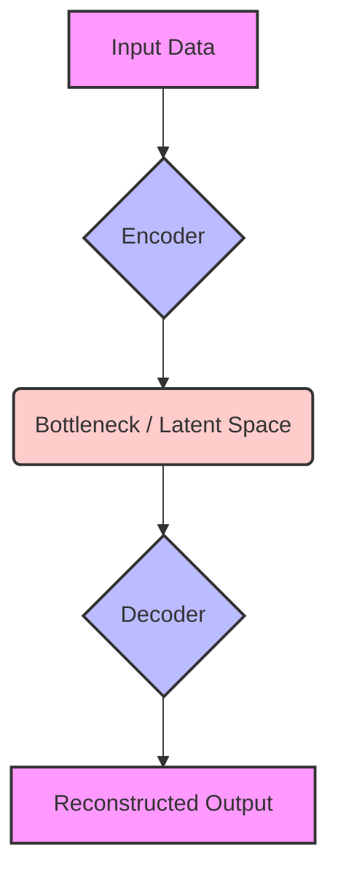

# Regularisation in auto encoders

## Introduction
An **autoencoder** is a type of artificial neural network designed for unsupervised learning, whose primary goal is to learn an **efficient data coding** in an unsupervised manner [GFG]. It achieves this by attempting to compress the input data into a lower-dimensional **latent-space representation** and then reconstructing the original input from this compressed form [GFG].

**Regularisation** refers to a set of techniques used to make a model generalize better by adding constraints to prevent it from **overfitting** the training data [GFG]. In the context of autoencoders, regularization helps the model learn meaningful, compact features rather than simply memorizing the input, leading to more robust and efficient representations [GFG].

## TL;DR
*   **Autoencoders** compress input data into a latent space and then reconstruct it, aiming to learn efficient data representations [GFG].
*   They consist of an **Encoder**, a **Bottleneck (Latent Space)**, and a **Decoder** [GFG].
*   **Regularisation** prevents autoencoders from **overfitting** (memorizing training data) and ensures they learn generalized, meaningful features [GFG].
*   Common autoencoder regularization strategies include **Undercomplete Autoencoders** (bottleneck), **Denoising Autoencoders** (reconstructing from noise), and **Sparse Autoencoders** (enforcing sparse activation in hidden layers) [GFG].
*   General regularization techniques like **L1/L2 penalties**, **Dropout**, **Early Stopping**, and **Batch Normalization** can also be applied to autoencoders [GFG].
*   **Sparse Autoencoders** specifically add sparsity constraints, often using L1 regularization or KL-divergence, to encourage only a small subset of neurons to activate [GFG].

## Autoencoder Architecture
An autoencoder's architecture typically comprises three main components:

1.  **Encoder**: This part compresses the input data into a smaller, more manageable form by reducing its dimensionality while preserving important information [GFG]. It includes the **Input Layer** [GFG].
2.  **Bottleneck (Latent Space)**: This is the smallest layer of the network, representing the most compressed version of the input data [GFG]. It acts as an information bottleneck, forcing the network to prioritize the most significant features [GFG].
3.  **Decoder**: Responsible for taking the compressed representation from the latent space and reconstructing it back into the original data form [GFG]. It contains hidden layers that progressively expand the latent vector [GFG].

## Loss Function and Training
During training, an autoencoder's goal is to minimize the **reconstruction loss** [GFG]. This loss measures how different the reconstructed output (`X_hat`) is from the original input (`X`) [GFG]. The specific choice of loss function depends on the type of data being processed [GFG].

## Why Regularisation? (Overfitting and Generalization)
Regularisation is crucial for autoencoders to prevent them from simply memorizing the training data, a phenomenon known as **overfitting** [GFG].

*   **Overfitting**: Occurs when a model learns the training data, including noise, too well and consequently performs poorly on unseen data [GFG]. In autoencoders, an increased hidden layer in a "normal" autoencoder can allow it to simply replicate the input data, essentially "cheating" and memorizing the input without learning meaningful features [GFG].
*   **Underfitting**: Happens when a model is too simplistic and fails to capture the underlying patterns in the data, leading to poor performance on both training and unseen data [GFG].
*   **Bias**: Errors that occur when a statistical model is too simplistic to accurately fit complex real-world data [GFG].
*   **Variance**: Refers to how much a model's performance changes with different training datasets [GFG]. A high-variance model is very sensitive to the training data.
*   **Bias-Variance Tradeoff**: Finding the right balance between bias and variance is essential for creating models that generalize well [GFG].
*   **Benefits of Regularisation**:
    *   **Prevents Overfitting**: Helps models focus on underlying patterns instead of memorizing noise [GFG].
    *   **Improves Generalization**: Makes the model more robust and able to perform well on new, unseen data [GFG].
    *   **Learns Meaningful Features**: By adding constraints, regularization forces the autoencoder to learn compact and efficient representations [GFG].

## General Regularisation Techniques
These techniques are commonly applied in neural networks, including autoencoders, to improve generalization:

*   **L1 Regularization (Lasso Regression)**: Adds a penalty term proportional to the **absolute value of the weights** to the loss function [GFG]. This encourages the model to use fewer features by driving some weights to zero, promoting sparsity in the model's parameters [GFG].
*   **L2 Regularization (Ridge Regression)**: Adds a penalty term proportional to the **squared magnitude of the weights** to the loss function [GFG]. It helps in handling multicollinearity and generally shrinks weights, but rarely forces them to zero [GFG].
*   **Elastic Net Regression**: A combination of both L1 and L2 regularization, adding both the absolute and squared measures of weights as penalties [GFG].
*   **Dropout Regularization**: During training, a fraction of neurons in a layer are randomly "dropped out" (set to zero) [GFG]. This prevents neurons from co-adapting too much, forcing the network to learn more robust features [GFG].
*   **Early Stopping**: Stops the training process when the model's performance on a validation set begins to degrade (e.g., validation loss stops improving), even if the training loss is still decreasing [GFG]. This prevents the model from overfitting by stopping before it fully memorizes the training data [GFG].
*   **Batch Normalization**: Normalizes the inputs of a layer by re-centering and re-scaling them [GFG]. This stabilizes the learning process, reduces the need for extensive regularization like dropout, and can speed up training [GFG].
*   **Combining Techniques**: Multiple regularization techniques (e.g., L2, dropout, early stopping) can be combined for more robust generalization [GFG].
*   **Practical Tips**: When applying L1 or L2 regularization, start with small values (e.g., **1e-5**) and gradually increase them [GFG]. A common **dropout rate** is between **0.2 and 0.5** [GFG].

## Regularisation in Autoencoders: Specific Types
Some autoencoder architectures are inherently designed with regularization in mind or specifically incorporate regularization mechanisms:

*   **Undercomplete Autoencoders**:
    *   These autoencoders intentionally restrict the size of the hidden layer (**bottleneck**) to be smaller than the input layer [GFG].
    *   This bottleneck forces the model to compress the data, ensuring it learns only the most significant features and prevents it from simply copying the input [GFG].
    *   **Applications**: Anomaly detection, feature extraction, data compression [GFG].

*   **Denoising Autoencoders**:
    *   Designed to handle corrupted or noisy inputs by learning to reconstruct the clean, original data [GFG].
    *   Training involves intentionally feeding corrupted inputs and minimizing the reconstruction loss against the *original, clean* data [GFG].
    *   This process prevents the network from merely memorizing the input; instead, it forces the autoencoder to learn robust feature representations that can recover the original data from its corrupted version [GFG].
    *   **Applications**: Image denoising, signal cleaning, data imputation [GFG].

*   **Sparse Autoencoders**:
    *   Introduce **sparsity constraints** that encourage only a small subset of neurons in the hidden layer to activate at once [GFG].
    *   This leads to a more efficient and focused representation [GFG].
    *   Sparse autoencoders address the overfitting issue in "normal" autoencoders by preventing the network from replicating the input data by simply increasing the hidden layer size [GFG].

## Sparse Autoencoders in Detail
Sparse autoencoders are a specific type of autoencoder that applies regularization to the activations of its hidden layers.

*   **Objective Function**:
    The loss function for a sparse autoencoder combines the standard reconstruction loss with a sparsity penalty:
    `Loss = Reconstruction_Loss(X, X_hat) + λ * Penalty(s)` [GFG]
    *   **X**: Original Input data [GFG].
    *   **X_hat**: Reconstructed output [GFG].
    *   **λ (lambda)**: A **regularization parameter** that controls the strength of the sparsity penalty [GFG].
    *   **Penalty(s)**: A function that penalizes deviations from sparsity. It is often implemented using **KL-divergence** [GFG].

*   **Techniques for Enforcing Sparsity**:
    *   **L1 Regularization**: Can be applied to the activations of the hidden layer. It encourages sparse activation by penalizing the absolute values of the activations, thereby pushing many of them towards zero [GFG].
    *   **KL-Divergence**: Used to penalize the difference between the actual average activation of a hidden neuron and a desired low-sparsity target activation [GFG]. If a neuron's average activation deviates from the target, a penalty is incurred.

*   **Training Sparse Autoencoders**:
    Training typically involves these steps [GFG]:
    1.  **Initialization**: Weights are initialized randomly or using pre-trained networks [GFG].
    2.  **Forward Pass**: Input `X` is fed through the encoder to obtain the **latent representation** [GFG].
    3.  **Loss Calculation**: The combined loss (reconstruction loss + sparsity penalty) is calculated [GFG].
    4.  **Backpropagation**: The loss is propagated backward through the network [GFG].
    5.  **Weight Update**: Network weights are updated using an optimization algorithm to minimize the loss [GFG].

*   **Applications of Sparse Autoencoders**:
    *   **Feature Selection**: By encouraging sparse activation, they highlight the most relevant features, improving interpretability [GFG].
    *   **Dimensionality Reduction**: Creates efficient, low-dimensional representations of data [GFG].

## Examples (Conceptual Sparse Autoencoder Implementation)
Implementing a sparse autoencoder, for instance, for the MNIST dataset, conceptually involves these steps [GFG]:

1.  **Import Libraries**: Import necessary libraries like TensorFlow, Keras for model construction, and NumPy for data handling [GFG].
2.  **Load and Preprocess Data**: Load a dataset like MNIST. Reshape the 28x28 images into a flat vector (e.g., 784 dimensions) and normalize pixel values (e.g., to a range of 0-1) [GFG].
3.  **Define Model Parameters**: Specify parameters such as the **input dimension**, **hidden layer size**, desired **sparsity level** (e.g., average activation target), and the **sparsity regularization weight (λ)** [GFG].
4.  **Build the Autoencoder Model**: Construct the encoder and decoder layers. The hidden layer of the encoder is where sparsity constraints will be applied.
5.  **Define the Sparse Loss Function**: Combine a reconstruction loss (e.g., Mean Squared Error for continuous data or Binary Cross-Entropy for binary/normalized data) with a sparsity penalty term (e.g., using KL-divergence for average neuron activations or L1 regularization on hidden layer outputs) [GFG].
6.  **Compile and Train**: Compile the model using an optimizer (e.g., Adam) and the custom sparse loss function. Then, train the model on the preprocessed dataset [GFG].

## Conclusion
Regularisation is a fundamental concept in machine learning, and its application to autoencoders is crucial for their effectiveness [GFG]. By preventing overfitting and encouraging the learning of compact, meaningful representations, techniques like undercomplete bottlenecks, denoising strategies, and sparse activation penalties ensure that autoencoders capture the essential features of data rather than simply memorizing noise [GFG]. Combining these autoencoder-specific methods with general regularization techniques further enhances the model's ability to generalize well to unseen data, leading to robust and efficient unsupervised learning [GFG].

## Memory Aids
*   **A**uto**E**ncoder **R**egularisation:
    *   **A**ll **E**liminate **R**edundancy (Autoencoders *reduce* dimensionality)
    *   **A**lways **E**nsure **R**obustness (Regularisation *improves* robustness)
*   **S**parse **A**uto**E**ncoders = **S**elect **A**ctivations **E**conomically (only few neurons active).
*   **D**enoising **A**uto**E**ncoders = **D**econtaminate **A**ll **E**rrors (learn to remove noise).
*   **U**ndercomplete **A**uto**E**ncoders = **U**ltimately **A**ll **E**ssentials (bottleneck forces learning core features).
*   **L1 vs L2**:
    *   **L**1 = **L**asso = **L**imits to Zero (weights can become zero).
    *   **L**2 = **L**argely Shrinks (weights shrink but rarely become exactly zero).

## Common Mistakes
1.  **Ignoring Overfitting**: Believing that autoencoders, as unsupervised models, are immune to overfitting. Autoencoders can easily overfit by learning an identity function if not regularized, simply copying input to output [GFG].
2.  **Incorrect Loss Function**: Choosing a reconstruction loss function that doesn't match the data type (e.g., using Mean Squared Error for binary data without proper scaling) [GFG].
3.  **Improper Regularization Strength (λ)**: Setting the regularization parameter (e.g., `λ` in sparse autoencoders or L1/L2 strength) too high can lead to underfitting, while setting it too low might not prevent overfitting effectively [GFG].
4.  **Misunderstanding Sparsity**: Confusing sparse weights (L1 regularization on weights) with sparse activations (sparse autoencoders enforcing few active neurons). Both are types of sparsity but target different aspects [GFG].
5.  **Over-reliance on a Single Technique**: Expecting one regularization technique to solve all generalization issues. Often, combining multiple techniques (e.g., L2 with dropout and early stopping) yields better results [GFG].

## CITATIONS
*   [GFG]: GeeksforGeeks
    *   `https://www.geeksforqeeks.org/machine-learning/auto-encoders/` ("Architecture of Autoencoder", "1. Encoder", "2. Bottleneck (Latent Space)", "3. Decoder", "Loss Function in Autoencoder Training", "Efficient Representations in Autoencoders", "Types of Autoencoders", "1. Denoising Autoencoder")
    *   `https://www.geeksforqeeks.org/numpy/types-of-autoencoders/` ("1. Vanilla Autoencoder", "Applications of Vanilla Autoencoders", "2. Sparse Autoencoder", "Applications of Sparse Autoencoders", "3. Denoising Autoencoder", "Applications of Denoising Autoencoders", "4. Undercomplete Autoencoder", "Applications of Undercomplete Autoencoders")
    *   `https://www.geeksforqeeks.org/deep-learning/sparse-autoencoders-in-deep-learning/` ("Objective Function of a Sparse Autoencoder", "Techniques for Enforcing Sparsity", "Training Sparse Autoencoders", "Preventing the Autoencoder from Overfitting", "Implementation of a Sparse Autoencoder for MNIST Dataset", "Step 1: Import Libraries", "Step 2: Load and Preprocess the MNIST Dataset", "Step 3: Define Model Parameters")
    *   `https://www.geeksforqeeks.org/machine-learning/regularization-in-machine-learning/` ("1. Lasso Regression", "2. Ridge Regression", "3. Elastic Net Regression", "What are Overfitting and Underfitting?", "What are Bias and Variance?", "Bias Variance tradeoff", "Benefits of Regularization")
    *   `https://www.geeksforqeeks.org/deep-learning/adding-regularizations-in-tensorflow/` ("Overview of Regularization", "Implementing L1 and L2 Regularization in TensorFlow", "Applying Dropout Regularization in TensorFlow", "Early Stopping with TensorFlow Callbacks", "Implementing Batch Normalization in TensorFlow", "Combining Multiple Regularization Techniques", "Practical Tips for Regularization in TensorFlow", "Conclusion")