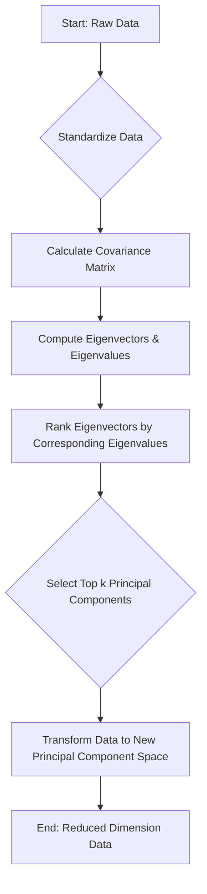

# Relation to PCA

## Introduction

Principal Component Analysis (**PCA**) is a fundamental technique in data science primarily used for **dimensionality reduction**. It transforms data into a new set of features called **principal components**, which are orthogonal and capture the maximum variance in the data [GFG]. PCA is a non-dependent procedure that reduces attribute space from a large number of variables to a smaller number of factors [GFG]. Principal Component Regression (**PCR**) is a regression analysis technique that leverages PCA for dimensionality reduction before performing a regression [GFG], [Wiki]. This document explores the mechanics of PCA, its applications, and its relationship to PCR.

## TL;DR

*   **PCA** is a dimensionality reduction technique using linear algebra [GFG].
*   It transforms data into new, orthogonal features called **principal components** [GFG].
*   **PCA Process**: Standardize data, calculate covariance matrix, find eigenvectors and eigenvalues, select top components, and transform data [GFG].
*   **Eigenvectors** define the directions (principal components), and **eigenvalues** indicate their importance (variance captured) [GFG].
*   **Objective**: Preserve maximum data variance with the fewest dimensions [GFG].
*   **Applications**: Finding interrelations between variables, data interpretation/visualization, simplifying analysis by reducing variables [GFG].
*   **PCR** is a regression technique that uses PCA to reduce data dimensionality *before* fitting a linear regression model [GFG].
*   **PCR Benefits**: Handles multicollinearity, suitable for high-dimensional data [GFG].
*   **PCR Limitation**: Only works with linear relationships [GFG].

## What is Principal Component Analysis (PCA)?

**Principal Component Analysis (PCA)** is a statistical procedure that uses linear algebra to transform data into a new set of features known as **principal components** [GFG]. Its core purpose is to reduce the dimensionality of a dataset while preserving as much variance (information) as possible [GFG]. It achieves this by identifying new axes (principal components) along which the data shows the most spread [GFG].

## Applications and Objectives of PCA

PCA serves several key objectives and is applied in various scenarios:
*   **Dimensionality Reduction**: It reduces the number of variables (attributes) from a large set to a smaller number of factors [GFG].
*   **Variance Preservation**: It identifies a linear combination of variables to extract the maximum variance from the data [GFG].
*   **Interrelation Discovery**: It is used to find interrelations between variables within the data [GFG].
*   **Data Interpretation and Visualization**: By reducing dimensions, PCA makes it simpler to interpret and visualize complex datasets [GFG].
*   **Simplifying Further Analysis**: Decreasing the number of variables makes subsequent data analysis tasks simpler [GFG].

## Key Concepts: Eigenvectors and Eigenvalues

Two mathematical concepts are central to PCA:
*   **Eigenvector**:
    *   A **non-zero vector** that remains parallel to itself after a linear transformation (matrix multiplication) [GFG].
    *   In PCA, eigenvectors represent the **directions** (or axes) of the new feature space, which are the principal components [GFG].
    *   The principal components are orthogonal to each other [GFG].
*   **Eigenvalue**:
    *   Also known as **characteristic roots** [GFG].
    *   Measures the **variance** in all variables accounted for by its corresponding eigenvector (factor) [GFG].
    *   Larger eigenvalues indicate that their corresponding eigenvectors capture more variance, hence are more important [GFG].
    *   The ratio of eigenvalues signifies their explanatory importance [GFG].

## How PCA Works (Detailed Steps)

PCA involves a series of steps to transform the data and reduce its dimensionality:

### PCA Steps: Data Standardization
The initial step is to **standardize the data**. This is crucial because features in a dataset might have different units and scales (e.g., salary vs. age) [GFG]. Standardization ensures that each feature contributes equally to the analysis by transforming them to have:
*   A mean of **0** [GFG].
*   A standard deviation of **1** [GFG].
This is often achieved using Z-score normalization [GFG].

### PCA Steps: Covariance Matrix Calculation
After standardization, PCA calculates the **covariance matrix** [GFG]. The covariance matrix shows how features relate to each other, indicating whether they tend to increase or decrease together [GFG]. The covariance between two features, `x1` and `x2`, is given by: `cov(x1,x2) = \frac{1}{n-1} \sum_{i=1}^{n} (x_{1,i} - \bar{x}_1)(x_{2,i} - \bar{x}_2)` [GFG].

### PCA Steps: Finding Principal Components
PCA then identifies new axes where the data spreads out the most [GFG]. This is done by computing the **eigenvectors** and **eigenvalues** from the covariance matrix [GFG].
*   **1st Principal Component (PC1)**: This is the direction (eigenvector) that captures the maximum variance (most spread) in the data [GFG].
*   **2nd Principal Component (PC2)**: This is the next best direction, orthogonal to PC1, capturing the next highest amount of variance [GFG]. This process continues for subsequent components [GFG].

### PCA Steps: Component Selection & Data Transformation
After calculating all eigenvalues and eigenvectors, PCA ranks them based on the amount of information (variance) they capture [GFG].
*   **Selection**: The top `k` principal components are selected. These components are chosen because they capture most of the variance (e.g., 95%) [GFG].
*   **Transformation**: The original data is then transformed (projected) onto this new lower-dimensional subspace defined by the selected `k` principal components [GFG]. This results in a new dataset with `k` features instead of the original number [GFG].

The overall PCA process can be visualized as follows:

### PCA: Principal Axis Method
PCA fundamentally searches for a **linear combination of variables** that can extract the maximum variance from the variables [GFG]. Once this principal component is extracted, it is effectively removed (or made orthogonal to) and the process searches for another linear combination that explains the next highest variance from the remaining data [GFG]. This iterative process forms the basis of the principal axis method.

## PCA Implementation in Python (General Steps)

Implementing PCA typically involves these steps:
1.  **Import Libraries**: Import necessary libraries like `pandas`, `numpy`, `scikit-learn`, `seaborn`, and `matplotlib` [GFG].
2.  **Create/Import Dataset**: Load or create a dataset (e.g., with features like Height, Weight, Age, Gender) [GFG].
3.  **Feature Scaling**: Apply **feature scaling** (e.g., `StandardScaler` from `scikit-learn`) to standardize the training and testing sets [GFG]. This is equivalent to the standardization step discussed earlier [GFG].
4.  **Apply PCA Function**: Instantiate and apply the `PCA` function (from `scikit-learn`) to the scaled training and testing data [GFG]. You can specify the number of components or the variance ratio to preserve.

## Principal Component Regression (PCR)

**Principal Component Regression (PCR)** is a regression technique that combines PCA with linear regression [GFG]. It is particularly useful for dealing with datasets that have a large number of predictor variables, especially when multicollinearity is present [GFG].

### Features of Principal Component Regression (PCR)
*   **Dimensionality Reduction**: PCR reduces the dimensionality of a dataset by projecting it onto a lower-dimensional subspace using orthogonal linear components (principal components) [GFG].
*   **Handles Multicollinearity**: By transforming original predictors into uncorrelated principal components, PCR effectively addresses multicollinearity issues that can destabilize traditional multiple linear regression [GFG].
*   **Mathematical Foundation**: The underlying mathematical concepts involve dimensionality reduction, similar to PCA [GFG].

### Limitations of Principal Component Regression (PCR)
*   **Linear Relationships Only**: PCR is primarily designed to work when there are linear relationships between the predictors and the response variable [GFG]. It may not perform well with non-linear relationships [GFG].

### Comparison of PCR with Other Techniques
PCR is often compared with:
*   **Multiple Linear Regression**: PCR is beneficial over multiple linear regression when predictors are highly correlated (multicollinearity) [GFG].
*   **Principal Component Analysis (PCA)**: PCA is a dimensionality reduction technique itself, while PCR *uses* PCA as a preprocessing step for regression [GFG].
*   **Partial Least Squares Regression (PLS)**: Both PCR and PLS are dimension reduction techniques for regression, but they differ in how they select components [GFG]. PCR focuses solely on explaining the variance in the predictor variables (X), while PLS considers both X and the response variable (Y) when forming components [needs review].

### PCR Implementation in Python (General Steps)
Implementing PCR in Python typically involves:
1.  **Import Libraries**: Import libraries like `numpy` and `scikit-learn` [GFG].
2.  **Load Dataset**: Load a dataset, distributing it into `X` (features) and `y` (target) components [GFG].
3.  **Scale Features**: Perform **feature scaling** on `X` (e.g., using `StandardScaler`) [GFG].
4.  **Apply PCA**: Apply the `PCA` function from `scikit-learn` to the scaled `X` to reduce its dimensionality. For example, reduce it by half [GFG].
5.  **Train Regression Model**: Use the transformed principal components as predictors to train a linear regression model (e.g., `LinearRegression` from `scikit-learn`) [needs review].

## Examples

1.  **PCA Dataset Creation**: For PCA implementation, a sample dataset might be created with features like **Height**, **Weight**, **Age**, and **Gender** [GFG]. PCA would then transform these original features into a reduced set of principal components while retaining the most important information.
2.  **PCR Dimensionality Reduction**: In a PCR example, an original dataset of shape `(442, 10)` (442 samples, 10 features) might be reduced by half using PCA to `(442, 5)` principal components before a regression model is applied [GFG]. This demonstrates how PCA preprocesses data for PCR.

## Conclusion

Principal Component Analysis (PCA) is a powerful, non-dependent dimensionality reduction technique that transforms complex, high-dimensional data into a simpler, lower-dimensional representation by identifying principal components based on variance [GFG]. By leveraging eigenvectors and eigenvalues, PCA extracts the most significant information, making data more interpretable, visualizable, and amenable to further analysis [GFG]. Principal Component Regression (PCR) builds upon PCA, using its dimensionality reduction capabilities as a crucial preprocessing step for regression tasks, especially when dealing with multicollinearity [GFG]. Together, PCA and PCR offer robust solutions for handling complex datasets in machine learning and statistical modeling.

## Memory Aids

*   **PCA (P**rincipal **C**omponent **A**nalysis): Think **P**reserve **C**ore **A**lignments (variance).
*   **Eigenvalues**: Imagine "importance scores" for each principal component (eigenvector). The larger the eigenvalue, the more variance that component explains.
*   **Eigenvectors**: Think "directions" or "axes" in the data space. They point along the maximal variance.
*   **Standardization**: Essential for "fair play" among features; prevents features with larger scales from dominating the principal components.
*   **PCR (P**rincipal **C**omponent **R**egression): Think **P**CA for **R**egression. It's PCA *then* Regression.

## Common Mistakes

*   **Forgetting Data Standardization**: A common error is not standardizing or scaling the data before applying PCA. This can lead to features with larger scales disproportionately influencing the principal components [needs review].
*   **Misinterpreting Principal Components**: Principal components are linear combinations of the original features, not simply a subset of them. They might not have direct, intuitive physical meanings [needs review].
*   **Selecting Too Few or Too Many Components**: Choosing an incorrect number of components (`k`) can either lead to significant information loss (too few) or negate the benefits of dimensionality reduction (too many) [needs review].
*   **Assuming Linearity**: While PCA is a linear transformation, blindly applying it to highly non-linear data may not yield optimal results for downstream tasks without further non-linear methods [needs review]. PCR, in particular, only works well with linear relationships [GFG].
*   **Confusing PCA with Factor Analysis**: While related, PCA primarily aims for dimensionality reduction and variance explanation, whereas Factor Analysis aims to uncover latent underlying factors [needs review].

## CITATIONS

*   **[GFG]**:
    *   GeeksforGeeks: Principal Component Analysis(PCA) - https://www.geeksforgeeks.org/data-analysis/principal-component-analysis-pca/
        *   "PCA uses linear algebra to transform data into new features called principal components."
        *   "PCA first standardizes the data by making each feature have: A mean of 0 A standard deviation of 1"
        *   "Next PCA calculates the covariance matrix to see how features relate to each other"
        *   "1st Principal Component (PC1): The direction of maximum variance (most spread)."
        *   "After calculating the eigenvalues and eigenvectors PCA ranks them by the amount of information they capture."
        *   "Hence PCA uses a linear transformation that is based on preserving the most variance in the data using the least number of dimensions."
        *   "We import the necessary library like pandas , numpy , scikit learn , seaborn and matplotlib to visualize results."
        *   "We make a small dataset with three features Height, Weight, Age and Gender."
    *   GeeksforGeeks: Principal Component Analysis with Python - https://www.geeksforgee_ks.org/data-analysis/principal-component-analysis-with-python/
        *   "It is used to find interrelations between variables in the data."
        *   "It is used to interpret and visualize data."
        *   "The number of variables is decreasing which makes further analysis simpler."
        *   "It is basically a non-dependent procedure in which it reduces attribute space from a large number of variables to a smaller number of factors."
        *   "PCA basically searches a linear combination of variables so that we can extract maximum variance from the variables."
        *   "It is a non-zero vector that stays parallel after matrix multiplication."
        *   "It is basically known as characteristic roots."
        *   "Import the dataset and distributing the dataset into X and y components for data analysis."
        *   "Doing the pre-processing part on training and testing set such as fitting the Standard scale."
        *   "Applying the PCA function into the training and testing set for analysis."
    *   GeeksforGeeks: Principal Component Regression (PCR) - https://www.geeksforg_eeks.org/principal-component-regression-pcr/
        *   "PCR reduces the dimensionality of a dataset by projecting it onto a lower-dimensional subspace, using a set of orthogonal linear com..."
        *   "Here is a brief overview of the mathematical concepts underlying Principal Component Regression (PCR): Dimensionality reduction:"
        *   "PCR only wo[rks with linear relationships]"
        *   "Principal Component Regression (PCR) is often compared to other regression analysis techniques, such as multiple linear regression, principal component analysis (PCA), and partial least squares regres[sion]."
        *   "Now let's reduce the dimensionality of the original dataset by half that"
*   **[Wiki]**:
    *   Principal component analysis - Wikipedia - https://en.wikipedia.org/wiki/Principal_component_analysis
    *   Principal component regression - Wikipedia - https://en.wikipedia.org/wiki/Principal_component_regression