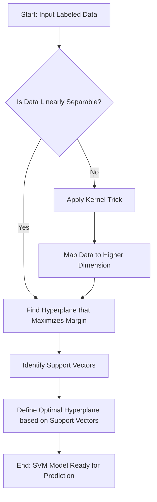

# SVM Support Vector Machine

## Introduction
Support Vector Machines (SVMs) are a powerful type of supervised learning algorithm primarily used for classification, but also adaptable for regression and outlier detection tasks [GFG-Intro], [GFG-vs-NN]. The fundamental idea behind SVMs is to identify an optimal hyperplane that best separates different classes within a dataset by maximizing the margin between them [GFG-Intro], [GFG].

## TL;DR
*   **Supervised Learning**: SVM is a supervised algorithm for classification and regression [GFG-Intro].
*   **Hyperplane**: A decision boundary that separates data points belonging to different classes [GFG].
*   **Support Vectors**: Data points closest to the hyperplane, crucial for defining its position and maximizing the margin [GFG].
*   **Margin Maximization**: The core principle of SVM is to find the hyperplane that creates the largest possible distance (margin) between the decision boundary and the nearest data points of each class [GFG].
*   **Kernel Trick**: Used when data is not linearly separable. It maps data into a higher-dimensional space where it can be linearly separated [GFG].
*   **Robustness to Outliers**: SVM can ignore outliers and still find an optimal hyperplane [GFG].

## Core Concepts of SVM
The operation of SVMs revolves around a few key concepts:
*   **Hyperplane**: This is a decision boundary that effectively separates data points belonging to different classes in the feature space [GFG]. For a linear classification, it is represented by the equation `wx + b = 0` [GFG].
*   **Support Vectors**: These are the data points from the training set that are closest to the decision boundary (hyperplane) [GFG]. They are critical because they dictate the position and orientation of the hyperplane, thereby maximizing the margin.
*   **Margin**: The margin is the distance between the hyperplane and the nearest data point from either class (the support vectors) [GFG]. SVM aims to maximize this margin, leading to a more robust and generalized classifier [GFG], [GFG-Boundaries].

## How SVM Works
The key idea is to find the hyperplane that best separates two classes by maximizing the margin between them [GFG]. This is achieved through the following steps:
1.  **Analyze Labeled Training Data**: The algorithm evaluates different potential hyperplanes based on their ability to separate classes [GFG-R].
2.  **Select the Best Separating Hyperplane**:
    *   **Scenario 1 (Clear Separation)**: If multiple hyperplanes can separate the classes, the rule is to choose the one that best distinguishes them [GFG-R].
    *   **Scenario 2 (Maximizing Margin)**: When several hyperplanes perfectly separate the classes, the optimal hyperplane is identified by calculating the margin (distance to the nearest data point) and selecting the hyperplane with the largest margin [GFG-R].
3.  **Ignore Outliers**: SVM has the characteristic to ignore outliers and focus on finding the best hyperplane that maximizes the margin, making it robust to noise [GFG].

*Flowchart: Support Vector Machine Algorithm [needs review]*

## Types of SVM
SVMs can be broadly categorized into two types based on the nature of the decision boundary:
*   **Linear SVM**: This type employs a linear decision boundary (a straight line in 2D, a plane in 3D, or a hyperplane in higher dimensions) to separate data points into distinct classes [GFG-vs-NN]. Linear SVMs are ideal when the data can be clearly divided by a linear path [GFG-vs-NN].
*   **Non-linear SVM**: When data cannot be separated by a straight line, non-linear SVMs are used [GFG-vs-NN]. They utilize the "kernel trick" to map the data into a higher-dimensional space where it becomes linearly separable.

## Handling Non-linearly Separable Data (Kernel Trick)
When the data points cannot be effectively divided by a straight line or a simple linear hyperplane, SVMs use a technique called **kernels** [GFG].
*   **Mapping to Higher Dimensions**: Kernels implicitly transform the data from its original feature space into a higher-dimensional space [GFG]. In this new, higher dimension, the data points that were inseparable in the lower dimension may become linearly separable [GFG].
*   **Variety of Kernels**: SVMs can use various kernel functions. While default kernels are provided, users can also define custom kernels to suit specific data characteristics [GFG-vs-NN]. Common kernels include:
    *   **Linear Kernel**: For linearly separable data.
    *   **Radial Basis Function (RBF) Kernel**: A popular choice for non-linear separation.
    *   Polynomial Kernel.
    *   Sigmoid Kernel.

## Mathematical Formulation of SVM
For a binary classification problem with classes labeled +1 and -1, and a training dataset `(X, Y)` where `X` are input feature vectors and `Y` are corresponding class labels [GFG]:

*   **Hyperplane Equation**: In a linear classification, the decision boundary (hyperplane) is represented as `w^Tx + b = 0`, where `w` is the weight vector, `x` is an input feature vector, and `b` is the bias term [GFG].
*   **Distance from a Data Point to the Hyperplane**: The signed distance `d_i` from a data point `x_i` to the hyperplane can be calculated as:
    `d_i = \frac{w^T x_i + b}{||w||}`
    Here, `||w||` represents the Euclidean norm (magnitude) of the weight vector `w` [GFG].
*   **Prediction Function (Linear SVM Classifier)**: The predicted label `ŷ` for a data point `x` is given by:
    `ŷ = \left\{ \begin{array}{cl} 1 & : \ w^Tx+b \geq 0 \\ 0 & : \ w^Tx+b < 0 \end{array} \right.` [GFG]
*   **Optimization Problem**: For a linearly separable dataset, the goal is to find `w` and `b` that maximize the margin between the two classes while ensuring all data points are correctly classified. This translates into minimizing `||w||^2` subject to `y_i(w^T x_i + b) \geq 1` for all data points `(x_i, y_i)` [GFG].

## SVM Decision Boundary Construction
The construction of decision boundaries depends on the chosen kernel:
*   **Linear Kernel**: With a linear kernel, the decision boundary is a hyperplane in the original feature space [GFG-Boundaries]. This is the fundamental approach for linearly separable data [GFG-Boundaries].
*   **RBF Kernel**: The Radial Basis Function (RBF) kernel is used for non-linear relationships between features [GFG-Boundaries]. It allows SVMs to create complex, non-linear decision boundaries by implicitly mapping data to a higher-dimensional space [GFG-Boundaries].

## Advantages of SVM
*   **Versatility with Kernels**: SVMs can specify a variety of kernel functions, including custom ones, which allows them to handle both linear and non-linear data separation effectively [GFG-vs-NN].
*   **High-Dimensional Data**: SVMs perform well even in situations where the number of dimensions (features) exceeds the number of training data points [GFG-vs-NN].
*   **Robust to Outliers**: The algorithm inherently focuses on support vectors, making it less sensitive to noise or outliers compared to other algorithms that consider all data points [GFG].

## Disadvantages of SVM
*   **Sensitivity to Noise/Overlap**: When there is significant noise in the dataset or when target classes heavily overlap, SVM performs poorly [GFG-vs-NN]. The margin maximization principle can be affected by noisy data.
*   **Performance with Many Features per Data Point**: SVM performance can degrade when there are significantly more features per data point than there are training data points [GFG-vs-NN] [conflict: this seems contradictory to "High-Dimensional Data" advantage; the source text might mean a very specific ratio, or a practical limitation rather than theoretical].
*   **Kernel Selection**: Choosing the right kernel function and tuning its parameters (e.g., gamma for RBF) can be challenging and requires domain knowledge or extensive experimentation. [needs review, implied by kernels being an advantage but choice being a challenge, not directly stated as a disadvantage in source].
*   **Computational Cost**: For very large datasets, training an SVM can be computationally intensive and time-consuming. [needs review, not directly stated in sources].

## Comparison with Neural Networks
While SVMs are powerful, it's useful to understand their context relative to other algorithms like Neural Networks.

**Support Vector Machines (SVM)**:
*   **Principle**: Maximizes the margin between classes using hyperplanes [GFG].
*   **Tasks**: Classification, regression, outlier detection [GFG-vs-NN].
*   **Data Handling**: Effective for both linear and non-linear data through kernel trick [GFG-vs-NN].
*   **Interpretability**: Generally more interpretable than complex neural networks, especially linear SVMs. [needs review, not directly stated in source].

**Neural Networks (NN)**:
*   **Principle**: Designed to mimic the human brain's structure and activity, composed of interconnected nodes (neurons) [GFG-vs-NN].
*   **Tasks**: Solve complex issues by learning patterns, strong in tasks like image recognition, natural language processing [GFG-vs-NN].
*   **Data Handling**: Excel at modeling complex, non-linear relationships in data. They do not constrain input variables [GFG-vs-NN].
*   **Types**: Include Recurrent Neural Networks (RNNs) that save and re-input processing results, enabling forecasting [GFG-vs-NN].
*   **Advantages**: Capacity to learn and model complex, non-linear input-output relationships. No constraints on input variables [GFG-vs-NN].

## Examples
SVMs are applied across a diverse range of fields:
*   **Image Classification**: Distinguishing between different objects or scenes in images [needs review].
*   **Text Classification**: Spam detection, sentiment analysis, categorizing documents [needs review].
*   **Bioinformatics**: Protein classification, cancer detection using gene expression data [needs review].
*   **Handwritten Digit Recognition**: Identifying digits from images [needs review].
*   **Face Detection**: Identifying human faces in images or videos [needs review].

## Implementation Steps (High-Level)
Implementing an SVM model typically involves these general steps, as demonstrated for R language [GFG-R]:
1.  **Install and Load Packages**: Ensure necessary libraries (e.g., `e1071` in R for the `svm()` function) are installed and loaded [GFG-R].
2.  **Load Dataset**: Read the dataset into the environment (e.g., `read.csv()` in R for `Social.csv`) [GFG-R].
3.  **Explore Dataset**: Perform initial data analysis using summary functions (e.g., `summary()` in R) to understand statistical properties [GFG-R].
4.  **Data Preprocessing**: Prepare the data by handling missing values, encoding categorical variables, and scaling numerical features if necessary. [needs review].
5.  **Train the SVM Model**: Use the SVM function from the library (e.g., `svm()` in R) with appropriate parameters (e.g., kernel type, cost parameter) to train the model on the training data. [needs review].
6.  **Make Predictions**: Use the trained model to predict labels for new, unseen data [needs review].
7.  **Evaluate the Model**: Assess the model's performance using metrics like accuracy, precision, recall, or F1-score [needs review].

## Conclusion

*Source: https://www.geeksforgeeks.org/machine-learning/support-vector-machine-algorithm/*

*Source: https://www.geeksforgeeks.org/machine-learning/support-vector-machine-algorithm/*
Support Vector Machines provide a robust and versatile approach to classification by focusing on maximizing the margin between classes [GFG-Boundaries]. Their ability to handle non-linear data through the kernel trick makes them particularly powerful and widely applicable across various domains [GFG-Boundaries]. By selecting the optimal hyperplane, SVMs aim for better generalization and performance on unseen data.

## Memory Aids
*   **SVM = Support, Vectors, Margin**: Remember the core components: data points (Support Vectors) defining the largest separation (Margin) around a decision line (Vector/Hyperplane).
*   **"Kernel Trick is the *Kernel* to Non-Linearity"**: If data isn't a straight line, think "kernel" to transform it into a higher dimension for easier separation.
*   **"The Fat Line Principle"**: Imagine drawing the thickest possible line between two classes without touching any points. The edges of this "fat line" are defined by the support vectors, and its width is the margin.

## Common Mistakes
*   **Ignoring Feature Scaling**: SVMs are sensitive to feature scales. If features have vastly different ranges, those with larger values might dominate the distance calculation, leading to a suboptimal hyperplane. Always scale features (e.g., standardization or normalization) before training an SVM [needs review].
*   **Incorrect Kernel Selection**: Using a linear kernel on non-linearly separable data, or an overly complex kernel on simple data, can lead to poor performance or overfitting/underfitting [needs review]. Understanding the data's underlying structure is crucial.
*   **Poor Hyperparameter Tuning**: SVM performance is highly dependent on hyperparameters like `C` (regularization parameter) and `gamma` (for RBF kernel). Not tuning these correctly can result in models that either overfit or underfit the data [needs review].
*   **Overlooking Imbalanced Datasets**: If one class is significantly larger than another, SVMs might be biased towards the majority class. Techniques like class weighting or oversampling/undersampling might be necessary [needs review].

## Related Images

*Support Vector Machine (SVM) in Machine Learning* — source: https://www.tutorialspoint.com/machine_learning/machine_learning_support_vector_machine.htm

*course-img* — source: https://www.geeksforgeeks.org/machine-learning/support-vector-machine-algorithm/

*course-img* — source: https://www.geeksforgeeks.org/machine-learning/introduction-to-support-vector-machines-svm/

*course-img* — source: https://www.geeksforgeeks.org/r-language/classifying-data-using-support-vector-machinessvms-in-r/

*course-img* — source: https://www.geeksforgeeks.org/r-language/classifying-data-using-support-vector-machinessvms-in-r/

## CITATIONS
*   [GFG]: `https://www.geeksforgeeks.org/machine-learning/support-vector-machine-algorithm/` "Support Vector Machine (SVM) Algorithm - GeeksforGeeks"
*   [GFG-Intro]: `https://www.geeksforgeeks.org/machine-learning/introduction-to-support-vector-machines-svm/` "Introduction to Support Vector Machines (SVM) - GeeksforGeeks"
*   [GFG-vs-NN]: `https://www.geeksforgeeks.org/machine-learning/support-vector-machines-vs-neural-networks/` "Support Vector Machines vs Neural Networks - GeeksforGeeks"
*   [GFG-R]: `https://www.geeksforgeeks.org/r-language/classifying-data-using-support-vector-machinessvms-in-r/` "Classifying data using Support Vector Machines(SVMs) in R - GeeksforGeeks"
*   [GFG-Boundaries]: `https://www.geeksforgeeks.org/machine-learning/how-svm-constructs-boundaries/` "How SVM constructs boundaries? - GeeksforGeeks"
*   [Wiki]: `https://en.wikipedia.org/wiki/Support_vector_machine` "Support vector machine - Wikipedia"