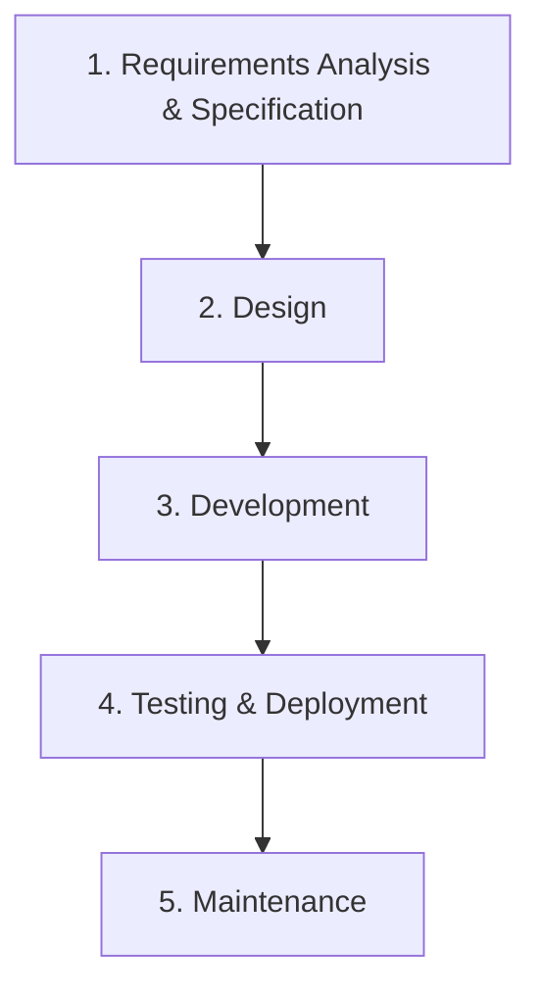

# Software Engineering

## Introduction

**Software Engineering** is a systematic, disciplined, quantifiable approach to the design, development, operation, and maintenance of software systems [GFG]. It provides a structured process for creating software applications, guiding planning, designing, implementing, testing, and deploying software [GFG]. This field aims to develop software that is not only functional but also easy to update for future requirements [Scaler].

## TL;DR

*   **Software Engineering (SE)** is a disciplined approach to building and maintaining software [GFG].
*   It focuses on **quality, efficiency, and maintainability** [GFG].
*   Key **principles** include Modularity and Abstraction [GFG].
*   Software has a **dual role**: as a product and as a vehicle for delivering products [GFG].
*   **Software Development Life Cycle (SDLC) models** like Waterfall and V-Model provide structured development frameworks [GFG].
*   SE is crucial for managing **complexity** and ensuring **reliable software** across various industries [Scaler].
*   Disciplines include **requirements, design, project management, testing, and quality assurance** [GFG].

## What is Software Engineering?

**Software engineering** is defined as the systematic, disciplined, quantifiable study and approach to the design, development, operation, and maintenance of a software system [GFG]. It encompasses the entire process of creating software that is functional and easily adaptable to future requirements [Scaler].

The main **attributes** of software engineering emphasize a disciplined and measurable method for handling software [GFG].

## Need and Importance of Software Engineering

Software engineering is essential for several reasons:
*   **Reduced Complexity**: It helps in managing and reducing the complexity inherent in software development projects through careful planning and design [Scaler].
*   **High Demand**: In the current digital age, software is ubiquitous, leading to a constant demand for skilled software engineers [Scaler].
*   **Fulfilling Career**: It offers opportunities for a rewarding career with diverse possibilities [Scaler].

## Objectives of Software Engineering

The primary objectives of software engineering include:
*   **Maintainability**: Ensuring the software can evolve and adapt to changing requirements over time [GFG].
*   **Efficiency**: Preventing wasteful use of computing resources such as memory and processor cycles [GFG].

## Key Principles of Software Engineering

Two fundamental principles guide software engineering practices:
*   **Modularity**: Breaking down software into smaller, independent, and reusable components that can be developed and tested separately [GFG].
*   **Abstraction**: Hiding the intricate implementation details of a component, exposing only its necessary functionalities [GFG].

## Dual Role of Software

Software plays a dual role in the industry:
1.  **As a Product**:
    *   Delivers computing potential across hardware networks [GFG].
    *   Enables hardware to provide expected functionality [GFG].
    *   Acts as an **information transformer**, acquiring, managing, and producing information [GFG].
2.  **As a Vehicle for Delivering a Product**:
    *   Provides system functionality (e.g., a payroll system) [GFG].
    *   Controls other software (e.g., an operating system) [GFG].
    *   Aids in building other software (e.g., software tools) [GFG].

## Characteristics of Software Engineering

Software engineering possesses several key characteristics:
*   **Iterative and Incremental**: It is a process that involves developing and testing software in successive, smaller cycles [Scaler].

## Applications and Areas of Use

Software engineering is widely applied across various domains:
*   **Web Development**: Used for creating websites, web applications, and online services, ranging from small business sites to large e-commerce platforms [Scaler].
*   **Healthcare**: Develops systems for patient record management, medical equipment control, and diagnostic tools [Scaler].
*   **Education**: Supports the creation of e-learning platforms, educational software, and administrative systems for institutions [Scaler].
*   **Finance**: Builds secure and efficient software for banking, trading, financial analysis, and payment processing [Scaler].
*   **Gaming**: Essential for developing interactive and complex video games across different platforms [Scaler].

## Software Development Life Cycle (SDLC) Models

**Software development models** are frameworks that guide the process of creating software applications [GFG]. They offer a structured approach to **planning, designing, implementing, testing, and deploying** software [GFG].

### Waterfall Model

The **Waterfall Model** is a Software Development Life Cycle (SDLC) model known for its structured, sequential approach [GFG]. It is typically used for large, complex projects, often in information technology [GFG]. Each phase must be completed before the next one begins [GFG].

#### Phases of Waterfall Model
The classical Waterfall Model divides the life cycle into sequential phases:
1.  **Requirements Analysis and Specification**: Understanding and documenting customer requirements accurately [GFG]. This includes gathering and specifying requirements [GFG].
2.  **Design**: Converting the specified requirements into a format suitable for coding, including high-level and detailed design [GFG].
3.  **Development (or Implementation)**: Translating the software design into source code using a suitable programming language and coding each module [GFG].
4.  **Testing and Deployment**: Integrating and testing modules, followed by deployment. Integration testing occurs incrementally after unit testing [GFG].
5.  **Maintenance**: The most crucial phase, where effort spent can be up to 60% of the total development effort [GFG].

#### Features of Waterfall Model
*   **Sequential Approach**: Each phase completes fully before the next one starts [GFG].

#### When to Use Waterfall Model? [needs review]
The source mentions it's used for "large, complex projects" [GFG], but doesn't explicitly state "when to use."

**Figure 1: Waterfall Model Phases**

### V-Model

The **V-Model** is a structural approach to software development that explicitly includes **Verification and Validation** activities [GFG]. It emphasizes testing activities parallel to development activities.

#### Phases of V-Model
The V-Model consists of parallel **Verification** and **Validation** phases.

##### 1. V-Model Verification Phases (Left side of the 'V')
These phases focus on "Are we building the product right?" [GFG].
*   **Business Requirement Analysis**: The initial step to gather and understand customer needs and define project scope [GFG]. This involves proper communication with the customer [GFG].
*   **System Design**: Planning the overall software structure, covering both high-level (system structure) and detailed design (individual components) [GFG].
*   **Architectural Design**: Comprehending and designing architectural specifications, often involving evaluating several technical approaches [GFG].
*   **Module Design (Low-Level Design - LLD)**: Specifying the comprehensive internal design for each system module, ensuring compatibility [GFG].
*   **Coding Phase**: Where the software is actually built, writing code for the system modules based on the designs [GFG].

##### 2. V-Model Validation Phases (Right side of the 'V')
These phases focus on "Are we building the right product?" and involve dynamic analysis and testing [GFG].
*   **Unit Testing**: Tests individual software modules after coding [GFG]. This corresponds to the **Module Design** phase.
*   **Integration Testing**: Tests the interactions between integrated modules [GFG]. This corresponds to the **Architectural Design** phase.
*   **System Testing**: Tests the complete and integrated software system [GFG]. This corresponds to the **System Design** phase.
*   **User Acceptance Testing (UAT)**: Tests the software with end-users to ensure it meets business requirements [GFG]. This corresponds to the **Business Requirement Analysis** phase.

#### Importance of V-Model
*   **Early Defect Identification**: Helps identify defects early in the development lifecycle [GFG].
*   **Determining Phases of Development and Testing**: Clearly defines parallel development and testing phases [GFG].
*   **Prevents "Big Bang" Testing**: Avoids a single, large testing effort at the end, by distributing testing throughout [GFG].
*   **Improves Cooperation**: Fosters better collaboration between development and testing teams [GFG].
*   **Improved Quality Assurance**: Leads to higher software quality through systematic verification and validation [GFG].

#### When to Use V-Model? [needs review]
The source mentions "structural approach to software development" [GFG] and its benefits, but doesn't explicitly state "when to use."

```mermaid
graph LR
    subgraph Verification Phases
        A[Business Requirement Analysis] --> B[System Design]
        B --> C[Architectural Design]
        C --> D[Module Design]
    end

    D -- "Code based on" --> E(Coding Phase)

    subgraph Validation Phases
        E -- "Tested by" --> UT[Unit Testing]
        UT -- "Tested by" --> IT[Integration Testing]
        IT -- "Tested by" --> ST[System Testing]
        ST -- "Tested by" --> UAT[User Acceptance Testing]
    end

    style A fill:#DDEBF7,stroke:#333,stroke-width:2px
    style B fill:#DDEBF7,stroke:#333,stroke-width:2px
    style C fill:#DDEBF7,stroke:#333,stroke-width:2px
    style D fill:#DDEBF7,stroke:#333,stroke-width:2px
    style E fill:#FFF2CC,stroke:#333,stroke-width:2px
    style UT fill:#E2F0D9,stroke:#333,stroke-width:2px
    style IT fill:#E2F0D9,stroke:#333,stroke-width:2px
    style ST fill:#E2F0D9,stroke:#333,stroke-width:2px
    style UAT fill:#E2F0D9,stroke:#333,stroke-width:2px

    linkStyle 0 stroke-dasharray: 5 5;
    linkStyle 1 stroke-dasharray: 5 5;
    linkStyle 2 stroke-dasharray: 5 5;
    linkStyle 3 stroke-dasharray: 5 5;
    linkStyle 4 stroke:#333,stroke-width:2px;
    linkStyle 5 stroke:#333,stroke-width:2px;
    linkStyle 6 stroke:#333,stroke-width:2px;
    linkStyle 7 stroke:#333,stroke-width:2px;
```

**Figure 2: V-Model of SDLC**
*(Dashed lines indicate conceptual correspondence between Verification and Validation phases, solid lines represent typical flow.)*

## Core Software Engineering Disciplines

Software engineering encompasses several specialized areas:

*   **Software Requirements**: These are descriptions of the features, functions, capabilities, and constraints that a software system must possess to meet user and stakeholder needs [GFG]. They serve as the foundation for the entire development process [GFG].
*   **Software Design**: This involves creating a blueprint or plan for how a software system will be structured and organized to meet its requirements effectively and efficiently [GFG].
*   **Software Project Management (SPM)**: SPM involves planning, organizing, and controlling software development projects. Its goal is to ensure projects are completed on time, within budget, and according to specified quality standards [GFG].
*   **Software Metrics**: These are quantitative measures used to assess various aspects of software development processes, products, and projects [GFG]. Metrics provide insights into quality, performance, and other characteristics [GFG].
*   **Software Quality**: This refers to the degree to which a software product meets specified requirements and satisfies customer expectations [GFG]. It ensures the software is **reliable, efficient, maintainable, and user-friendly** [GFG].
*   **Software Configuration**: This process focuses on managing and controlling changes to software systems, components, and related artifacts throughout the software development lifecycle [GFG].

## Career and Tasks of a Software Engineer

A degree in software engineering coupled with relevant experience can lead to numerous computing job choices [GFG]. Software engineers have opportunities for well-paying careers and professional growth [GFG].

The main responsibility of a **software engineer** is to develop useful computer programs and applications [GFG]. They typically work in teams to complete various projects and develop solutions that satisfy specific requirements [GFG].

## Examples

*   **Web Development**: Building an e-commerce platform like Flipkart or Myntra using principles of modularity and scalable architecture [Scaler].
*   **Healthcare Systems**: Developing an Electronic Health Record (EHR) system that manages patient data securely and efficiently, ensuring maintainability for future updates [Scaler].
*   **Operating Systems**: Creating an operating system like Linux or Windows, which acts as a vehicle to control other software and hardware functionalities [GFG].
*   **Mobile Applications**: Designing and developing an app for online food delivery, where requirements are gathered, designs are made, and iterative testing ensures quality [Scaler].

## Memory Aids

*   **SDLC Phases**: Think of "R-D-I-T-M" for Waterfall – **R**equirements, **D**esign, **I**mplementation (Development), **T**esting, **M**aintenance.
*   **V-Model**: Visualize a "V" where the left side is "building it right" (Verification/Development) and the right side is "building the right thing" (Validation/Testing), meeting at the **Coding** phase.
*   **Software Attributes**: "SMSQ" - **S**ystematic, **M**easurable, **S**cience, **Q**uantifiable [needs review - derived from "systematic, disciplined, quantifiable study and approach" and "four main Attributes" mentioned without explicit acronym, so this is an interpretation based on description].

## Common Mistakes

*   **Neglecting Requirements**: Failing to thoroughly gather and document requirements early can lead to building the wrong product, resulting in costly rework [GFG, implied from importance of Requirement Analysis in Waterfall/V-Model].
*   **Skipping Design Phase**: Jumping directly into coding without a clear design blueprint can lead to unmanageable complexity, poor architecture, and difficulties in maintenance [GFG, implied from Design phase in Waterfall/V-Model].
*   **Insufficient Testing**: Not allocating enough time and resources for comprehensive testing can result in a buggy product and dissatisfied users [GFG, implied from Testing phases in Waterfall/V-Model].
*   **Ignoring Configuration Management**: Poor management of changes to code and artifacts can lead to version conflicts and unstable software builds [GFG, implied from Software Configuration section].

## Conclusion

Software engineering is a critical discipline that provides the necessary frameworks, principles, and processes for developing high-quality, maintainable, and efficient software systems. By adopting structured approaches like the Waterfall and V-Models, and focusing on key areas such as requirements, design, project management, and quality assurance, software engineers can effectively manage complexity and deliver reliable solutions that meet evolving user needs. Its systematic nature is indispensable in today's software-driven world, enabling innovation across diverse industries.

## CITATIONS

*   [GFG] GeeksforGeeks. "Software Engineering Tutorial." `https://www.geeksforgeeks.org/software-engineering/software-engineering/`
    *   [Basics] "This Introduction part covers the topic like Basics of Software and Software engineering, What is the need of Software Engineering etc."
    *   [Software Development Models & Architecture] "Software development models are frameworks that guide the process of creating software applications. They provide a structured approach to planning, designing, implementing, testing, and deploying sof…"
    *   [Software Project Management(SPM)] "Software Project Management (SPM) involves planning, organizing, and controlling software development projects to ensure they are completed on time, within budget, and according to specified quality s…"
    *   [Software Metrices] "Software metrics are quantitative measures used to assess various aspects of software development processes, products, and projects. These metrics provide valuable insights into the quality, performan…"
    *   [Software Requirements] "Software requirements are descriptions of the features, functions, capabilities, and constraints that a software system must possess to meet the needs of its users and stakeholders. They serve as the …"
    *   [Software Configuration] "Software configuration refers to the process of managing and controlling changes to software systems, components, and related artifacts throughout the software development lifecycle. Here are some art…"
    *   [Software Quality] "Software quality refers to the degree to which a software product meets specified requirements and satisfies customer expectations, ensuring it is reliable, efficient, maintainable, and user-friendly.…"
    *   [Software Design] "Software design involves creating a blueprint or plan for how a software system will be structured and organized to meet its requirements effectively and efficiently. These articles gives you a clear …"
    *   [Key Principles of Software Engineering] "Modularity : Breaking the software into smaller, reusable components that can be developed and tested independently. Abstraction : Hiding the implementation details of a component and exposing only th…"
    *   [Main Attributes of Software Engineering] "Software Engineering is a systematic, disciplined, quantifiable study and approach to the design, development, operation, and maintenance of a software system. There are four main Attributes of Softwa…"
    *   [Dual Role of Software] "There is a dual role of software in the industry. The first one is as a product and the other one is as a vehicle for delivering the product. We will discuss both of them."
    *   [1. As a Product] "It delivers computing potential across networks of Hardware. It enables the Hardware to deliver the expected functionality. It acts as an information transformer because it produces, manages, acquires…"
    *   [2. As a Vehicle for Delivering a Product] "It provides system functionality (e.g., payroll system). It controls other software (e.g., an operating system). It helps build other software (e.g., software tools)."
    *   [Objectives of Software Engineering] "Maintainability: It should be feasible for the software to evolve to meet changing requirements. Efficiency: The software should not make wasteful use of computing devices such as memory, processor cy…"
    *   [What Careers Are There in Software Engineering?] "A degree in software engineering and relevant experience can be utilized to explore several computing job choices. Software engineers have the opportunity to seek well-paying careers and professional …"
    *   [What Tasks do Software Engineers do?] "The main responsibility of a software engineer is to develop useful computer programs and applications. Working in teams, you would complete various projects and develop solutions to satisfy certain c…"
    *   [What is the SDLC Waterfall Model?] "The waterfall model is a Software Development Model used in the context of large, complex projects, typically in the field of information technology. It is characterized by a structured, sequential ap…"
    *   [Phases of Waterfall Model] "Classical Waterfall Model divides the life cycle into a set of phases. The development process can be considered as a sequential flow in the waterfall. The different sequential phases of the classical…"
    *   [1. Requirements Analysis and Specification] "Requirement Analysis and specification phase aims to understand the exact requirements of the customer and document them properly. This phase consists of two different activities. 1. Requirement Gathe…"
    *   [2. Design] "The goal of this Software Design Phase is to convert the requirements acquired in the SRS into a format that can be coded in a programming language. It includes high-level and detailed design as well …"
    *   [3. Development] "In the Development Phase software design is translated into source code using any suitable programming language. Thus each designed module is coded. The unit testing phase aims to check whether each m…"
    *   [4. Testing and Deployment] "1. Testing: Integration of different modules is undertaken soon after they have been coded and unit tested. Integration of various modules is carried out incrementally over several steps. During each …"
    *   [5. Maintenance] "In Maintenance Phase is the most important phase of a software life cycle. The effort spent on maintenance is 60% of the total effort spent to develop a full software. There are three types of mainten…"
    *   [Features of Waterfall Model] "Following are the features of the waterfall model: Sequential Approach : The waterfall model involves a sequential approach to software development, where each phase of the project is completed before…"
    *   [Phases of SDLC V-Model] "The V-Model, which includes the Verification and Validation it is a structural approach to software development. The following are the different Phases of the V-Model of the SDLC."
    *   [1. V-Model Verification Phases] "This is where the process begins. The first step is to gather and understand the customer’s needs for the software. The goal is to define the scope of the project clearly to make sure everyone is on t…"
    *   [1. Business Requirement Analysis] "This is the first step of the designation of the development cycle where product requirement needs to be cured from the customer's perspective. These phases include proper communication with the custo…"
    *   [2. System Design] "In this phase, the overall structure of the software is planned out. The team develops both the high-level design (how the system will be structured) and detailed design (how the individual components…"
    *   [3. Architectural Design] "In this stage, architectural specifications are comprehended and designed. Usually, several technical approaches are put out, and the ultimate choice is made after considering both the technical and f…"
    *   [4. Module Design] "This phase, known as Low-Level Design (LLD), specifies the comprehensive internal design for every system module. Compatibility between the design and other external systems as well as other modules i…"
    *   [5. Coding Phase] "This is where the software is actually built. Developers write the code based on the design created in the previous phase. The Coding step involves writing the code for the system modules that were cr…"
    *   [2. V-Model Validation Phases] "It involves dynamic analysis techniques (functional, and non-functional), and testing done by executing code. Validation is the process of evaluating the software after the completion of the developme…"
    *   [1. Unit Testing] "Unit testing ensures that individual components of the software function correctly. This typically happens during or immediately after the coding phase."
    *   [2. Integration testing] "Integration testing focuses on validating the interfaces and interactions between different modules or components of the software. This phase follows unit testing, once individual units are verified."
    *   [3. System Testing] "System testing evaluates the complete and integrated software system to verify that it meets the specified requirements. It often involves testing the system as a whole, including both functional and non-functional aspects."
    *   [4. User Acceptance Testing (UAT)] "User Acceptance Testing is the final phase of testing, where the end-users or clients validate the software against their business requirements and expectations. It ensures that the software is ready for deployment and meets the user's needs in a real-world scenario."
    *   [Importance of V-Model] "Importance of V-Model: Early Defect Identification. Determining the Phases of Development and Testing. Prevents "Big Bang" Testing. Improves Cooperation. Improved Quality Assurance."
*   [Scaler] Scaler Topics. "Software Engineering Tutorial - What is, Definition, Basics." `https://www.scaler.com/topics/software-engineering/`
    *   [What is Software Engineering?] "Software engineering is the process of developing software that is functional and easy to update according to future requirements. Software engineering subject involves planning, designing, creating, …"
    *   [Why to Learn Software Engineering?] "Software engineering is a skill that can lead to a fulfilling career with a lot of exciting possibilities. In today's digital age, software is everywhere, and the demand for skilled software engineers…"
    *   [Audience] "If you're a student, software developer, or an IT professional looking to learn or improve your software engineering skills or to know what is Software Engineering, this Software Engineering Tutorial …"
    *   [Prerequisite] "The best thing about this Software Engineering Tutorial is that you don't need to be a coding wizard or a software pro to have a grip on this! All you need is a curious mind and a desire to learn abou…"
    *   [Areas where Software Engineering is Used?] "Here are the top 5 areas where software engineering is being used heavily: Healthcare: Software engineering is used to develop systems for managing patient records, medical equipment, and diagnostic t…"
    *   [Applications of Software Engineering] "Here are some of the applications of software engineering: Web Development: Software engineering is used to develop websites, web applications, and other online services. From small business websites …"
    *   [Characteristics of Software Engineering] "Some of the characteristics of Software Engineering are as follows: Iterative and incremental: Software engineering is an iterative and incremental process that involves developing and testing softwar…"
    *   [Advantages of Software Engineering] "Reduced Complexity: One of the primary advantages of software engineering is that it helps to reduce the complexity of software development projects. Emphasis are laid on the importance of careful pla…"
*   [Wiki] Wikipedia. "Software engineering." `https://en.wikipedia.org/wiki/Software_engineering`