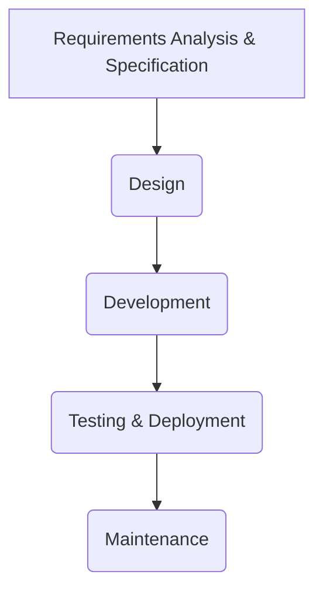

# Software Engineering

## TL;DR

*   **Software Engineering** is a systematic, disciplined approach to designing, developing, operating, and maintaining software systems [GFG].
*   It involves processes like planning, designing, creating, and testing software that is functional, reliable, and adaptable to future changes [Scaler].
*   Software plays a **dual role**: as a **product** (delivering computing potential) and as a **vehicle** (providing system functionality, controlling other software, or building other software) [GFG].
*   Key principles include **modularity**, **abstraction**, and a **systematic, iterative, and incremental** approach [GFG], [Scaler].
*   **Software Development Models** like the **Waterfall Model** (sequential) and **V-Model** (verification and validation phases) guide the development process [GFG].

## Introduction

**Software Engineering** is defined as the process of developing software that is functional and easy to update according to future requirements [Scaler]. It involves a structured approach to planning, designing, creating, implementing, testing, and deploying software applications [GFG], [Scaler]. It is also characterized as the systematic, disciplined, quantifiable study and approach to the design, development, operation, and maintenance of a software system [GFG].

### Why Learn Software Engineering?
Learning software engineering can lead to a fulfilling career with many exciting possibilities [Scaler]. In today's digital age, software is ubiquitous, driving a constant demand for skilled software engineers [Scaler].

### Audience and Prerequisites
This field is beneficial for students, software developers, or IT professionals seeking to learn or improve their software engineering skills [Scaler]. The primary prerequisite is a curious mind and a desire to learn; deep coding expertise is not strictly necessary to grasp the basics [Scaler].

## Core Concepts

### Dual Role of Software
Software serves a **dual role** in the industry [GFG]:
1.  **As a Product**: It delivers computing potential across hardware networks, enabling hardware to perform its expected functionality. It acts as an information transformer, producing, managing, and acquiring data [GFG].
2.  **As a Vehicle for Delivering a Product**: It provides specific system functionality (e.g., a payroll system), controls other software (e.g., an operating system), or helps build other software (e.g., software development tools) [GFG].

### Key Principles of Software Engineering
Fundamental principles guide the software development process [GFG]:
*   **Modularity**: Breaking software into smaller, reusable components that can be developed and tested independently [GFG].
*   **Abstraction**: Hiding the implementation details of a component, exposing only necessary functionality [GFG].
*   **Systematic Approach**: Emphasizes careful planning, designing, and testing [Scaler].

### Main Attributes of Software Engineering
Software engineering is characterized by a **systematic, disciplined, quantifiable** study and approach to the **design, development, operation, and maintenance** of software systems [GFG].

### Characteristics of Software Engineering
Software engineering possesses several key characteristics [Scaler]:
*   **Iterative and Incremental**: Development often proceeds in cycles, building upon previous versions and adding features gradually [Scaler].
*   **Systematic and Disciplined**: Follows structured processes to ensure quality and manage complexity [Scaler].
*   **Process-oriented**: Adheres to defined steps and methodologies [Scaler].
*   **Manageable Complexity**: Aims to reduce the complexity of large projects through careful planning and design [Scaler].
*   **Quality Focused**: Ensures the software meets specified requirements and customer expectations [Scaler].

### Objectives of Software Engineering
The primary objectives are to ensure software is [GFG]:
*   **Maintainable**: Capable of evolving to meet changing requirements [GFG].
*   **Efficient**: Optimized to avoid wasteful use of computing resources like memory and processor cycles [GFG].
*   **Reliable**: Performs its functions correctly and consistently over time [GFG].
*   **Usable**: Easy for users to understand and operate [GFG].
*   **Cost-effective**: Developed and maintained within budget constraints [GFG].

## Software Development Life Cycle (SDLC) Models

**Software development models** are frameworks that guide the process of creating software applications. They provide a structured approach to planning, designing, implementing, testing, and deploying software [GFG].

### Waterfall Model

The **Waterfall Model** is a traditional, structured, and sequential approach to software development, often used for large, complex projects in IT [GFG]. Each phase must be completed before the next one begins [GFG].

#### Phases of Waterfall Model
The classical Waterfall Model divides the life cycle into sequential phases [GFG]:
1.  **Requirements Analysis and Specification**: Understanding and documenting the customer's exact requirements. This includes gathering requirements and creating a **Software Requirements Specification (SRS)** document [GFG].
2.  **Design**: Converting the requirements from the SRS into a format that can be coded. This involves both high-level and detailed design [GFG].
3.  **Development (Implementation)**: Translating the software design into source code using a suitable programming language. Each designed module is coded and subjected to unit testing [GFG].
4.  **Testing and Deployment**: Integrating different coded and unit-tested modules. Integration is typically incremental. This phase includes various testing activities like integration testing and system testing, followed by deployment [GFG].
5.  **Maintenance**: The most critical and often the longest phase, where approximately 60% of the total effort is spent. It involves addressing defects, adapting to new environments, and adding new functionalities [GFG].

#### Features of Waterfall Model
*   **Sequential Approach**: Phases are completed strictly one after another [GFG].
*   **Documentation-driven**: Each phase produces specific documentation before proceeding to the next [GFG].
*   **Predictable**: Provides a clear structure and timeline, making project management straightforward [GFG].


**Figure 1: Waterfall Model Flow**

### V-Model (Verification and Validation Model)

The **V-Model** is an SDLC model that emphasizes the relationship between development phases and corresponding testing phases. It is a structured approach that explicitly includes **Verification** (checking if we are building the product right) and **Validation** (checking if we are building the right product) [GFG].

#### Phases of V-Model
The V-Model comprises distinct Verification and Validation phases [GFG]:

**1. V-Model Verification Phases (Left Arm - Development)**
These phases define the scope and design of the software [GFG]:
*   **Business Requirement Analysis**: Gathering and understanding customer needs and defining the project scope [GFG].
*   **System Design**: Planning the overall structure, including high-level and detailed design [GFG].
*   **Architectural Design**: Specifying the architectural blueprint, considering technical and financial aspects [GFG].
*   **Module Design (Low-Level Design - LLD)**: Defining the internal design for each system module, ensuring compatibility with other modules and external systems [GFG].
*   **Coding Phase**: Writing the actual software code based on the module designs [GFG].

**2. V-Model Validation Phases (Right Arm - Testing)**
These phases involve dynamic analysis and testing by executing code [GFG]:
*   **Unit Testing**: Testing individual modules developed in the Coding Phase [GFG].
*   **Integration Testing**: Testing the combined modules, corresponding to Architectural Design [GFG].
*   **System Testing**: Testing the complete system against the System Design [GFG].
*   **User Acceptance Testing (UAT)**: Testing by end-users to ensure the software meets business requirements [GFG].

```mermaid
graph TD
    A[Business Requirement Analysis] --> B(System Design)
    B --> C(Architectural Design)
    C --> D(Module Design)
    D --> E(Coding Phase)
    E -- Code --> F[Unit Testing]
    D -- Module Design --> G[Integration Testing]
    C -- Architectural Design --> H[System Testing]
    B -- System Design --> I[User Acceptance Testing (UAT)]
    A -- Requirements --> I
```
**Figure 2: V-Model Phases and Correspondence**

#### Importance of V-Model
*   **Early Defect Identification**: Proactive detection of defects due to corresponding testing phases [GFG].
*   **Clear Phases**: Clearly defines development and testing activities for each phase [GFG].
*   **Prevents "Big Bang" Testing**: Avoids finding many issues late in the cycle by distributing testing throughout [GFG].
*   **Improved Cooperation**: Fosters collaboration between development and testing teams [GFG].
*   **Improved Quality Assurance**: Enhances overall software quality through rigorous verification and validation [GFG].

#### When to Use V-Model?
The V-Model is preferred when requirements are clearly defined, stable, and not likely to change [GFG]. It is suitable for projects where reliability and robustness are critical, and there's a need for early defect identification [GFG].

#### Advantages of V-Model
*   **Systematic and Disciplined**: Structured approach with clear deliverables [GFG].
*   **Strong Traceability**: Easy to trace requirements to test cases and vice versa [GFG].
*   **Better Quality**: Emphasis on testing at each stage leads to higher quality [GFG].
*   **Reduced Risk**: Early detection of errors minimizes risks later in the project [GFG].

## Key Areas of Software Engineering

### Software Requirements
**Software requirements** are descriptions of the features, functions, capabilities, and constraints a software system must possess to meet user and stakeholder needs. They serve as the foundation for the entire development process [GFG].

### Software Design
**Software design** involves creating a blueprint or plan for how a software system will be structured and organized to meet its requirements effectively and efficiently [GFG]. This includes both high-level and detailed design [GFG].

### Software Development
This phase involves the actual **coding** or **implementation** of the software based on the design specifications [GFG].

### Software Testing
**Software testing** involves evaluating the software to ensure it meets specified requirements, functions correctly, and is free of defects. It includes unit testing, integration testing, system testing, and user acceptance testing [GFG].

### Software Maintenance
**Software maintenance** is the most significant phase in terms of effort, often consuming 60% of the total project effort [GFG]. It involves modifying a software product after delivery to correct faults, improve performance or other attributes, or adapt it to a modified environment [GFG].

### Software Project Management (SPM)
**Software Project Management (SPM)** involves planning, organizing, and controlling software development projects to ensure they are completed on time, within budget, and according to specified quality standards [GFG].

### Software Metrics
**Software metrics** are quantitative measures used to assess various aspects of software development processes, products, and projects. They provide valuable insights into quality, performance, and progress [GFG].

### Software Configuration
**Software configuration** refers to managing and controlling changes to software systems, components, and related artifacts throughout the development lifecycle [GFG].

### Software Quality
**Software quality** is the degree to which a software product meets specified requirements and satisfies customer expectations, ensuring it is reliable, efficient, maintainable, and user-friendly [GFG].

## Applications and Use Cases

Software engineering is heavily utilized across diverse sectors [Scaler]:
*   **Healthcare**: Developing systems for patient records, medical equipment, and diagnostic tools [Scaler].
*   **Web Development**: Creating websites, web applications, and other online services for businesses and individuals [Scaler].
*   **Telecommunications**: Building infrastructure for communication networks and services [Scaler].
*   **Automotive**: Developing software for autonomous vehicles, infotainment systems, and engine control units [Scaler].
*   **Finance**: Creating trading platforms, banking applications, and financial management systems [Scaler].
*   **Gaming**: Developing video games and game engines for various platforms [Scaler].
*   **Operating Systems**: Designing and implementing operating systems for computers and mobile devices [Scaler].

## Advantages of Software Engineering

*   **Reduced Complexity**: Helps manage the complexity of software development projects through careful planning and systematic approaches [Scaler].
*   **Increased Productivity**: Structured methods lead to more efficient development [Scaler].
*   **Improved Quality**: Emphasis on design, testing, and maintenance results in higher-quality software [Scaler].
*   **Better Cost Management**: Planning and control help keep projects within budget [Scaler].
*   **Timely Delivery**: Structured approaches contribute to completing projects on schedule [Scaler].
*   **Enhanced Maintainability**: Designing for evolution makes future changes easier and less costly [GFG].

## Career and Tasks

### What Careers Are There in Software Engineering?
A degree in software engineering and relevant experience can open doors to various computing job choices [GFG]. Software engineers have opportunities for well-paying careers and professional growth [GFG].

### What Tasks do Software Engineers do?
The main responsibility of a software engineer is to develop useful computer programs and applications [GFG]. They typically work in teams, completing various projects and developing solutions to satisfy specific client or user requirements [GFG].

## Examples

*   **Developing a patient management system for a hospital**: This involves gathering requirements for patient records, designing secure data storage, coding the interface, thoroughly testing for data integrity, and maintaining it as regulations change [Scaler], [GFG].
*   **Creating an e-commerce website**: This project requires understanding user needs for online shopping, designing a scalable architecture, developing the frontend and backend, integrating payment gateways, and continuous maintenance and updates [Scaler], [GFG].
*   **Building an operating system**: This is a complex project requiring careful architectural design, modular development of components (e.g., kernel, file system), rigorous testing for reliability, and ongoing updates [GFG].

## Common Mistakes

The provided sources do not explicitly list "common mistakes" in software engineering. However, based on the characteristics and principles discussed, potential mistakes could include:
*   **Inadequate Requirements Gathering**: Leading to building the wrong product [GFG]. [needs review]
*   **Lack of Proper Design**: Resulting in unmaintainable or inefficient software [GFG]. [needs review]
*   **Skipping Testing Phases**: Leading to a high number of defects discovered late in the development cycle, increasing costs and delays [GFG]. [needs review]
*   **Ignoring Configuration Management**: Causing difficulties in tracking changes and managing different versions of software [GFG]. [needs review]
*   **Poor Project Management**: Leading to projects exceeding budget or schedule [GFG]. [needs review]

## Memory Aids

*   **Waterfall Model Phases (R-D-D-T-M)**: **R**equirements, **D**esign, **D**evelopment, **T**esting, **M**aintenance. Think "**R**eady **D**evs, **D**eploy **T**horoughly, **M**aintain".
*   **Key Principles of SE (M-A)**: **M**odularity, **A**bstraction. Think "**M**ake **A**bstract".

## Conclusion

Software engineering is a crucial and evolving discipline that provides a structured and systematic approach to the development of high-quality, reliable, and maintainable software systems [GFG], [Scaler]. By adhering to defined processes, models like Waterfall and V-Model, and core principles, software engineers can effectively manage complexity, meet user requirements, and deliver valuable solutions across various industries [GFG], [Scaler]. Its importance in today's digital world, where software permeates every aspect of life, continues to grow, offering significant career opportunities [Scaler].

## CITATIONS

*   [GFG]: https://www.geeksforgeeks.org/software-engineering/
    *   [Basics] "This Introduction part covers the topic like Basics of Software and Software engineering, What is the need of Software Engineering etc."
    *   [Software Development Models & Architecture] "Software development models are frameworks that guide the process of creating software applications. They provide a structured approach to planning, designing, implementing, testing, and deploying sof…"
    *   [Software Project Management(SPM)] "Software Project Management (SPM) involves planning, organizing, and controlling software development projects to ensure they are completed on time, within budget, and according to specified quality s…"
    *   [Software Metrices] "Software metrics are quantitative measures used to assess various aspects of software development processes, products, and projects. These metrics provide valuable insights into the quality, performan…"
    *   [Software Requirements] "Software requirements are descriptions of the features, functions, capabilities, and constraints that a software system must possess to meet the needs of its users and stakeholders. They serve as the …"
    *   [Software Configuration] "Software configuration refers to the process of managing and controlling changes to software systems, components, and related artifacts throughout the software development lifecycle. Here are some art…"
    *   [Software Quality] "Software quality refers to the degree to which a software product meets specified requirements and satisfies customer expectations, ensuring it is reliable, efficient, maintainable, and user-friendly.…"
    *   [Software Design] "Software design involves creating a blueprint or plan for how a software system will be structured and organized to meet its requirements effectively and efficiently. These articles gives you a clear …"
    *   [Key Principles of Software Engineering] "Modularity : Breaking the software into smaller, reusable components that can be developed and tested independently. Abstraction : Hiding the implementation details of a component and exposing only th…"
    *   [Main Attributes of Software Engineering] "Software Engineering is a systematic, disciplined, quantifiable study and approach to the design, development, operation, and maintenance of a software system. There are four main Attributes of Softwa…"
    *   [Dual Role of Software] "There is a dual role of software in the industry. The first one is as a product and the other one is as a vehicle for delivering the product. We will discuss both of them.…"
    *   [1. As a Product] "It delivers computing potential across networks of Hardware. It enables the Hardware to deliver the expected functionality. It acts as an information transformer because it produces, manages, acquires…"
    *   [2. As a Vehicle for Delivering a Product] "It provides system functionality (e.g., payroll system). It controls other software (e.g., an operating system). It helps build other software (e.g., software tools).…"
    *   [Objectives of Software Engineering] "Maintainability: It should be feasible for the software to evolve to meet changing requirements. Efficiency: The software should not make wasteful use of computing devices such as memory, processor cy…"
    *   [What Careers Are There in Software Engineering?] "A degree in software engineering and relevant experience can be utilized to explore several computing job choices. Software engineers have the opportunity to seek well-paying careers and professional …"
    *   [What Tasks do Software Engineers do?] "The main responsibility of a software engineer is to develop useful computer programs and applications. Working in teams, you would complete various projects and develop solutions to satisfy certain c…"
    *   [What is the SDLC Waterfall Model?] "The waterfall model is a Software Development Model used in the context of large, complex projects, typically in the field of information technology. It is characterized by a structured, sequential ap…"
    *   [Phases of Waterfall Model] "Classical Waterfall Model divides the life cycle into a set of phases. The development process can be considered as a sequential flow in the waterfall. The different sequential phases of the classical…"
    *   [1. Requirements Analysis and Specification] "Requirement Analysis and specification phase aims to understand the exact requirements of the customer and document them properly. This phase consists of two different activities. 1. Requirement Gathe…"
    *   [2. Design] "The goal of this Software Design Phase is to convert the requirements acquired in the SRS into a format that can be coded in a programming language. It includes high-level and detailed design as well …"
    *   [3. Development] "In the Development Phase software design is translated into source code using any suitable programming language. Thus each designed module is coded. The unit testing phase aims to check whether each m…"
    *   [4. Testing and Deployment] "1. Testing: Integration of different modules is undertaken soon after they have been coded and unit tested. Integration of various modules is carried out incrementally over several steps. During each …"
    *   [5. Maintenance] "In Maintenance Phase is the most important phase of a software life cycle. The effort spent on maintenance is 60% of the total effort spent to develop a full software. There are three types of mainten…"
    *   [Features of Waterfall Model] "Following are the features of the waterfall model: Sequential Approach : The waterfall model involves a sequential approach to software development, where each phase of the project is completed before…"
    *   [Phases of SDLC V-Model] "The V-Model, which includes the Verification and Validation it is a structural approach to software development. The following are the different Phases of the V-Model of the SDLC.…"
    *   [1. V-Model Verification Phases] "This is where the process begins. The first step is to gather and understand the customer’s needs for the software. The goal is to define the scope of the project clearly to make sure everyone is on t…"
    *   [1. Business Requirement Analysis] "This is the first step of the designation of the development cycle where product requirement needs to be cured from the customer's perspective. These phases include proper communication with the custo…"
    *   [2. System Design] "In this phase, the overall structure of the software is planned out. The team develops both the high-level design (how the system will be structured) and detailed design (how the individual components…"
    *   [3. Architectural Design] "In this stage, architectural specifications are comprehended and designed. Usually, several technical approaches are put out, and the ultimate choice is made after considering both the technical and f…"
    *   [4. Module Design] "This phase, known as Low-Level Design (LLD), specifies the comprehensive internal design for every system module. Compatibility between the design and other external systems as well as other modules i…"
    *   [5. Coding Phase] "This is where the software is actually built. Developers write the code based on the design created in the previous phase. The Coding step involves writing the code for the system modules that were cr…"
    *   [2. V-Model Validation Phases] "It involves dynamic analysis techniques (functional, and non-functional), and testing done by executing code. Validation is the process of evaluating the software after the completion of the developme…"
    *   [Importance of V-Model] "1. Early Defect Identification, 2. Determining the Phases of Development and Testing, 3. Prevents "Big Bang" Testing, 4. Improves Cooperation, 5. Improved Quality Assurance"
    *   [When to Use of V-Model?] "When to Use of V-Model? When requirements are clearly defined and stable. For projects where reliability and robustness are crucial. When early defect identification is important."
    *   [Advantages of V-Model] "Advantages of V-Model 1. Systematic and Disciplined: The V-Model provides a structured and disciplined approach to software development, ensuring that each phase is clearly defined and executed. 2. Strong Traceability: It offers strong traceability between requirements, design, and testing activities, making it easier to track the project’s progress and identify any inconsistencies. 3. Better Quality: The V-Model emphasizes verification and validation throughout the development lifecycle, leading to higher-quality software products. 4. Reduced Risk: By identifying defects early in the process, the V-Model helps reduce the risk of major issues emerging later in the project, which can be costly and time-consuming to fix."
*   [Scaler]: https://www.scaler.com/topics/software-engineering/
    *   [What is Software Engineering?] "Software engineering is the process of developing software that is functional and easy to update according to future requirements. Software engineering subject involves planning, designing, creating, …"
    *   [Why to Learn Software Engineering?] "Software engineering is a skill that can lead to a fulfilling career with a lot of exciting possibilities. In today's digital age, software is everywhere, and the demand for skilled software engineers…"
    *   [Audience] "If you're a student, software developer, or an IT professional looking to learn or improve your software engineering skills or to know what is Software Engineering, this Software Engineering Tutorial …"
    *   [Prerequisite] "The best thing about this Software Engineering Tutorial is that you don't need to be a coding wizard or a software pro to have a grip on this! All you need is a curious mind and a desire to learn abou…"
    *   [Areas where Software Engineering is Used?] "Here are the top 5 areas where software engineering is being used heavily: Healthcare: Software engineering is used to develop systems for managing patient records, medical equipment, and diagnostic t…"
    *   [Applications of Software Engineering] "Here are some of the applications of software engineering: Web Development: Software engineering is used to develop websites, web applications, and other online services. From small business websites …"
    *   [Characteristics of Software Engineering] "Some of the characteristics of Software Engineering are as follows: Iterative and incremental: Software engineering is an iterative and incremental process that involves developing and testing softwar…"
    *   [Advantages of Software Engineering] "Reduced Complexity: One of the primary advantages of software engineering is that it helps to reduce the complexity of software development projects. Emphasis are laid on the importance of careful pla…"
*   [Wiki]: https://en.wikipedia.org/wiki/Software_engineering
    *   [Software engineering] "Software engineering is the systematic application of engineering approaches to the development of software."